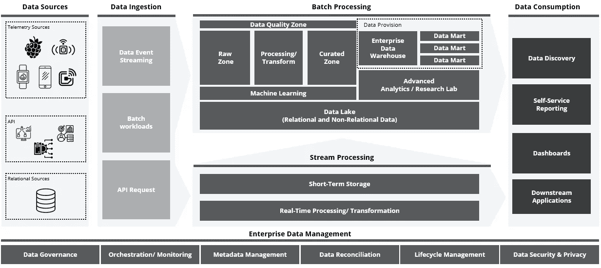
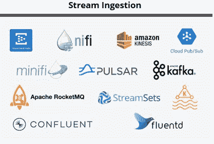
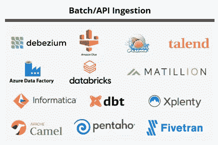
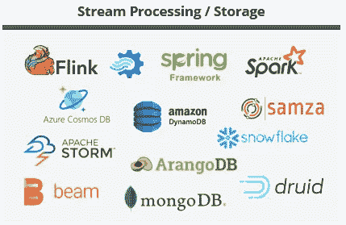
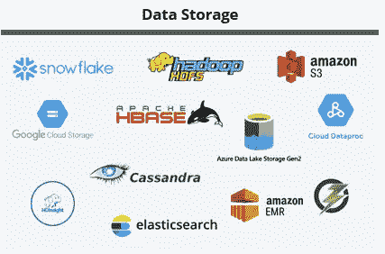
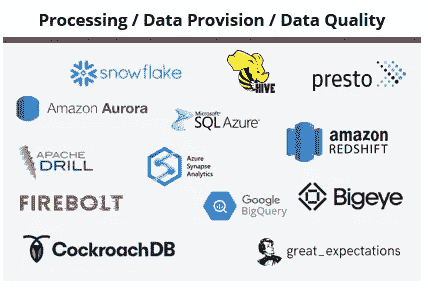
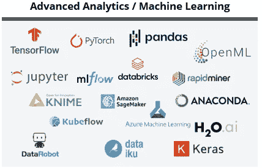
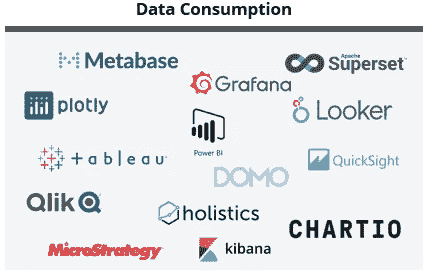
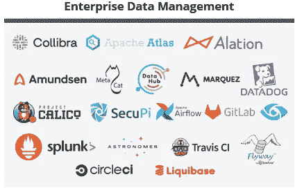
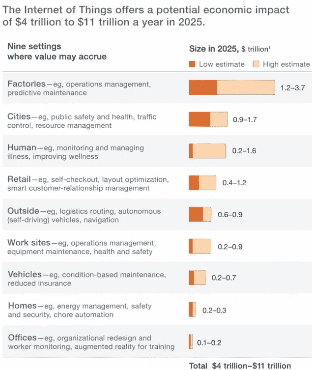

# 物联网和实时数据处理架构

> 原文：<https://medium.com/codex/architecture-for-iot-and-real-time-data-processing-f0a8c7e63c35?source=collection_archive---------0----------------------->

来源: [Shutterstock](https://www.shutterstock.com/image-photo/male-bright-firework-stick-standing-on-1468050074)

当我们谈论物联网时，首先想到的是当外面天黑时在你的院子里打开一盏智能灯(对于那些有院子的人来说)。

对我来说，它始于智能助理(Alexa)，尽管它比简单的灯更复杂，但这种技术背后的潜力有时让我想知道我们可以通过利用这些类型的东西来改善我们的生活。不高兴，开始加继电器，Xbox，一个智能路由器等等。我的房子变成了半自动的东西。

不幸的是，最终这还不够——作为一名数据爱好者，我对物联网进行了更多的研究，并意识到它们与数据架构有很多协同作用。因此，不再赘言，我将分享我关于物联网架构的一些想法，涉及我对 Lambda 和 Kappa 架构的一些了解。

从左到右阅读，我们可以看到物联网数据架构的多个层次。图标由[名词项目](https://thenounproject.com/)组成

# **数据来源**

这是物联网数据架构的第一层，我们的来源可以分为几种类型的数据:

*   **遥测**:通过使用智能手机、平板电脑、可穿戴设备、传感器等加载到网络中。
*   **API:** 主要用于解决业务需求、客户信息或者静态信息。这种类型的源可以由 CRM、ERP 或用于集成的 API 网关来表示。
*   **关系数据:**可用于数据丰富的数据源，包含核心系统或遗留客户系统等信息。

# 数据摄取

**数据事件流**

当我们谈到事件流时，半结构化数据是非常常见的，它是以 JSON 或 XML 有效载荷的形式摄入的，这些有效载荷利用了队列和其他几种协议。

这种类型的数据接收最常用的协议是使用发布/订阅方法的 **MQTT** 。基本上包括在向 MQTT 代理发布数据时包含一个主题名。
然后，这些主题负责为代理路由信息，需要来自每个想要接收特定主题消息的客户端的订阅。代理保证将具有匹配主题的所有消息传递给客户端。

可以使用其他类型的协议，例如 **COAP** (受限应用协议)**、AMQP** (高级消息队列协议)**、**和 **DDS** (数据分发服务)。

溪流摄取技术示例

**批次/API 摄入**

这种类型的数据接收包括定期收集和分组数据，并将其发送到目标系统。可以基于任何逻辑排序、特定条件的激活或简单的时间表来处理组。这种类型的摄取通常用于使用 **CDC** (变更数据捕获)、**快照、**或**增量**从关系数据库加载数据，因为这通常更容易且更实惠。

批处理/API 摄取技术示例

# 流处理

考虑到所呈现的图是基于 Lambda 架构的，流层将仅存储短期信息，这些信息将被移动到批处理层以供进一步处理(复杂度增加、历史比较等)。).

使用流处理，**数据在到达**时被处理，在需要**实时数据分析**时很有用。处理是立即进行的，但是它仅适用于较简单的分析功能。

此流程中可以包括以下任务:

*   **转换** —它包括从物联网设备和其他来源收集的数据的转换。转换完成后，生成的数据将被传输用于进一步分析。
*   **数据丰富** —数据丰富过程是将收集的原始数据与其他数据集相结合以获得快速洞察的操作。
*   **短期存储** —以原始格式存储转换/丰富后的数据，并能够执行数据的快速输入/输出。这就是为什么建议使用非 SQL 或文档数据库的原因。

流处理/存储技术的例子

# 成批处理

**数据存储**

数据湖是以其自然格式存储的数据仓库，通常是 blobs 或文件。可以按原样存储数据，而不必首先对其进行结构化并运行不同类型的分析-从仪表盘和可视化到大数据处理、实时分析和机器学习技术，以指导更好的决策。也就是说，是一个计算集群，它利用分布式计算能力来存储和处理大量数据。通常，它由以下区域组成:

*   **原始区域:**原始数据被接收到分布式文件系统的着陆区域。
*   **管理区:**存储的数据已经被清理并修改成确定的符合模式。

我们应该考虑到，在提到的两层之上，总是有一个**数据质量层**，可以/应该创建它来跟踪我们的数据，并向业务用户建议需要执行的任何更正。

数据存储技术的例子

# **处理/转换和数据提供**

**转换、企业数据仓库和数据**

转换是将数据从一种格式转换为另一种格式的过程。数据通常以不同的格式存储在企业的不同位置，因此，有必要执行数据转换，以确保来自一个应用程序或数据库的数据能够被其他应用程序和/或数据库理解。业务规则的应用可能还需要执行数据转换。

此外，EDW 或企业数据仓库用于以集成的方式存储公司数据，以便能够为战术和战略报告提供数据。EDW 提供了当前和历史信息的单一、全面的来源。在数据集市上，它们是数据仓库的简单子集，通常面向单个主题或功能领域。一个 EDW 可以分成不同的数据集市，因为每个数据集市都专用于一个特定的主题或功能领域。可以对数据进行聚合、转换和标准化。

注意，用于**批处理/API 摄取**的一些技术可以在这些层中执行 ETL(提取、转换和加载)。

处理/数据提供/数据质量技术的例子

**高级分析/机器学习**

高级分析是分析功能，涉及使用现代数据挖掘、模式匹配、数据可视化和预测建模工具来生成分析和算法，以帮助企业做出更好的决策。这些工具允许用户使用通常需要编码技能的不同方法、算法和技术来分析数据。

高级分析/机器学习技术示例

# 数据消费

数据消费层旨在通过一套用于分析数据和呈现信息的工具来提供信息，以帮助最终用户做出更明智的业务决策。

此外，整个企业中发生的分析活动主要利用结构化数据、孤立的数据存储、数据提取、专有工具和各种编程语言。传统的分析可以从数据湖或数据仓库中获得。

数据消费技术的例子

# **企业数据管理**

这个主题是您可以与他人围绕数据进行的最普遍、最广泛的对话之一。它涵盖了从数据架构到数据治理，甚至元数据管理或编排的所有内容。

我不会深入探讨这个主题，但当我们谈论数据管理时要记住的一点是，它可以分为几个功能:

*   数据治理
*   数据集成和互操作性
*   数据质量管理
*   元数据管理
*   文档和内容管理
*   仓储、BI、ML 和数据科学
*   数据架构
*   数据建模
*   数据存储、数据湖和运营
*   数据安全
*   参考和主数据

要想对数据管理了解得多一点，我建议你快速看一下 [**DAMA-DMBOK**](https://www.dama.org/cpages/home) **。**尽管如此，我还是会给你留下一些适合这个领域的技术。

涵盖一些数据管理功能的技术示例

# **结论&用例**

来源:麦肯锡

物联网是当今的一个主要趋势，正如我们在图表中看到的，它以跨行业的方式产生了巨大的经济影响。

有一个我非常喜欢的用例:**办公室占用率**。

随着新冠肺炎限制和远程工作成为一件常见的事情，在办公桌上安装传感器可以为仍然喜欢在办公室工作的员工带来很多价值。这样我就知道办公设施是否拥挤，我是否能享受新鲜空气😄

*免责声明:这篇文章反映了我的个人观点、建筑观点和经验，应该得到相应的对待*