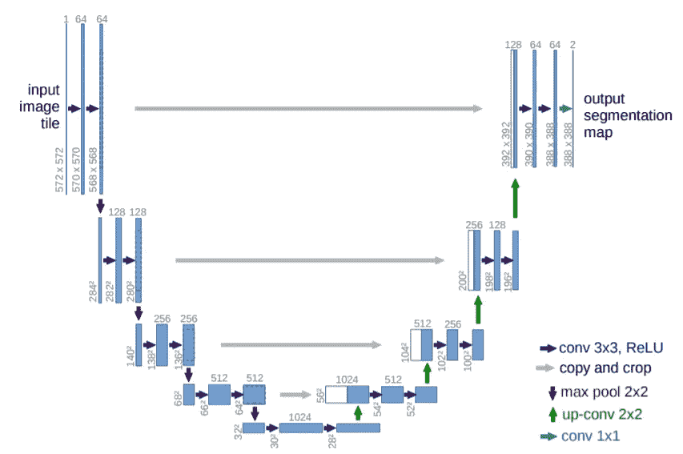

# 医学图像分割的体系结构[第 1 部分:UNet]

> 原文：<https://medium.com/codex/architectures-for-medical-image-segmentation-part-1-unet-9d8bbd8b7518?source=collection_archive---------5----------------------->

由[乌列尔 SC](https://unsplash.com/@urielsc26?utm_source=medium&utm_medium=referral) 在 [Unsplash](https://unsplash.com?utm_source=medium&utm_medium=referral) 上拍摄的照片

医学图像分割是医学图像分析中的一个重要领域，对于诊断、监控和治疗是必不可少的。基于深度学习的方法在医学图像分割任务中取得了优于传统方法的性能。我将介绍 UNet 和其他几种从 UNet 派生出来的用于医学图像分割的架构。

# 基本 UNet

任何 UNet 都有两个部分:

1.  收缩路径[编码器](左侧)
2.  扩展路径[解码器](右侧)。

**编码器/收缩路径**遵循卷积网络的典型架构。它从图像中提取特征图。它重复应用了两个 3×3 卷积(无填充卷积)，每个卷积后面都跟有一个整流线性单元(ReLU)和一个跨度为 2 的 2×2 最大池操作，用于**下采样**。在每个下采样步骤，特征通道的数量加倍，空间维度减半。

**解码器/扩展路径**中的每一步都由特征图的**上采样**组成，之后是将特征通道数量减半的 2x2 卷积(“上卷积”)。

UNet 架构

来自收缩路径的相应裁剪的特征映射和两个 3×3 卷积的串联，每个卷积后面都跟有一个 ReLU。由于每次卷积都会丢失边界像素，因此裁剪是必要的。在最后一层，使用 1x1 卷积将每个 64 分量特征向量映射到所需数量的类别。网络总共有 23 个卷积层。

# 3D UNet

3D UNet 是基本 U-net 框架的扩充，支持 3D 体积分割。其核心架构与基本的 UNet 相同，只是所有的 2D 操作都被其 3D 对应物所取代。基本上:

*   2D·conv 到 3D Conv
*   最大池 2D 到最大池 3D
*   2D 向上转换为 3D 向上转换

这产生了现在可用于 3D 体积分割的 3 维框架。它广泛用于体积 CT 和 MR 图像
分割应用，包括诊断心脏结构、骨骼结构、脊柱、脑肿瘤、肝肿瘤、肺结节、鼻咽癌、多器官分割、头颈部器官风险评估和白质束分割。

在本系列的下一篇文章中，我将回顾一下注意力。

# 参考

医学图像分割的 U-Net 及其变体:理论与应用。 *arXiv 预印本 arXiv:2011.01118* (2020)。

罗恩伯格，奥拉夫，菲利普费舍尔和托马斯布罗克斯。" U-net:生物医学图像分割的卷积网络."国际医学图像计算和计算机辅助介入会议。施普林格，查姆，2015。