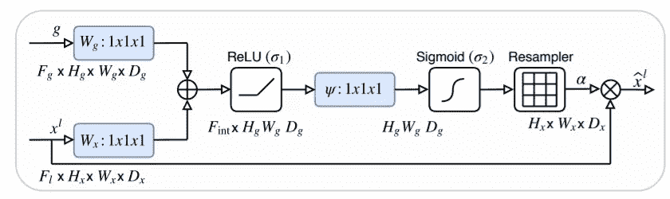
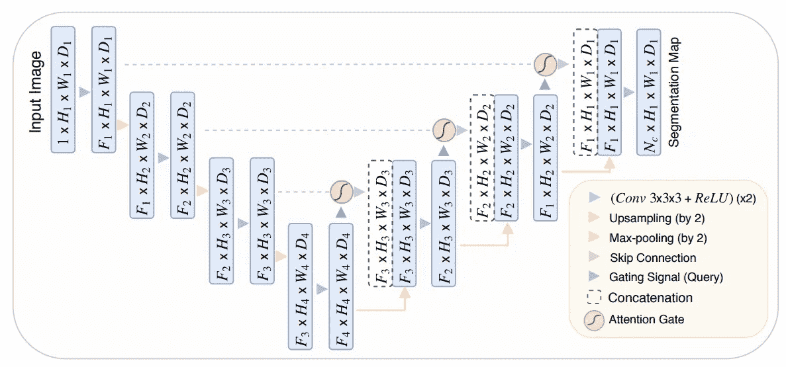
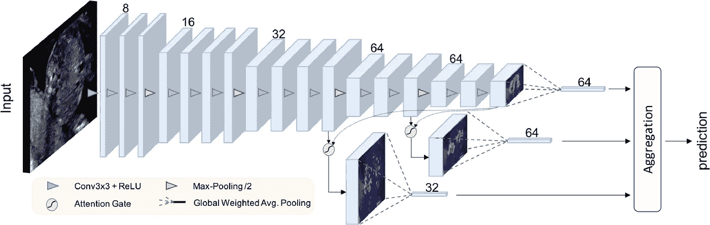

# 医学图像分割的体系结构[第 2 部分:注意 UNet]

> 原文：<https://medium.com/codex/architectures-for-medical-image-segmentation-part-2-attention-unet-c96858cc05d3?source=collection_archive---------4----------------------->

嘿，你们好！我开始撰写对医学图像分割有用的网络架构，即 UNet 及其变体。在第一篇文章中，我已经介绍了基本的 UNet 和 3D UNet。这里可以找到那个[。在这篇文章中，我将回顾一下注意力。](/codex/architectures-for-medical-image-segmentation-part-1-unet-9d8bbd8b7518)

照片由在 [Unsplash](https://unsplash.com?utm_source=medium&utm_medium=referral) 上拍摄

# 请注意 UNet

像 UNet 这样的完全卷积神经网络(FCNNs)在医学图像分析方面优于传统方法。这主要归因于以下事实:( I)使用随机梯度下降(SGD)优化来学习特定领域的图像特征,( II)在所有像素之间共享学习到的核，以及(III)图像卷积操作很好地利用了医学图像中的结构信息。卷积层通过逐层处理局部信息来逐步提取更高维的图像表示。

## 图像分析的注意门

提议的附加注意门(AG)的示意图[图片由奥克泰、奥赞等人提供]

注意系数αi ∈ [0，1]识别显著的图像区域，并修剪特征响应以仅保留与特定任务相关的激活。门控向量 gi ∈ R^Fg 用于每个像素 I，以确定聚焦区域。门控向量包含上下文信息，以剪除较低级别的特征响应。附加注意用于获得门控系数。使用了 sigmoid 激活函数。

提出的注意力 U 网分割模型的框图。在网络的编码部分，输入图像被渐进地滤波，并在每个尺度下以因子 2 下采样(例如，H4 = H1/8)。Nc 表示类的数量。注意门(AGs)过滤通过跳过连接传播的特征。AGs 中的特征选择性是通过使用在粗尺度中提取的上下文信息(门控)来实现的。(图片由奥克泰、奥赞等人提供)

所提出的 AGs 被合并到标准 U-Net 架构中，以突出通过跳过连接传递的显著特征。从粗尺度提取的信息用于门控，以消除跳过连接中的不相关和有噪声的响应。这是在拼接操作之前执行的，以便只合并相关的激活。此外，AGs 在正向传递和反向传递期间过滤神经元激活。源自背景区域的梯度在反向传递期间被向下加权。这允许浅层中的模型参数主要基于与给定任务相关的空间区域来更新。在每个子 AG 中，互补信息被提取和融合以定义跳过连接的输出。为了减少可训练参数的数量和 AGs 的计算复杂度，在没有任何空间支持的情况下执行线性变换(1×1×1 卷积),并且输入特征图被下采样到门控信号的分辨率，类似于非局部块。相应的线性变换解耦特征图，并将它们映射到较低维度的空间用于门控操作。

## 密码

拟议中的注意力门控声纳网的示意图(图片由奥克泰、奥赞等人提供)

原代码可以在[这里](https://github.com/ozan-oktay/Attention-Gated-Networks)找到。下面是简化版。

Attention U-net 已应用于眼部疾病诊断、黑色素瘤、肺癌、宫颈癌、腹部结构分割、胎儿发育和脑组织量化等问题。

请继续关注剩余 UNet 的下一篇文章。此外，在这里可以找到之前关于基础 UNet [的文章。](/codex/architectures-for-medical-image-segmentation-part-1-unet-9d8bbd8b7518)

# 参考

医学图像分割的 U-Net 及其变体:理论与应用。 *arXiv 预印本 arXiv:2011.01118* (2020)。

奥赞·奥克泰等着，〈注意 u-net:学习在哪里寻找胰腺〉 *arXiv 预印本 arXiv:1804.03999* (2018)。