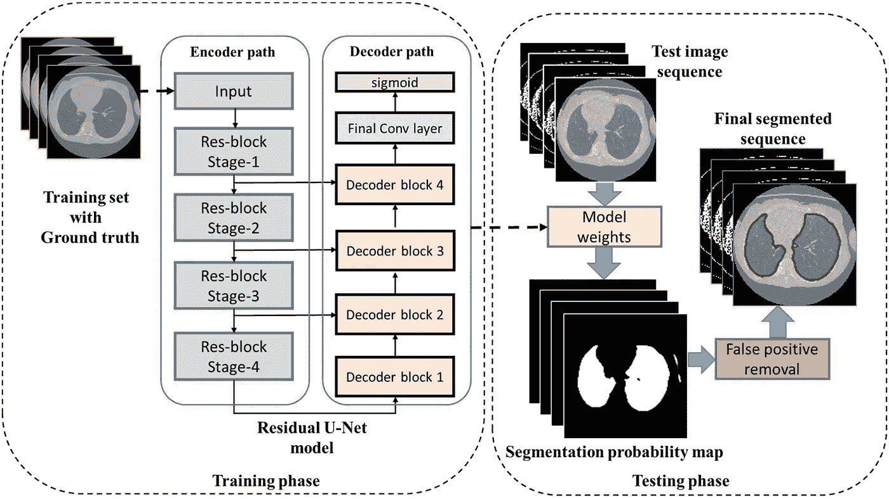
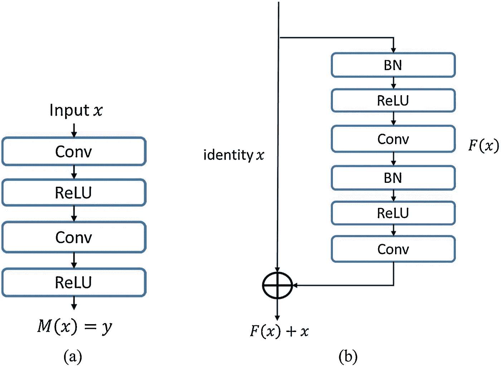

# 医学图像分割的体系结构[第 3 部分:残差 UNet]

> 原文：<https://medium.com/codex/architectures-for-medical-image-segmentation-part-3-residual-unet-ac5a4ca4212d?source=collection_archive---------3----------------------->

在这篇文章中，我将尝试总结剩余的 UNet，它的架构和应用。之前我已经讲过基本 UNet，3D UNet，注意力 UNet，都可以在这里找到[。](/@shambhavi-malik)

图片来自融合联盟

在医学图像分割的情况下，例如从 CT 图像中分割肺，存在许多挑战，例如照明条件差、形状不规则和边界模糊。在最近的过去，诸如阈值处理之类的形态学技术已经被用于自动分割，但是在不均匀照明和高度可变的肺形态学的情况下，它们导致较差的泛化能力。模糊连接性已经被用于确定分割的相邻性和细化的胸腔信息。此外，还使用依赖于种子选择的区域生长方法。这种方法存在过分割和泄漏问题。

与传统的图像处理技术相反，研究人员还利用了监督技术。一些例子是基于形状和基于图谱的模型。这些方法需要先前的解剖学知识，并且在计算上可能是昂贵的。最近，深度学习方法显著提高了对象识别和分割领域的最新水平，因为它们能够直接从数据中学习。非常复杂的功能可以通过多级转换来学习。

# 残余 UNet

最近的一些研究已经证明了如何有效地训练非常深的网络，例如批量标准化技术。但是这些技术不能解决退化的问题。因此，研究人员最近引入了一种称为剩余学习的新方法。剩余技术可以通过引入快捷连接(SC)来处理退化问题。

用于肺部 CT 分割的基于残差 U-Net 的 CNN 结构综述。[图片由卡纳、安妮塔等人提供。]

## 剩余单位

剩余技术改善了网络中的信息流。此外，它将各层重构为参考各层输入的学习剩余函数。因此，它克服了更深网络的退化问题。深度残差网络包含一组残差块，这些组中的每一个都由堆叠层组成，例如批量归一化(BN)、ReLU 激活、权重层(即卷积层)。快捷连接是那些跳过神经网络中一层或多层的连接。SC 通过卷积层来维持主卷积块输出的维数。具有卷积层的 SC 由 SC(conv)表示。在构造了残差单元之后，我们可以通过堆叠残差单元来进一步构建非常深的卷积编码器-解码器。

## 体系结构

神经网络的基本构件。(a)在 U-网中使用的常规前馈神经网络，(b)残差单元包括在残差 U-网中使用的单位映射。[图片由卡纳、安妮塔等人提供。]

在编码器和解码器路径中总共有四级，并且每一级都由残差块组成。每一级被认为是一个单元，并且在编码器路径的每一级中都有重复的单元。对于阶段 1，有 3 个单元。对于阶段 2、3，单元的数量分别是 4 和 6。对于最后阶段，有 3 个单元。

*   **编码器路径** —编码器部分共有 50 个卷积层，包括穿过卷积层的快捷连接。在每个块中执行卷积运算。输入图像的大小调整为 128 × 128，然后对该批次执行批次归一化。批量归一化后，用 3 × 3 的滤波器进行 2D 卷积。
*   **解码器路径—** 解码器部分实现残差 U-Net，包括上采样层、级联层以及卷积、BN 和 ReLU 激活堆栈。利用上采样层的主要优点是重建激活的原始大小并生成密集的激活图。转置卷积用于上采样任务。最后，使用一个 1 × 1 卷积层，后面跟随一个 sigmoid 激活函数。sigmoid 激活函数用于在建议模型的输出端生成概率得分。该层将单通道特征表示提供到期望的分割图中。

深度残余 U 网已经在许多生物医学成像应用中发挥了巨大作用，例如细胞核分割、脑组织量化、脑结构绘图、视网膜血管分割、乳腺癌、肝癌、前列腺癌、内窥镜检查、黑色素瘤、骨肉瘤、骨结构分析和心脏结构分析。深度残差 U 网是复杂图像分析应用的理想选择。

敬请关注下一篇文章。另外，点击这里可以找到之前关于注意力网络[的文章。](/codex/architectures-for-medical-image-segmentation-part-2-attention-unet-c96858cc05d3)

# 参考

医学图像分割的 U-Net 及其变体:理论与应用。 *arXiv 预印本 arXiv:2011.01118* (2020)。

计算机断层摄影图像中用于自动肺部分割的深度残差 U-Net 卷积神经网络。*生物控制和生物医学工程*40.3(2020):1314–1327。