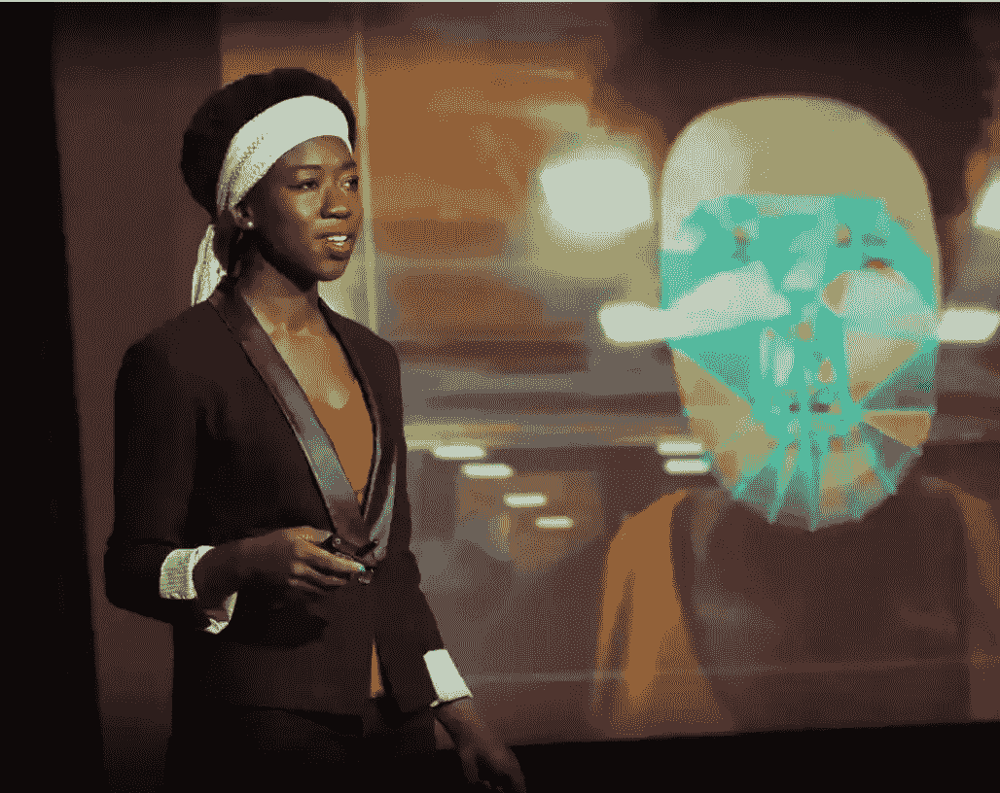
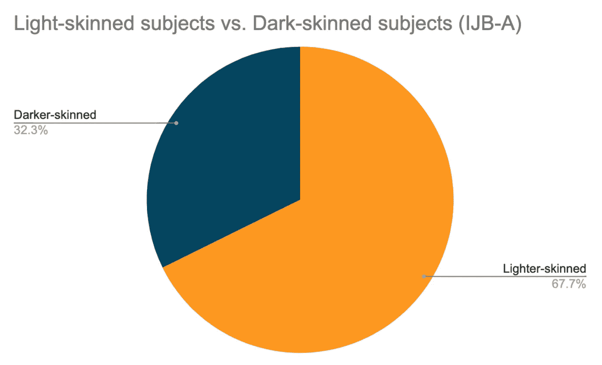
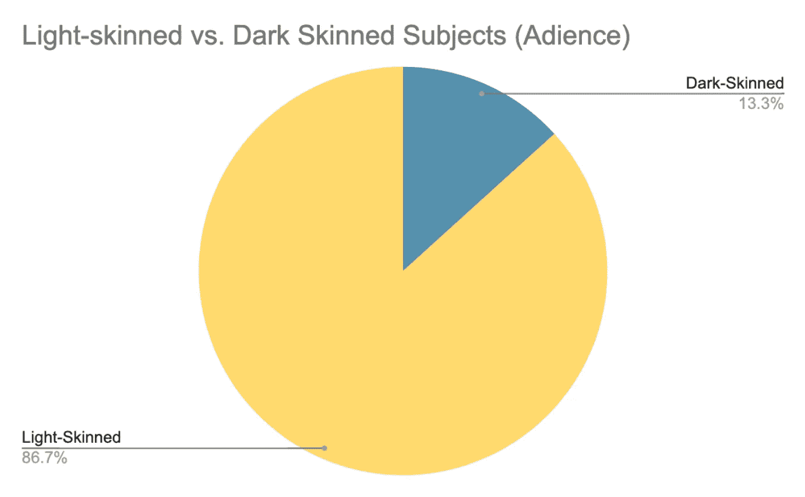
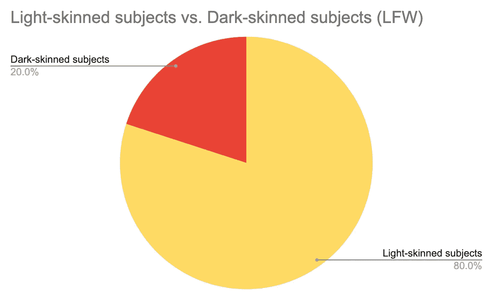
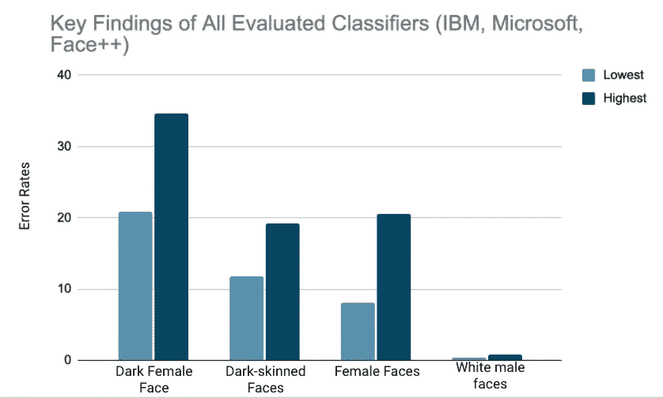

# AI 系统是种族主义者吗？

> 原文：<https://medium.com/codex/are-ai-systems-racist-897a1c6d3b67?source=collection_archive---------20----------------------->

《卫报》的照片

人工智能有能力创造我们梦想的乌托邦——它可以消除基于性别、宗教、种族、性取向或种族的歧视。但事实是，AI 也有恶化歧视的力量。输入人工智能系统的数据在很大程度上影响了从系统中获得的结果，而不平衡的数据集可能会导致种族偏见的结果。

这个发现有点像一夜之间的发现。麻省理工学院媒体实验室(MIT Media Labs)研究员、代码诗人乔伊·波伦维尼(Joy Buolamwini)用“艺术和研究来阐明人工智能的社会意义”。为了做到这一点，Buolamwini 使用开源的 Beyond Reality Face NXT 软件创建了“Aspire Mirror ”,该软件使人们能够看着镜子，看到他们受到启发的东西的反射。成功创建项目后，她用自己的脸测试了程序。但该程序在 Buolamwini 的脸上反复失败，直到她戴上*白色口罩、*或请她肤色较浅的朋友来测试算法。为什么系统没有识别出深色皮肤对象的脸？

这个问题的答案比看起来要深刻得多。问题不在于系统本身，而在于用来训练模型的数据。在 Buolamwini 2018 年的研究论文[“性别阴影:商业性别分类的交叉准确性差异”](https://proceedings.mlr.press/v81/buolamwini18a/buolamwini18a.pdf)中，她评估了三个开源数据集:IJB-A、阿迪内斯和 LFW。以下是她的发现结果:

IJB——一个种族比较的数据集

Adience 数据集种族比较

LFW 数据集种族比较

很有趣，不是吗？这项研究中使用的所有数据集，包括数据集的“黄金标准”LFW，都对深色皮肤的人有偏见。事实上，最好的数据集以 20:80 的比例对深色皮肤的受试者有偏见，这意味着大多数其他数据集都有种族偏见。这些系统，不管它们有多好，总是会有种族偏见，因为它们大多是由白人训练出来的。

# 这种歧视的影响是什么？

为了充分解释这些影响，让我们仅从美国人口的角度来看待这种差异。截至 2019 年，美国总人口为 3.282 亿，黑皮肤人数达 4199 万。如果即将出现的人工智能系统使用 Adience、IJB-A 或 LFW 数据集进行训练，它们将无法识别美国总人口中高达 12.7%的人口。

这些不平衡的数据集是世界上最大的分类器中种族偏见背后的主要原因。Buolamwini 在她的研究论文中评估了 IBM 的 Watson 视觉识别 Face API、微软的认知服务 Face API 以及 Face++的面部分析技术，这些技术以前集成在一些联想电脑中。当把每个分类器的错误率按照深色女性面孔、深色面孔、女性面孔和白色男性面孔进行分解时，结果是极其令人震惊的。

所有评估分类器的结果

这张图表清楚地显示了最大的人工智能公司中种族和性别的差异——白人男性面孔的平均错误率为 0.3%-0.8%，而深色女性面孔的错误率为 21%-36%。但是从社会意义上来说，这意味着什么呢？

Buolamwini 分析的所有 API 都是开源的，这意味着每天都有成百上千的人使用这些服务来创建面部识别项目。现实生活中的数据是不平衡的，事实上这些 API 是在不平衡的数据上训练的，这意味着随着时间的推移，偏差只会加剧。

# 我们如何解决这个问题？

人工智能模型遵循“垃圾进，垃圾出”的原则。这意味着只有两种解决方案可以消除人工智能中的种族偏见:

## 多样化数据集

用于训练模型的数据必须在性别和种族方面保持平衡——如试点议会基准(PPB)。该数据集包括来自卢旺达、塞内加尔和南非的 1，270 人，以及来自冰岛、芬兰和瑞典的 1，270 人。尽管 PPB 数据集通常用于研究，但它也是必要的。走向消除人工智能中的种族偏见。

## 完全移除有偏差的工具

已经在有偏差的数据上训练过的系统很难逆转，更新版本的系统是解决问题的最佳方式。当 IBM 收到“性别差异”结果时，他们在 24 小时内采取了行动，并开发了他们新的沃森视觉识别软件。新版本使用了来自芬兰、冰岛、瑞典、卢旺达、塞内加尔和南非的受试者的图像，甚至还为每个受试者手动标注了肤色。尽管重新训练商业分类器很困难——如果不是不可能的话——但 IBM 的行动表明，发布更新、平衡的非歧视性系统是可能的。

完全消除人工智能中的偏见是一项需要集体努力来解决的任务。鉴于许多商业分类器是在不平衡的数据上训练出来的，这将需要创建这些系统的公司的努力。现在是我们采取行动消除种族偏见数据的时候了——人工智能是社会成功还是毁灭的根源在我们手中。

## 联系我了解详情、问题和更多信息！

嗨！我是 Tasfia Ara，10 年级学生，对机器学习和构建新项目充满热情。如果你喜欢这篇文章，可以看看我在 Medium 上的其他一些故事。有任何问题或想知道更多细节吗？请联系我:

[LinkedIn](https://www.linkedin.com/in/tasfia-ara/)

电子邮件:tasfia_ara@outlook.com