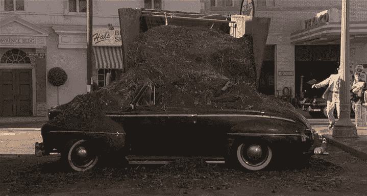

# 咏叹调角色是无知的代码膨胀肥料吗？

> 原文：<https://medium.com/codex/are-aria-roles-ignorant-code-bloat-manure-97b3ad747a9f?source=collection_archive---------5----------------------->

大部分是。

我讨厌粪肥…

咏叹调角色总是让我感到困惑，比如“这些角色究竟为什么会存在？”这种最初的反应只是因为他们的文档甚至说了一些让他们听起来毫无意义的事情而变得更加复杂。

所以让我们回顾一下我认为它们是无意义垃圾的一些原因。

# 只要使用正确的标记！