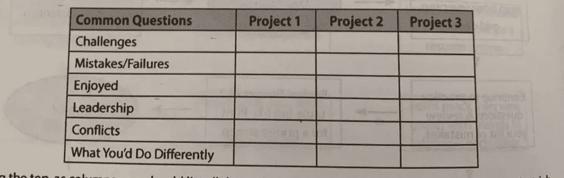

# 编码面试坏了吗？

> 原文：<https://medium.com/codex/are-coding-interviews-broken-870b0859e131?source=collection_archive---------5----------------------->

是时候打开你去年洒了咖啡的那本旧的《破解编码面试》了。准备好迎接你将要经历的无数小时的 LeetCode 和技术编码问题吧！但是这一切是必须的还是编码面试坏了？

克里斯托夫·高尔在 [Unsplash](https://unsplash.com/s/photos/coding?utm_source=unsplash&utm_medium=referral&utm_content=creditCopyText) 上拍摄的照片

# 软件面试是什么样的？

所以你刚开始找工作，申请了一堆有前途的初创公司或成熟的公司。不要被荒谬的额外津贴和时髦的办公空间所迷惑，在科技领域找一份工作可能需要很多工作。面试过程与其他行业大不相同，它通常是一个漫长而艰难的旅程。我们都有在商业或其他工程领域的朋友，他们在与一家公司交谈一两次后就获得了工作机会。相比之下，在科技行业找工作感觉像是一项全职工作。在得到一份工作之前，你不仅要经历公司至少 3-4 个面试步骤，而且有许多类型的技术面试来全面评估每个候选人。

该过程通常如下(给出或采取步骤):

## 与招聘人员的对话

这通常被称为介绍性拜访。招聘人员会直接给你打电话，或者安排一次面试(通常是语音面试)，目的是澄清他们对你的简历和申请的任何疑问。准备好自我介绍，谈谈你过去的经历。这不是面试官挖掘你的技术技能的地方，尽管一些更倾向于技术的招聘人员会问一些关于技术和你做过的任务的一般性问题。招聘人员还想知道你是否能调动工作(如果需要的话)，有时会问你期望的薪水。这也是你第一次了解这个职位、团队结构和公司文化的机会。招聘人员并不总是能回答你所有的技术问题，所以把这些留给工程师吧，但是他们仍然有很多关于公司的有价值的信息。

## 编码任务或挑战

这一步更像是家庭作业，而不是面试。这一步的基本思想是评估你的编码技能，而不需要你与任何面试官直接交流。这节省了工程师的时间，因为它可以淘汰糟糕的候选人，而不必占用他们的面试时间。任务和挑战以各种形式和规模出现。它们可以是一组需要在给定时限内完成的 LeetCode 或 HackerRank 风格的问题。它们可以是一个“真实生活”的场景，向你介绍一个代码库，一个问题，它评估你如何处理它。它们可以像学校作业一样，带有提供的工具和不完整的样板代码，以及需要完成的任务列表。不管你遇到的挑战是什么类型的，都把它当成一次测试，在开始解决问题之前，通读所有的说明或帮助。留出一定的时间(通常是 1-2 小时)来完成它。

## 技术筛选面试

哇，看起来你终于值得一个工程师花宝贵的时间和你聊天了。技术筛选是你与公司的第一次技术对话。面试你的工程师可能会进一步挖掘你过去的经历和你所做的技术决策。不要害怕承认过去的错误，也不要对项目进展撒谎，工程师会理解的。你的面试官并不是在寻找下一个天才工程师，他们寻找的是扎实的解决问题的技能，良好的技术知识基础，良好的沟通技巧，以及理解事物如何工作的渴望。有时公司会把这些筛选面试完全集中在技术问题上，所以要做好准备(查看“准备这些面试的最好方法是什么？”如果不确定怎么准备)。

## 小组面试

这是整个过程中最详尽的部分，小组面试。该小组由不同的面试者(工程师、商务人士、产品经理和公司领导)进行的三到五次面试组成。这些访谈各有不同的侧重点，从编码基础到软件架构设计，再到行为和领导力评估。他们的目标是全面审查候选人，以便只选择最好的。面试结束后，面试官一起坐下来讨论他们对你的看法，并决定是否发出邀请。不要害怕，面试官理解你也是人，也会有不开心的时候。他们也明白没有人是完美的，并在寻找他们认为有潜力做这项工作的最佳人选。只要有一个面试官在努力让你被那个小组录用，并且你没有被其他任何人发现，你就可以得到一份工作。

过程中最糟糕的部分？感觉上大多数技术面试都是在测试你的技能，而你在日常的软件开发中并没有用到这些技能。这通常包括算法和数据结构的测试，使用类似谜题的编码问题。一个广泛争论的话题是，目前评估面试候选人的流程是否过时和破损。

# 嗯…它们坏了吗？

编码面试过程并没有完全中断。每个公司都有稍微不同的标准，因此有些公司有一个破碎的过程，但在大多数情况下，这个过程是可行的。这其中的关键原因是，你不需要正确回答一个编码问题就能得到一份工作。一次好的面试是评估候选人是否能与团队合作，测试合作技能，你如何处理问题，以及如何与你日常工作。这意味着如果你没有正确解决一个问题，这并不是世界末日。

编码问题提供了一种测试一个人是否有很强的基础知识的方法。这些基础知识可能来自正规教育或自学，但这表明候选人在编写软件方面受过良好的教育。这些问题也是一个很好的方法，可以看出哪些考生拿出了时间来学习和练习。这些同样的候选人会在工作中为他们的专业工作带来努力。在回答这些问题的时候，面试官可以清楚地衡量候选人解决问题的能力以及他们的解决方案有多好。

也就是说，一些公司过分强调正确答案，而忘记了他们应该审查的更重要的技能。这就是为什么会产生这种破碎的编码面试的想法。回到“编码任务或挑战”部分，你会看到一系列不同类型的面试，我认为更接近日常工作环境的面试风格要好得多。给候选人一个真实的场景或看他们如何实现功能是一个很好的方法，可以了解他们如果和你一起工作会有什么表现。相比之下，让他们回答一些他们刚刚练习过的难题。与任何算法问题相比，让候选人解释他们的解决方案将更好地洞察他们的问题解决和沟通技巧。

# 准备这些面试的最好方法是什么？

所以你想在这些失败的(或者希望不是失败的)面试中胜出？我推荐的第一个资源是 Gayle Laakmann McDowell 撰写的《破解编码访谈》。这本书是软件面试的圣经，它讲述了算法和数据结构等基础知识，用大 O 符号理解运行时和空间复杂性，它提供了组织你的行为答案的方法，以及大量的问题供你练习。我想在书中强调的一个特别有用的行为工具是“面试准备网格”，或者我喜欢称之为项目表。这张表是一个很好的方法，可以让你组织你的想法，回顾你过去完成的项目。我发现完成这个表格有助于我交流面试官感兴趣的过去的经历和场景。

[破解编码面试](https://www.crackingthecodinginterview.com/)中的“面试准备网格”

接下来，我会建议通过常见的行为问题。你不需要照本宣科地回答每一个问题，但是要熟悉它们，这样当你在面试中被问到时就不会措手不及。这里有一个我在网上找到的指南，里面有一些很棒的问题:【https://www.techinterviewhandbook.org/behavioral-questions/

回答好编码问题是有条理的。这意味着不要即兴发挥，你需要研究如何回答它们。不要只是过普通的问题，而是要知道面试时该说些什么，做些什么。[破解编码面试](https://www.crackingthecodinginterview.com/)有一个很棒的流程图，但这是我的流程的一般指导方针:

1.  **澄清**。再次阅读问题，询问假设或歧义，理解输入和输出
2.  浏览一个**示例**以了解您的解决方案必须做什么
3.  想出一个**天真的方法**，交流它将如何工作并陈述其表现
4.  **优化**天真的方法，考虑空间权衡、解决方案中的瓶颈、重复或不必要的工作。
5.  **代码。你已经想出了一个解决方案，现在你可以专注于编写漂亮的代码。不要停止交流你写的东西，解释一切！**
6.  通过示例浏览代码。思考**边缘情况**和“热点”,它们可能是错误的来源。
7.  陈述**最终时空**的复杂性

如果列出的步骤对您没有意义，您可能需要在深入解决过程之前学习更多的基础知识。我建议在网上看一些模拟面试，看看理想的面试者是如何处理这类问题的。这个资源收集了这些由科技专业人士拍摄的模拟面试。我说过问题不应该被记忆，但是练习会让你熟悉不同类型的问题。如果你在面试中看到类似的问题，你会知道使用什么工具以及如何处理这些问题，而不是盲目地去做。通常使用 [LeetCode](https://leetcode.com/) 或 [HackerRank](https://www.hackerrank.com/) 来练习这类问题。

最后，投入时间研究公司。不言而喻，在你申请之前，你应该知道公司是做什么的，并且对他们感兴趣。这不仅仅是为了给你的面试官留下深刻印象，记住你面试的公司和他们面试你的一样多！可能感觉每个机会都是好机会，尤其是对初级候选人来说，但你必须尽力挑剔，想想哪些职位最符合你的要求。

# 去哪里找好机会？

看看你的周围，软件无处不在！你可能使用软件，而这些公司正在寻找新的开发者。我发现这些是最好的机会，因为你是最终用户之一，了解消费者的观点。当然，你使用的软件只是冰山一角。有许多受欢迎的求职板和网站可以找到申请的公司。即使公司没有空缺职位，如果你感兴趣，给他们发一封电子邮件概述你和你的兴趣也是值得的。

一些受欢迎的求职公告板:

*   Angel.co——创业公司
*   建于{插入城市}—针对特定城市的公司(例如[https://www.builtinsf.com/jobs](https://www.builtinsf.com/jobs)
*   LinkedIn——不仅仅是工作公告栏，还要调查招聘人员和你的关系可能工作的有趣的地方

如果你有任何其他很棒的资源，请随意分享！

# 我有什么资格发表意见？

如果你已经做到了这一步，你可能想知道我是谁，为什么我对这个话题有自己的看法。我是一名软件工程师(谁会想到呢？)，我本来做了很多找实习的软件面试。毕业后，我参加了各种规模公司的无数次面试，从初创公司到 MMANGA/MAGA(我对 FANNG 的新缩写)公司。我还在上一个公司的不同阶段进行了多次面试。我坐过面试桌的两边，我明白既是面试官又是被面试者意味着什么。我希望分享我的经历，并希望这篇文章能帮助其他人找到他们梦想的工作！

敬请关注，保持好奇！

你觉得这篇文章有趣或有帮助吗？通过留言让我知道你的想法，或者考虑关注我，继续了解我的旅程。

# 了解更多关于我@ [shrey.codes](https://shrey.codes/)