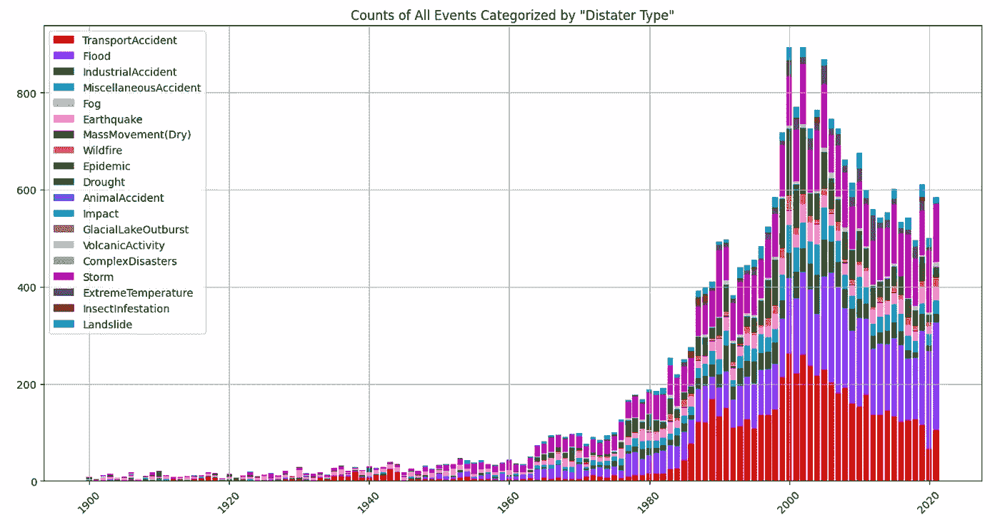
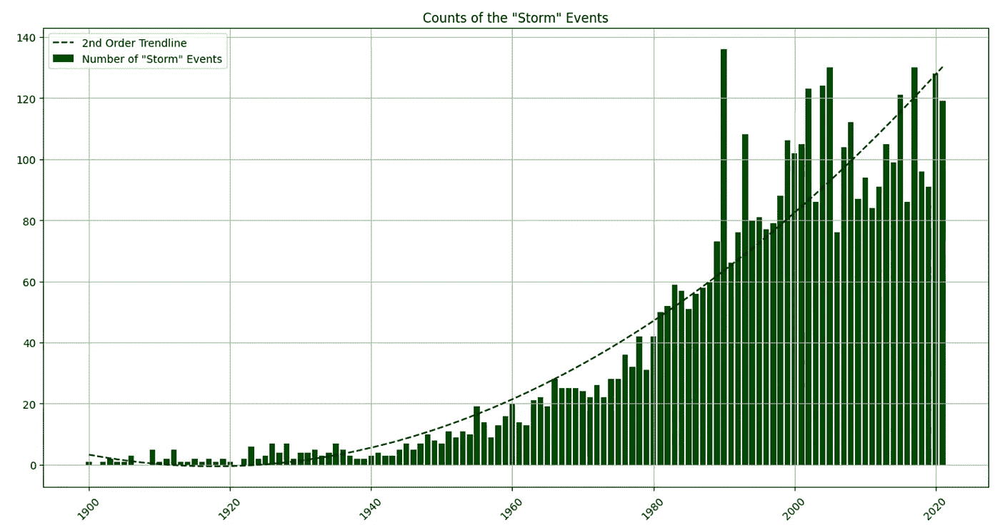
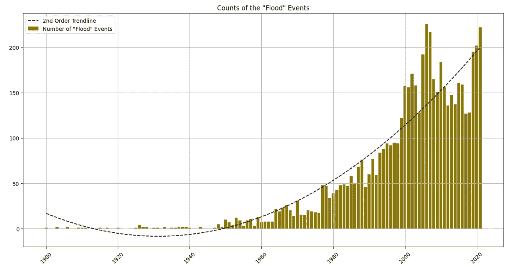
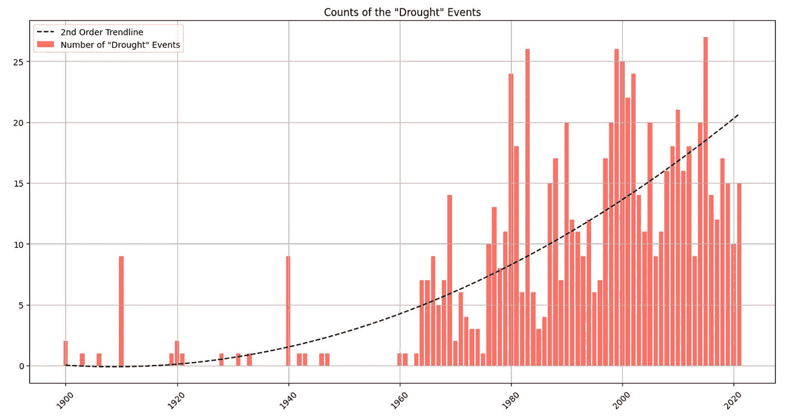
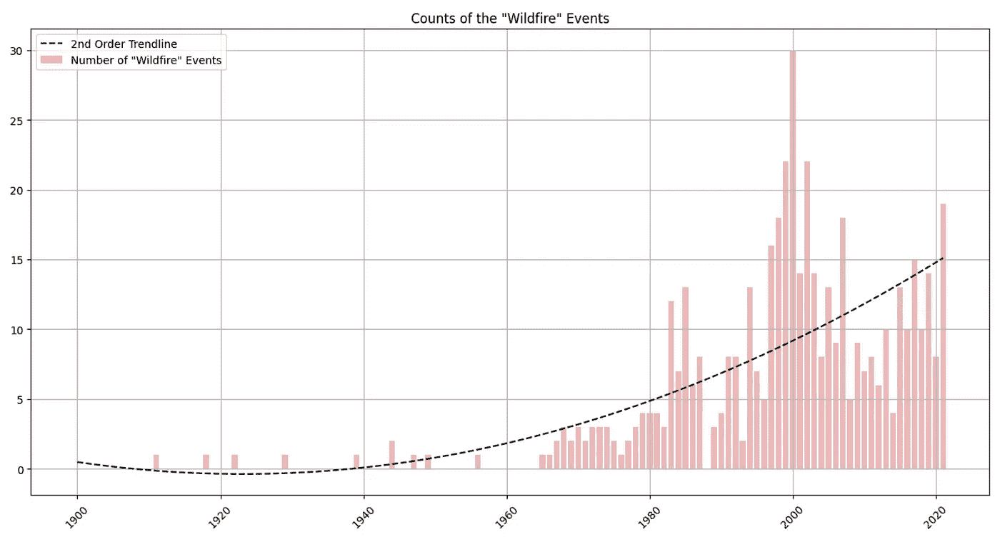
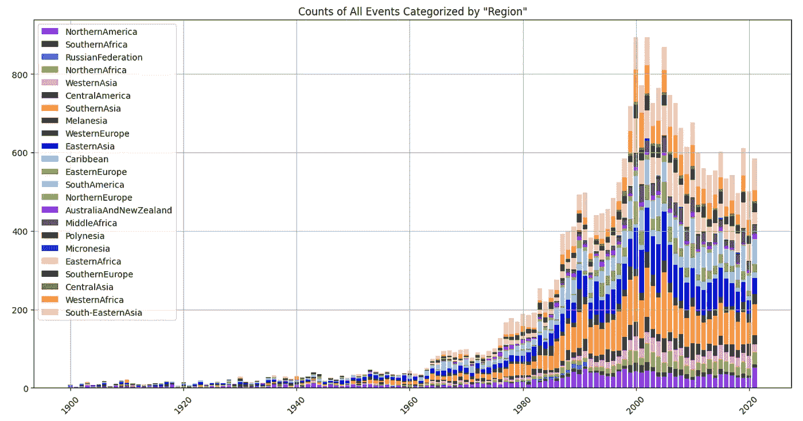
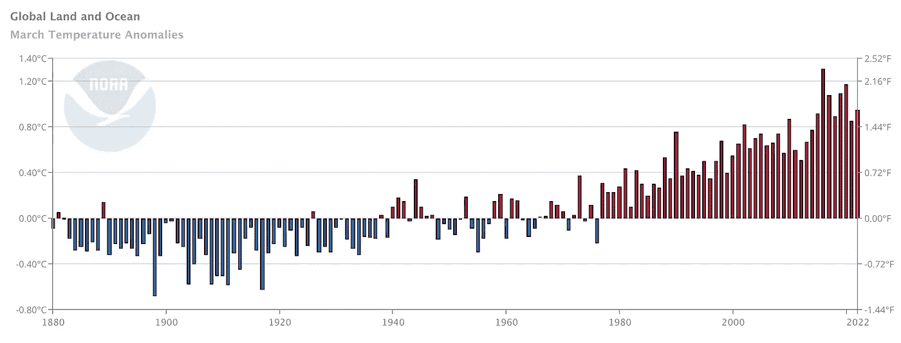

# 我们在 2022 年的优先事项是有序的吗？

> 原文：<https://medium.com/codex/are-our-priorities-in-order-in-2022-5cf0a82559b?source=collection_archive---------21----------------------->

作者图片

我不是气候科学家，也不自称是学者。我只是一个观察者。我想就一个值得讨论的重要话题，分享一下我目前为止观察到的情况。我所看到的未来充其量看起来是暗淡的。看到事物的本来面目，而不是我喜欢的样子，我看到我们(人类)正在迅速走向一个不可逆转的点，或者更简单地说，一个不可逆转的局面。随着时间的推移，气候正在发生显著且越来越明显的变化，而我们的行动似乎是负责任的。

在接下来的段落中，我将讨论气候变化的影响以及导致这些影响的原因。最后，我要用一个例子来结束我的讲话，这个例子应该表明我们有能力采取行动，现在就行动！

# 效果

我先从调查数据开始。*紧急事件数据库*(或 EM-DAT)发布了一个包含从 1900 年开始的全球范围的“自然和技术灾难”信息的数据库。EM-DAT 网站常见问题部分规定的数据收集标准表明，当任何事件导致 10 人或 10 人以上死亡、100 人或 100 人以上受影响、宣布紧急状态和/或呼吁国际援助时，应收集数据。

图 1 显示了从 1900 年到 2021 年按“灾难类型”分类的所有事件的数量。

图 1:从 1900 年到 2021 年，按“灾害类型”分类的所有事件的数量[图片由作者使用 EM-DAT 的数据生成]

图 2、图 3、图 4 和图 5 显示了从 1900 年到 2021 年特定灾害类别(即“风暴”、“洪水”、“干旱”和“野火”)的数量。

图 2:从 1900 年到 2021 年“风暴”的数量[图片由作者使用 EM-DAT 的数据生成]

图 3:从 1900 年到 2021 年“洪水”类别的计数[图片由作者使用 EM-DAT 的数据生成]

图 4:从 1900 年到 2021 年“干旱”类别的计数[图片由作者使用 EM-DAT 的数据生成]

图 5:从 1900 年到 2021 年“野火”的数量[图片由作者使用 EM-DAT 的数据生成]

图 6 显示了按事件位置分类的相同计数。

图 6:从 1900 年到 2021 年按“地区”分类的所有事件的计数[图片由作者使用 EM-DAT 的数据生成]

如果想重现同样的剧情，自己参考资料，可以参考这里的 GitHub [要诀](https://gist.github.com/troymyname/552562119d127b6fdc0fa8f82076f25e)。您需要在 EM-DAT 注册，以便首先下载原始数据文件。下载完数据后，您需要做的就是替换 *read_excel* 函数中的字符串参数，该参数指示您下载的文件的名称和位置。我想让你知道，我已经有意过滤掉了从 2022 年开始的数据。

所有这些事件的财务影响是什么？根据*国家海洋和大气管理局*或简称 NOAA (2022)，仅在美国 2021 年，灾害就造成了 1450 亿美元的费用。NOAA 进一步指出，气候灾害的数量和代价正在增加。

# 原因

那么，我们如何将*原因*与*结果*联系起来呢？有几种方法可以进行归因研究，将结果(或极端天气事件)与原因(或人类活动)联系起来。根据 CarbonBrief (2021 年)的说法，一种常见的方法是在当前气候下对一个极端事件进行气候模型模拟，并将其与同一事件在不受人类活动影响的条件下的理想模型运行进行比较。最后，比较模型模拟之间的差异，以评估事件的可能性或严重性如何变化。像这样的研究以及使用气象站和卫星跟踪的温度测量提供了大量证据，表明我们的星球正在变暖。一旦将这些数据与自工业革命时代以来用于发电的方法进行比较，情况就变得更加清晰了。

根据美国国家资源保护委员会(或 NRDC) (2019 年)的说法，温室效应使地球变暖到舒适的平均 59 华氏度(或约 15 摄氏度)，从而使我们的地球变得适合居住。然而，如果不加以控制，由于特定大气气体(也称为温室气体)的增加而导致的温室效应会导致来自太阳的热能增加。国家环境教育基金会(或 NEEF)解释说，在大气中最丰富的温室气体(如水蒸气、二氧化碳、甲烷、一氧化二氮和其他氟化气体)中，水蒸气浓度的变化是由大气变暖引起的，而不是由工业化引起的。然而，二氧化碳、甲烷和氧化亚氮浓度的变化是由人类活动引起的。美国国家海洋和大气管理局的全球监测实验室公布了一些数据，显示这些气体的一些浓度是如何随着时间的推移而变化的，这些数据可以在这里访问。如果你想知道哪些部门排放的温室气体最多，可以参考《我们的世界》在数据中发布的[信息。](https://ourworldindata.org/ghg-emissions-by-sector)

# 结论

为了量化自前工业时代以来地球变暖的程度，科学家们测量了所谓的*全球平均表面温度*，目的是跟踪温度的变化。根据 NOAA (2021)，从全球各地获得的测量值从绝对温度转换为温度异常，这只不过是“每个位置和日期的观测温度和长期平均温度之间的差异”。图 7 显示了截至 2022 年 3 月的数据。

图 7:截至 2022 年 3 月的全球陆地和海洋温度异常数据[图片来自 NOAA 国家环境信息中心，2022 年 4 月发布，2022 年 4 月 19 日检索]

2015 年通过的《巴黎协定》是一项具有法律约束力的国际条约，得到了 190 多个国家的“同意”。它为参与国设定了减少全球温室气体排放的目标，为各国每五年的承诺提供透明度，并为发展中国家提供财政支持。该文件第 2 条规定如下。

> 1.本协定旨在加强《公约》的执行，包括其目标，目的是在可持续发展和努力消除贫困的背景下，加强全球应对气候变化的威胁，包括通过:
> 
> (a)将全球平均气温增幅控制在比工业化前水平高出 2 摄氏度以下，并继续努力将气温增幅限制在比工业化前水平高出 1.5 摄氏度以内，认识到这将大大降低气候变化的风险和影响；
> 
> (b)以不威胁粮食生产的方式，提高适应气候变化不利影响的能力，促进气候复原力和低温室气体排放发展；和
> 
> (c)使资金流动符合低温室气体排放和抵御气候变化的发展道路。
> 
> 2.该协定的实施将根据不同的国情，反映公平以及共同但有区别的责任和各自能力的原则。

如果我看一下图 7 和第 2 条的粗体部分，我看不出我们离跨过 1.5 摄氏度的门槛有多远，如果我们的政策和生活方式没有突然改变，我们很可能会很快跨过这个门槛。事实上，Marotzke 等人(2022 年)在《天气》杂志上发表的一份报告中指出，如果我们能够在未来三十年内达到净零排放，然后转向净负值，我们有可能再次下降到 1.5 摄氏度以下；否则，我们将跨过这个门槛。

这可能吗？《T2 蒙特利尔议定书》的批准应该表明我们确实有能力在全球范围内采取行动并改变现状。

我希望通过这篇文章，我能够让你相信我们面临的迫在眉睫的威胁。作为后续，我计划再写一篇文章，概述一些我们都可以采取的步骤，为我们今天面临的问题做准备。如果你认为我有办法提高我的写作水平，请留下你的评论。如果你想支持我，让我产生更多这样的内容，你可以[给我买杯咖啡](https://www.buymeacoffee.com/tonmoyroy)。感谢阅读！

# 参考

[1] EM-DAT，CRED / UCLouvain，比利时布鲁塞尔。(未注明)。国际灾难数据库。EM-DAT。 [www.emdat.be](http://www.emdat.be/)

[2]沃德，莫里斯(巴德)。(未注明)。*主要温室气体及其来源*。NEEF。[https://www . neefusa . org/weather-and-climate/climate-change/principal-green-gases-and-their-sources](https://www.neefusa.org/weather-and-climate/climate-change/principal-greenhouse-gases-and-their-sources)

[3] NOAA 全球监测实验室地球系统研究实验室。(未注明)。国家海洋和大气管理局。[https://gml.noaa.gov/ccgg/trends/mlo.html](https://gml.noaa.gov/ccgg/trends/mlo.html)

[4]诺阿国家环境信息中心(NCEI)。(未注明)。*美国十亿美元天气气候灾害(2022)* 。国家海洋和大气管理局。【https://www.ncei.noaa.gov/access/monitoring/billions/ 

[5]联合国气候行动。(未注明)。*巴黎协定*。联合国。[https://www.un.org/en/climatechange/paris-agreement](https://www.un.org/en/climatechange/paris-agreement)

[6] NOAA 国家环境信息中心。(2022 年 4 月)。*气候一瞥:全球时间序列*。国家海洋和大气管理局。检索于 2022 年 4 月 19 日，来自[https://www . ncei . NOAA . gov/access/monitoring/climate-at-a-glance/](https://www.ncei.noaa.gov/access/monitoring/climate-at-a-glance/)

[7]马罗兹克、米林斯基和琼斯(2022 年)。我们离全球变暖 1.5 摄氏度或 2 摄氏度还有多远？*天气*。77 (4), 147–148.[https://doi.org/10.1002/wea.4174](https://doi.org/10.1002/wea.4174)

[8]亚当·b·斯密(2022 年 1 月 24 日)。*历史背景下 2021 年美国十亿美元天气气候灾害*。美国国家海洋与大气管理局 Climate.gov 气候智能国家科学与信息。https://www . climate . gov/news-features/blogs/beyond-data/2021-us-billion-dollar-weather-and-climate-disasters-historical

[9]罗森，朱莉娅。(2021 年 4 月 19 日)。气候变化科学解释:事实、证据和证明重大问题的明确答案。纽约时报。[https://www . nytimes . com/article/climate-change-global-warming-FAQ . html](https://www.nytimes.com/article/climate-change-global-warming-faq.html)

[10]林赛，丽贝卡&达尔曼，卢安。(2021 年 3 月 15 日)。气候变化:全球气温。美国国家海洋与大气管理局 Climate.gov 气候智能国家科学与信息。[https://www . climate . gov/news-features/understanding-climate/climate-change-global-temperature](https://www.climate.gov/news-features/understanding-climate/climate-change-global-temperature)

[11]carbon 气候简介。(2021 年 2 月 25 日)。*绘制:气候变化如何影响世界各地的极端天气*。碳简报。[https://www . carbon brief . org/mapped-how-climate-change-affects-extreme-weather-around-world](https://www.carbonbrief.org/mapped-how-climate-change-affects-extreme-weather-around-the-world)

[12]汉娜·里奇。(2020 年 9 月 18 日)。*分行业:全球温室气体排放从何而来*？我们的数据世界。[https://ourworldindata.org/ghg-emissions-by-sector](https://ourworldindata.org/ghg-emissions-by-sector)

13 梅丽莎·登查克。(2019 年 7 月 16 日)。*温室效应 101* 。NRDC。[https://www.nrdc.org/stories/greenhouse-effect-101](https://www.nrdc.org/stories/greenhouse-effect-101)

[14]t .克努特森(2017 年)。*附录 C 检测和归因方法概述*。气候科学特别报告:第四次国家气候评估，第一卷[https://science2017.globalchange.gov/chapter/appendix-c/](https://science2017.globalchange.gov/chapter/appendix-c/)

[15]托尼·里格利。(2011 年 7 月 22 日)。*打开潘多拉魔盒:重新审视工业革命*。沃克斯乌。[https://voxeu . org/article/industrial-revolution-energy-revolution](https://voxeu.org/article/industrial-revolution-energy-revolution)