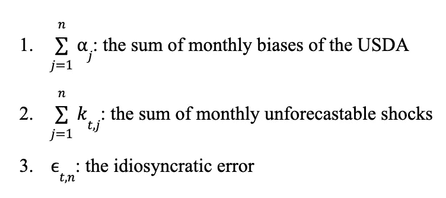
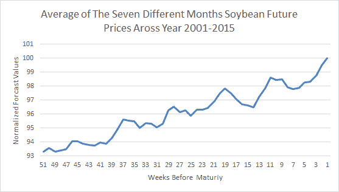
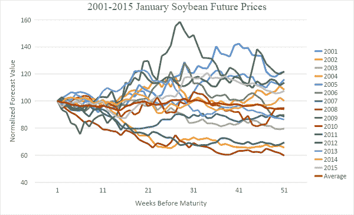
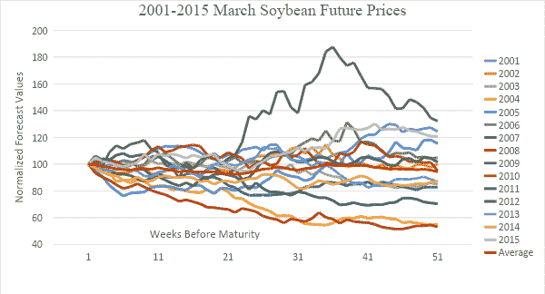
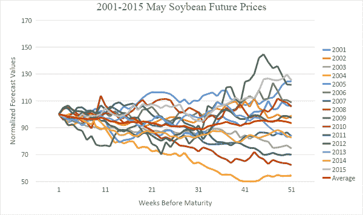
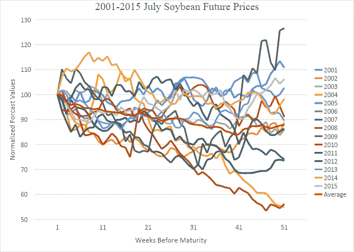
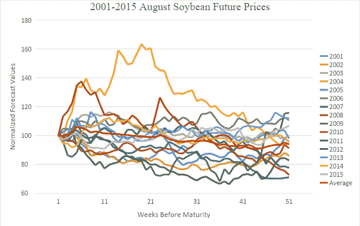
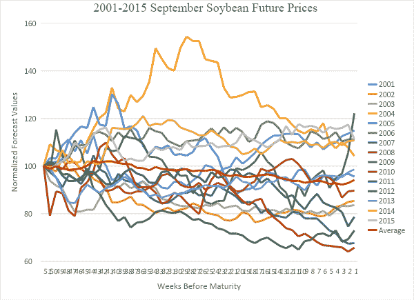
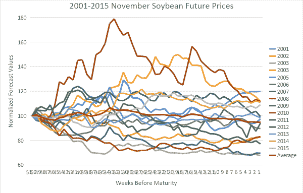
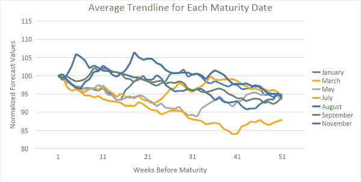

# 美国农业部的大豆期末库存预测会影响市场吗？

> 原文：<https://medium.com/codex/are-the-usdas-soybean-ending-stocks-projections-influencing-the-market-5c22a788be14?source=collection_archive---------34----------------------->

**作者:吴倩蓉、瑞安·古德里奇和德莫特·海斯| 2016 年**

# ***执行摘要***

美国农业部(USDA)提供大豆供应和利用的月度预测，这些报告对市场价格有影响。ISU 最近的研究表明，美国农业部的预测在统计上是低效的，在过去 18 年中，对期末库存的估计在统计上有显著的向上偏差。股票的平均年高估率约为 16%。美国农业部有偏见的预测给大豆期货价格带来下行压力，7 月和 8 月合约受到的影响最大，也最显著。到期前一年的 7 月合约的偏差约为 10%。随着到期日的临近，这种 7 月偏差逐渐下降，整个期间的平均偏差约为 5%。使用这些合同预售大豆的农民比没有偏见的情况下少收了 2%到 5%。

***建立偏差美国农业部预测***

美国农业部 1985/86 至 2013/14 销售年度的大豆期末库存效率是爱荷华州立大学肖最近所做研究的一部分。由于我们希望在美国农业部的偏见预测及其对市场的影响之间建立联系，并且因为这些结果尚未公开，我们将在此提供这项工作的简要总结。

根据 Davies 和 Lahiri 提出的方法，Xiao 将预测误差分为三个部分:不可预测的冲击、预测者的特殊误差和偏差。如果我们将 St 表示为销售年度 t 的大豆期末库存，将 Ut，n 表示为美国农业部对销售年度 t 结束前 n 个月的期末库存的预测，我们可以将预测误差想象成如下形式:

其中右侧包括以下组件:

通过从上个月的预测误差中减去给定月份的预测误差，开发出一个方程系统来执行统计检验。在可视化之后，第一差分方程可以被认为遵循如下形式:

除了冲击、偏差和特质误差之外，肖还引入了一个变量来解释美国农业部在预测时是否没有考虑到所有已知的信息。由于在任何一个时间考虑所有已知的信息是不切实际的，他使用的度量是最初的预测和下个月的修正之间的差异。这两个值之间的任何差异都意味着，在公布了他们的月度预测后，美国农业部获得了可能会对他们的预测值产生影响的进一步信息。

在此基础上，他为每个营销年度开发了以下等式系统，其中 N 代表离营销年度结束日期最远的预测:

该系数代表美国农业部每月下调预测的数量，该系数衡量美国农业部利用新信息的程度。的无效假设

暗示 Ut，n 是期末存货 st 的有效预测。

为了估计方程组，使用贝叶斯马尔可夫链蒙特卡罗方法，先验选自现有文献(Gelman (2006))。选择这种方法是为了适应月冲击变量的异方差性

和由于特殊误差变量引起的方程的自相关。举个例子，

由此得出的大豆系数明显不同于零，这意味着美国农业部对期末库存的估计是低效的。他发现α=1.37%，这意味着美国农业部每月将其预测下调约 1.37%，或者相当于美国农业部倾向于高估期末大豆库存。对大豆期末库存的最大预测(6-16 个月)将高估期末库存 21.92%(公式如下)。按年度计算，高估了 16.44%。大豆的预期为 51.37%，这意味着如果美国农业部上个月将其预测上调 1%，它将把本月的预测上调 0.5137%。更新中的这种序列相关性表明，当美国农业部意识到自己高估了库存时，它会很慢地让市场参与者知道。

***与美国农业部大豆期末库存预估相关的未来价格偏差***

随着美国农业部大豆期末库存预测出现偏差，下一个问题是，这种偏差是否会导致期货市场的大豆价格低于其他情况。为了探索这种可能性，我们利用了摩尔研究中心从 2001 年到 2015 年的历史大豆周期货价格。

在下面显示的结果中，我们提供了每个到期日每年(2001-2015)的标准化周价格，将到期价格设置为 100。由于期货价格必须在到期时收敛于现金价格，周价格的显著正趋势线将指示价格在到期前向下偏移，并且这种偏移随着合约到期而消除。

下图总结了结果。它显示了大豆期货合约跨合约月份和年份的平均变化。平均而言，大豆期货市场低于同一市场的收盘价。在到期前一年，低估程度最大，随着美国农业部减少结转规模，低估程度逐渐消失。

上面显示的总结幻灯片隐藏了巨大的年度和合同可变性。这些图表如下所示。如图所示，每个到期日的平均趋势线的斜率为正，表明期货价格实际上低于相同合约的到期价格。

**图 1 . 2001-2015 年 1 月、3 月、5 月、7 月、8 月、9 月、11 月大豆期货合约到期前的标准化年度周大豆期货价格。**

**图 2 . 2001-2015 年 1 月、3 月、5 月、7 月、8 月、9 月、11 月大豆期货合约到期前的 15 年平均标准化年度周大豆期货价格。**

为了确定价格趋势中显示的向下偏差的统计意义，对 1 月、3 月、5 月、7 月、8 月、9 月和 11 月期货合约进行了 t 检验。结果显示，7 月合约的偏差在统计上是显著的(p 值:0.03)。考虑到每个合约到期日的平均价格趋势线存在上升趋势，其他月份缺乏重要性可能会令人惊讶。这在一定程度上是由于将 2012 年纳入数据带来的噪音。

***偏差的原因***

在期货市场看到一致的偏差是非常不寻常的。在过去 15 年里，投资者只要做多大豆期货，就会获得可观的利润。这与有效市场假说直接矛盾。这种偏差很有可能部分是由于美国农业部高估了结转的规模。但这并不意味着美国农业部的预测者在发布这些预测时没有尽最大努力。在此期间，美国大豆出口飙升，美国农业部的预测者和其他市场参与者可能对此感到意外。出口增长的大部分是对中国，很难预测甚至理解这个市场。

美国农业部逐渐更新预测的证据更令人担忧。证据表明，一旦预测者意识到他们错了，他们就会将调整分散到几个预测中。这可能有助于减少市场波动和对预测者的关注，但它会给市场带来扭曲，而这种扭曲很容易消除。