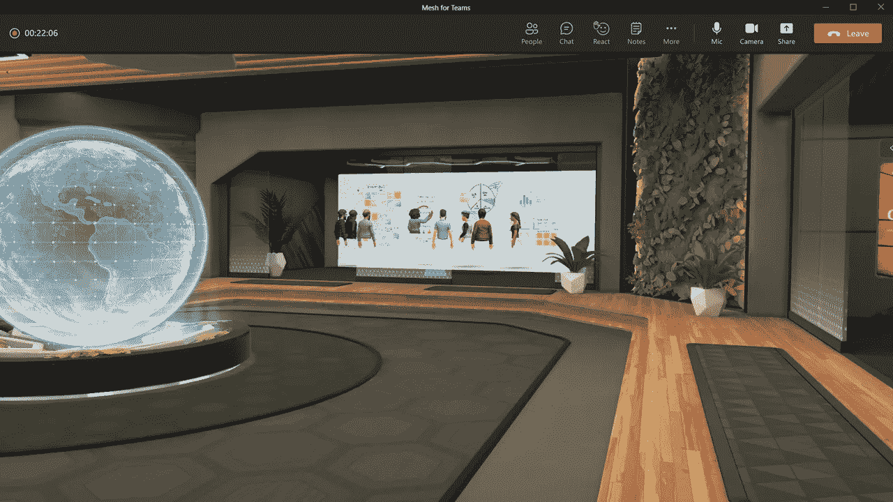

# 我们注定要被困在元宇宙吗？

> 原文：<https://medium.com/codex/are-we-doomed-to-be-locked-in-to-the-metaverse-ac4533ab6437?source=collection_archive---------6----------------------->

## 科技公司承诺的新的想象中的元宇宙似乎令人兴奋，但我们必须小心梦游进入这些技术。

“在未来五到十年内，很多这类产品将成为主流，”— [马克·扎克伯格](https://www.youtube.com/watch?v=Uvufun6xer8)在元宇宙。

当前的技术炒作似乎是“元宇宙”的想法，这是一个新的未来沉浸式虚拟世界，经常被比作 *Ready Player One。*简而言之，元宇宙是数字世界和物理世界的结合，我们的体验要么发生在数字内容覆盖物理世界的混合区域，要么发生在完全的数字世界，我们可以与物体和其他人互动，就像他们就在我们的物理世界中一样。它不仅仅由一种技术组成，而是新兴技术的组合，如[扩展现实](https://www.weforum.org/agenda/2021/10/facebook-meta-what-is-the-metaverse/)和[数字双胞胎](https://www.dezeen.com/2021/07/23/digital-twins-metaverse-david-weir-mccall-epic-games/)。

科技公司首席执行官的大胆言论，如“[元宇宙将成为移动互联网的继承者](https://www.youtube.com/watch?v=Uvufun6xer8)”，以及对他们想象中的元宇宙的描述，助长了这种技术炒作，并反映出科技公司已经假设他们的元宇宙技术将成为规范。

扎克伯格的元宇宙包括能够在虚拟环境中参加音乐会。来源: [Meta](https://www.youtube.com/watch?v=Uvufun6xer8) 。

然而，这一切都让人感觉似曾相识。社交媒体平台承诺连接世界，然而我们一次又一次地看到它们把我们分开。目睹了在这些平台深深融入我们的生活后监管这些平台的困难，我们开始尝试在元宇宙被锁定之前了解并潜在地监管它是至关重要的。正如 Collingridge 所详述的，当技术变得根深蒂固，我们不能再选择退出技术时，就会发生这种情况。这使得该技术在经历了有害影响后更难监管。

随着脸书[将自己](https://www.nytimes.com/2021/10/28/technology/facebook-meta-name-change.html)更名为‘Meta ’,正式将他们的[重心](https://www.theverge.com/22588022/mark-zuckerberg-facebook-ceo-metaverse-interview)从脸书转移到元宇宙，各公司都急于迎合这种炒作。其他公司如[微软](https://www.theverge.com/2021/11/2/22758974/microsoft-teams-metaverse-mesh-3d-avatars-meetings-features)也对炒作有所贡献，但对元宇宙在我们生活中可能扮演的角色有不同的看法。虽然扎克伯格的元宇宙是虚拟环境中的社交中心，但微软首席执行官塞特亚·纳德拉的愿景包括在工作场所和游戏中的合作。尽管如此，它们似乎都暗示了一件事:元宇宙是不可避免的。

随着企业竞相实现它们对元宇宙的愿景，必须就其潜在危害提出一些重要问题。虽然这项技术仍处于早期阶段，但我们需要避免“[技术梦游症](https://link.springer.com/content/pdf/10.1057/9781137349088.pdf)”,这种现象是由兰登·温纳提出的，关于我们如何“梦游”进入技术领域。根据 Winner 的说法，这是因为我们一直将技术视为辅助人类活动的工具，而不是“重塑活动及其意义的强大力量”。

这已经可以应用于元宇宙:我们目前将这项技术视为我们可以选择使用的工具，但我们不认为这些技术在与我们现有的系统集成时会有问题。

很明显，这些技术会以何种方式强加给我们，以及由此产生的问题。微软的元宇宙愿景包括一个沉浸式工作场所协作的虚拟环境，不同物理位置的员工可以与其他人一起工作，就好像他们就在他们身边一样。微软的新功能[团队网格](https://www.microsoft.com/en-us/mesh)涉及混合现实，以增强微软团队的虚拟会议功能，例如允许员工使用模仿他们面部表情和手势的定制头像。这项功能将于 2022 年发布，但[埃森哲](https://news.microsoft.com/innovation-stories/mesh-for-microsoft-teams/)获得了早期访问，为我们提供了这项技术如何在未来大规模实施的一瞥。

微软的 Mesh for Teams 为用户提供了虚拟空间，以促进身临其境的工作场所协作。来源:[微软](https://news.microsoft.com/innovation-stories/mesh-for-microsoft-teams/)。

通过 Mesh，埃森哲创建了一个埃森哲公园，这是一个共享的元宇宙，数万名员工使用笔记本电脑或虚拟现实耳机参加了活动。埃森哲的首席领导和人力资源官 Ellyn Shook 解释说，这些技术“将人类联系带入了我们的数字世界”。

虽然这听起来令人兴奋和充满希望，但它回避了一个至关重要的问题:我们会被我们为之工作的公司强迫接受元经文吗？[制度承诺](https://www.sciencedirect.com/science/article/pii/S0048733300001086)是一种技术锁定的方法，我们面临着在没有仔细评估其潜在危害和实施法规的情况下被迫采用这些技术的后果。

科技公司首席执行官们使用的语言，让元宇宙的潜在问题看起来似乎离他们很远。正如扎克伯格所说，“元宇宙完全实现还有很多年，所以我们有时间确保互操作性、开放标准、隐私和安全能够被嵌入其中。”

然而，脸书已经存在了 17 年，我们仍然不知道这个 2D 平台应该如何监管。Foley Hoag 的技术律师 Brittan Heller 反映了这些担忧，他强调，当我们沉浸在这些 3D 虚拟环境中时，我们不再试图监管内容，而是行为。我们如何才能找到一种方法，让用户对他们在元宇宙的行为负责？

然而，扎克伯格在一个方面是正确的，元宇宙仍然处于非常早期的阶段。因此，重要的是要记住，这种技术炒作可能永远不会真正成为现实。

科技公司描绘的[想象图](https://www.youtube.com/watch?v=Uvufun6xer8)展示了我们在虚拟环境中击剑、参加音乐会和下棋的全息图，这一切几乎完全模拟了我们的物理现实。人们很容易被这种愿景所诱惑，直到我们意识到访问这些虚拟世界需要体积庞大的耳机，目前[的最低价格为 299](https://www.oculus.com/quest-2/) 。记者[詹姆斯·d·沃什](https://nymag.com/intelligencer/2021/11/why-facebooks-metaverse-is-dead-on-arrival.html)批判性地写了元宇宙和虚拟现实耳机成为常态的未来，嘲笑戴着一个耳机表示“我不约会”

投资增强现实的风险投资家彼得·巴雷特也怀疑已经被在线视频电话弄得筋疲力尽的员工是否还会热衷于数字现实的其他层面。尽管元宇宙技术带来了承诺的“人类联系”，但最终，“我们希望和其他人在一起。”

总而言之，元宇宙有潜力改变我们的社会和工作生活中的社会技术过程。无论元宇宙最终只是新技术的炒作，还是有效地改变了我们体验互联网的方式，我们都需要讨论元宇宙的潜在危害以及我们如何监管它们。正如历史所证明的那样，我们习惯于梦游般地进入技术领域，并在了解其全部影响和危害之前就被锁定了。