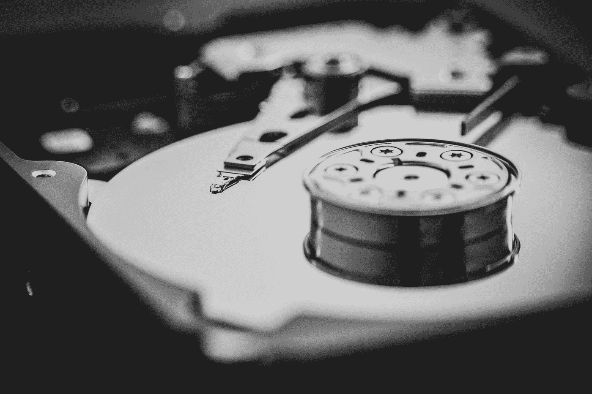

# 我们会丢失所有的数据吗？！？

> 原文：<https://medium.com/codex/are-we-going-to-lose-all-our-data-eb4cddde2967?source=collection_archive---------11----------------------->

## 我现在才明白，数字资产可能终究是短暂的…

丹尼·米勒在 [Unsplash](https://unsplash.com?utm_source=medium&utm_medium=referral) 上的照片

前几天，我买了一个 2 TB 的外置固态硬盘来保存我在 iTunes 上购买的所有东西的副本——大部分是电影、音乐会和电视剧。因为它是 DRMd 内容，苹果对此完全没有意见，他们在每次购买时都提供下载按钮。不用说，这些年来我已经…