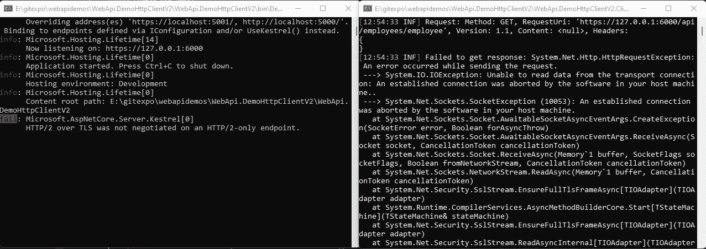
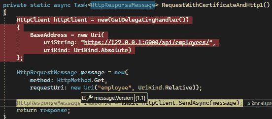
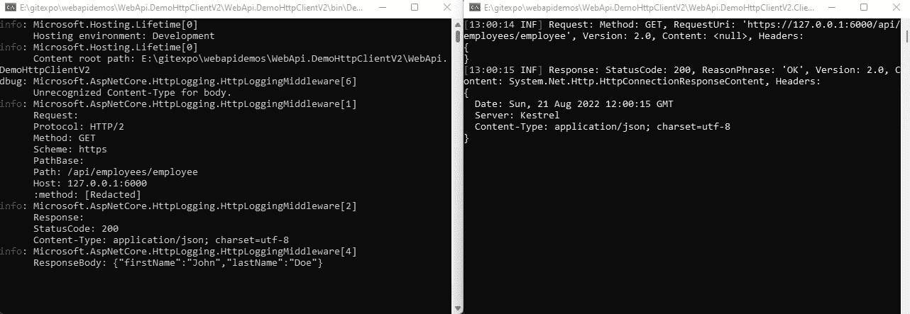

# 你真的在用 HTTP/2.0 吗？

> 原文：<https://medium.com/codex/are-you-actually-using-http-2-0-df4bf597fb15?source=collection_archive---------4----------------------->

## 将 HttpRequestMessage 配置为使用 2.0 版

米格尔·Á拍摄的照片。帕德里纳在[佩克斯](https://www.pexels.com/photo/close-up-shot-of-keyboard-buttons-2882570/)

我不得不与 API 客户机、HTTP 客户机打交道，发送请求、处理响应、正确地使用。NET HttpClient、加载证书等等……在这段时间里，我一直在问自己:

"我使用的是什么版本的 HTTP 协议？"

当事情正常运行时，一切都很美好，但有时它们并不像预期的那样运行，我想对此进行调查(了解)。

我不会详细讨论 HTTP/1.1 和 HTTP/2.0 之间的区别，但是在它的[中，我最喜欢的是](https://cheapsslsecurity.com/p/http2-vs-http1/):

*   多路复用:**在一个**单个** TCP 连接上交错**请求和响应，而没有线头阻塞
*   二进制协议:二进制成帧层将消息分成帧(数据或报头)

> *您可以使用以下链接找到演示的链接:*[*https://github.com/ramihamati/webapidemos/tree/main/WebApi.*DemoActionConstraintFactory](https://github.com/ramihamati/webapidemos/tree/main/WebApi.DemoHttpClientV2)

# 调查详情

*   创建一个 API，配置内核只监听 HTTP/2.0，并为所有 HTTP 请求添加详细的日志记录
*   创建一个带有默认设置的 HTTP 客户端的控制台应用程序，并尝试访问 API
*   将 HTTP 客户端更改为使用 HTTP/2.0，并尝试访问 API

## API 设计

我创建了一个简单的项目，它有一个返回一些随机细节的端点，一个有名字和姓氏的雇员。

因为缺省情况下 API 将支持 HTTP/1.x 和 HTTP/2 协议，所以我手工配置了 Kestrel 监听选项，只使用 HTTP/2.0。

来源:[https://docs . Microsoft . com/en-us/dot net/API/Microsoft . aspnetcore . server . kestrel . core . listen options？view=aspnetcore-6.0](https://docs.microsoft.com/en-us/dotnet/api/microsoft.aspnetcore.server.kestrel.core.listenoptions?view=aspnetcore-6.0)

我的启动也很简单，我只是添加了 **Http 日志**来查看关于 API 处理什么请求的细节

最后，这是我的端点，它简单地返回一个带有预定义数据的雇员

## 带有 HTTP 客户端版本的控制台应用程序

我创建了一个简单的控制台应用程序，并进行了一些小的调整，以帮助我更好地了解正在发生的事情:

*   我用 Serilog 创建了一个日志记录器(就像格式化的输出，比简单地写入控制台要好)
*   我在记录请求/响应的 HttpClientHandler 上创建了一个 [DelegatedHandler](https://thomaslevesque.com/2016/12/08/fun-with-the-httpclient-pipeline/)

注意:我喜欢 HttpClientHandler 的管道特性，它为许多可能性打开了大门。我的委托处理程序很简单，不是原创的，我的代码来自:[https://thomaslevesque . com/2016/12/08/fun-with-the-httpclient-pipeline/](https://thomaslevesque.com/2016/12/08/fun-with-the-httpclient-pipeline/)

现在，我将粘贴整个控制台应用程序，然后我将向您展示在我测试的两种情况下会发生什么:

## 尝试 1:将 HttpClient 与 HttpVersion 一起使用。10

用默认的 HttpClient 调用 API 将会失败，因为 HttpRequestMessage 使用的默认版本是 1.0。

根据文档([https://docs . Microsoft . com/en-us/dot net/API/system . net . http . http request message . version？view=net-6.0](https://docs.microsoft.com/en-us/dotnet/api/system.net.http.httprequestmessage.version?view=net-6.0) )如果你是针对。Net Core 2.1 或 2.2 该值应为 2。我想情况并非如此。NET 6 因为这不是我调试时看到的:

## 尝试 2:将 HttpClient 与 HttpVersion 一起使用。20

我的第二次尝试是明确指定我们应该使用的消息版本，现在我确信我使用的是 Http2.0，我现在很高兴

感谢您的阅读和关注！