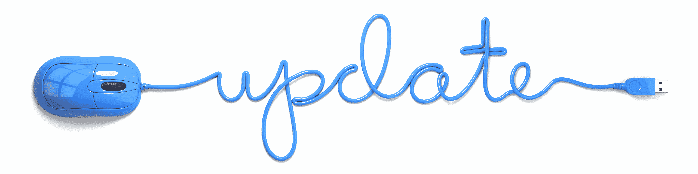
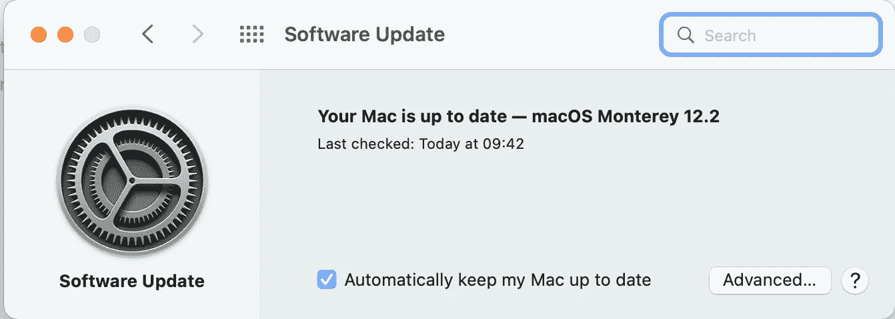

# 你害怕 iOS 更新吗？

> 原文：<https://medium.com/codex/are-you-afraid-of-ios-updates-a60c037ec0a?source=collection_archive---------16----------------------->

## 不要…你会更安全

我们都有。那些无害弹出的通知告诉我们有一个操作系统更新需要我们注意。然而，如此多的人只是不断驳回这些警告，好像它们是对他们一天的侵扰。

## 那么，你害怕什么？

我非常清楚，我们都被教导要对骗局保持高度警惕。也理应如此。但是软件更新通常不会通过电子邮件提供给我们，而是通过我们的台式机、笔记本电脑或设备发出通知。

我们来看看上周出来的最新 iOS 更新，15.3。正如你可能在我的另一篇博客中读到的，这篇博客一点也不有趣，也不花哨。所有好的东西都还在 15.4 的测试版中，将于今年晚些时候发布。在那个版本中，我们将拥有所有我们喜欢的东西，新的表情符号，按钮和布局，由于这些花里胡哨的东西，对那个更新的接受度无疑会明显更高。

但是 15.3 主要是为了你的安全。它包含许多错误和故障修复，但最重要的是，安全功能。这些功能可以让你免受各种在线伤害，甚至可能有助于避免被黑客攻击。然而，还是有很多 iPhone 用户逃避它。我认为这可能值得更深入地探究一下为什么会这样。

 [## iOS 15.4——你激动吗？

### 目前，仅处于测试阶段，但很快就会出现在你身边的 iOs 设备上！

medium.com](/codex/ios-15-4-are-you-excited-886be765138c) 

## 注意力和焦点

这些讨厌的通知既烦人又让人分心。听着，我不是清教徒，当我看到他们冒出来的时候，我的牙齿会像其他人一样磨牙。不可避免的是，当我试图专注于某件事时，比如写这些博客。在这种情况下，我试图在全屏模式下尽可能不受干扰地写作，以避免尽可能多的干扰，以免丢失我的线索。

更新确实会导致压力和注意力分散。我似乎记得在 Windows 平台上甚至更糟，但在 Mac 和 iOS 上我们仍然得到我们的公平少数。在谷歌上查一下**‘如何禁用更新’**的搜索次数，你就会明白我的意思了。

事实上，在研究这个博客的时候，我看到了一位瑞典教授的文章，他认为通知实际上是有害的刺激。在办公桌前度过的相当单调的一天，可能没有太多让我们感到压力的事情，这是一件好事。但这也意味着大脑的受体不受应激源的攻击，这些更新会导致皮质醇等激素的增加。我们的注意力受到侵犯，我们感到被冒犯了，我们的注意力不再放在当前手头的任务上。

## 赢还是输？

当在最近的一些调查中被问及为什么用户避免更新时，似乎有固定的答案；

*   担心更新的有效性
*   没有真正的好处
*   耗时太长
*   不清楚更新会带来什么
*   数据丢失
*   占用太多存储空间

诚然，所有这些都是合理的担忧，但我相当确信，没有哪家公司会发出已知问题的更新。别忘了，这些真的是在第一时间帮助保护我们。

由 ***路由器网络*** 对 1，000 人进行的研究发现，只有 43%的 iOS 用户在新版本发布后立即更新他们的设备。显然，仍有大约 15%的 iOS 用户**从未**更新他们的设备！

## 沉默的路线

苹果是静默更新的大师，当数据显示我们没有生产力时，它就在后台进行更新。这一切都很好，但是当然，即使这种方法也有它的缺陷。例如，您可能远离电源或不在网络上。因此，虽然乍一看这似乎是一个赢家，但它确实有其局限性。

## 完成它——少了一件让你担心的事

所以，下次当你在 Mac 电脑的右上角弹出讨厌的小通知或在 iOS 设备上收到消息时，不要忽视它，停止推诿，点击 ***下载&安装*** 。你最终会更安全，更少受到网络攻击，并确保你的设备尽可能平稳运行。老实说，不这样做，你是唯一的输家。

**每当我发布时，都会收到电子邮件通知。立即订阅。**

首次发布[https://www.talkingtechandaudio.com/blog](https://www.talkingtechandaudio.com/blog)2022 年 2 月 3 日