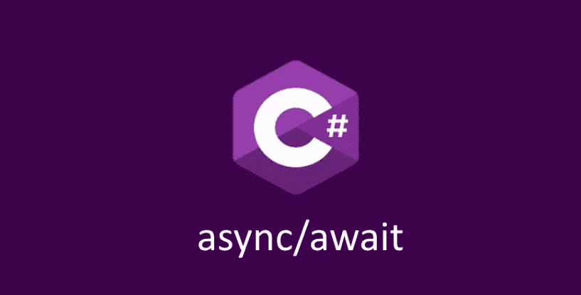
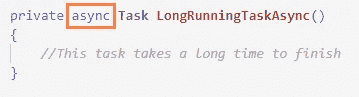
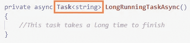
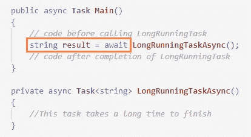
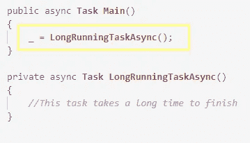
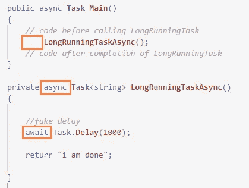
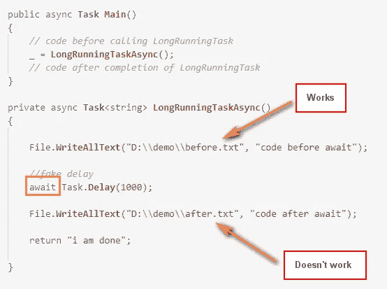
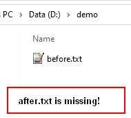

# 你丢弃异步函数是正确的吗？

> 原文：<https://medium.com/codex/are-you-discarding-async-functions-correctly-405da846766d?source=collection_archive---------0----------------------->

C#中的异步/等待

用 async/await 做正确的事情通常很棘手。这篇文章将帮助你识别在 C#异步函数中使用丢弃操作符时的一个常见陷阱。

# 异步和等待简介

您很可能已经知道了这一点，但让我们先快速了解一下基础知识:

异步函数是一个非阻塞函数，它运行在一个单独的线程上，因此不会阻塞 UI 运行的主线程。异步函数用 ***async*** 关键字声明:

异步函数声明

如果上述 ***async*** 函数的返回类型是一个对象或类型，只需将返回类型括在任务关键字后的< >中即可:

具有返回类型的异步函数

当调用 ***异步*** 函数并等待结果时，使用 ***await*** 关键字:

使用 await 调用异步函数

这段代码不会阻塞 UI，只要点击了 ***await*** 关键字，代码就会等待结果并释放 UI 线程。一旦从底层函数获得结果，代码将继续执行下面的命令。

# 什么是丢弃运算符？

当你需要调用一个长时间运行的任务，但是 ***不想等待结果*** 时，你使用一个丢弃操作符。这将任务抛出到不同的线程上，main 函数中的代码继续执行，而不等待长时间运行的任务的结果。

以下是放弃异步函数的方法:

调用异步函数时使用丢弃运算符

简单来说就是把 ***async*** 函数的结果赋给一个 _(下划线)代码就不会等待函数返回。即使***LongRunningTask***内部有异常，调用任务也不会知道。

# 丢弃操作符的捕捉

要记住的一件主要事情是，目标函数(其结果被丢弃)应该以这样一种方式设计，即它独立地处理异常并记录它们。因为调用函数永远得不到结果，所以您不知道它内部是否发生了错误。

# 在丢弃的函数中使用 await

由于***LongRunningTask***是一个*异步函数，它也可以使用 ***await*** 运算符！太混乱了？让我们看看这段代码:*

**

*在被丢弃的异步函数中使用 await*

***然而，这是绝对不应该的！**这就是这篇文章的全部意义。当您在一个原本被调用函数丢弃的函数中使用 ***await*** 时，任何出现在 ***await*** 关键字之后的语句都不会被执行！*

*让我们看看这个例子:*

**

*await 之后的代码不会在被丢弃的异步函数中执行*

*如果执行上面的代码，你会注意到 ***before.txt*** 生成了而 ***after.txt*** 没有！*

**

*文件丢失*

*此外，即使您将代码包装在 try/catch 块中，也不会引发任何异常。*

# *结论*

*因此，您可以看到使用 discard 操作符是有用的，但也是危险的。如果您不小心在丢弃的函数中使用了 await，之后的代码将永远不会执行，您也永远不会知道！在某个地方记录被丢弃函数的结果并跟踪可能的错误变得极其重要。*

*希望这对您的编程之旅有所帮助！*

# *编辑后*

*这篇文章从这个领域的其他专家那里获得了一些意想不到的评论。因此，我认为我应该在这里澄清一两件事。*

1.  *当你丢弃一个*长时间运行的*函数，该函数需要比如说 5 秒钟才能完成，并且*主*(调用)函数在 5 秒钟之前(丢弃后)就退出了，那么*长时间运行的*函数中`await`之后的语句的执行将**而不是**被执行。*
2.  *如果*主*函数丢弃后有更多的工作要做，并且完成*本身*需要 5 秒以上，那么*长时间运行* **中`await`之后的语句将被执行**。*
3.  *因此，**不能保证*长运行*会完全执行，除非你确定只要*长运行*完成，你的*主*就会继续运行。***

*这篇文章背后的想法是避免一个可能导致意外行为的陷阱，我没有提到这是一个绝对的情况。这是基于我的实践经验，我在产品代码中看到的情况，而不仅仅是我随意提出的理论:)*