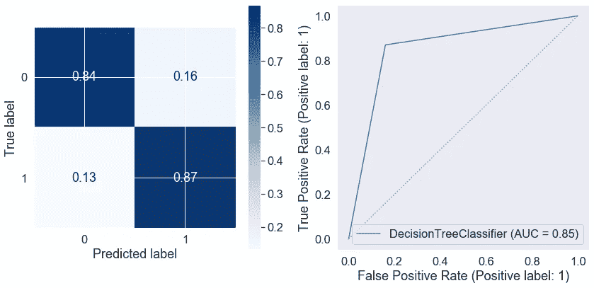

# 你真的是你所说的那个人吗？

> 原文：<https://medium.com/codex/are-you-really-who-you-say-you-are-10be5b06b825?source=collection_archive---------4----------------------->

## 你的网上约会资料透露了你什么？

网上约会打破了传统的约会方式，成为我们希望找到爱情和浪漫伴侣的互动方式的核心支柱之一。在线约会现已存在多年，但尽管 2013 年只有 11%的美国成年人报告使用过约会网站或应用程序，但随着时间的推移，用户比例稳步上升，2019 年有 30%的美国成年人报告他们使用过/使用过约会网站或应用程序(皮尤研究中心)。

但是为什么网恋会变得如此流行呢？这一次，随着技术的进步并成为我们生活中不可或缺的一部分，我们作为一个社会的生活方式发生了巨大的变化。世界现在就在指尖！另一方面，在我们的职业生活中，我们也变得更加忙碌，时间紧，压力大。所以网上约会是一种简单而有效的方式来结识有相同兴趣和信仰的人。另一方面，网上约会也大大拓宽了潜在浪漫伴侣的范围，远远超出了一个人的社交圈。

但是网恋产生有意义的关系的效率有多高呢？皮尤研究中心(Pew Research Center)的数据显示，30%的美国成年人报告使用过在线约会网站或应用程序，其中只有 12%的人报告与他们通过在线约会认识的人结婚或建立了稳定的关系。事实上，50%的美国成年人认为网上约会并没有真正影响他们的约会和/或关系，而 22%的人认为网上约会产生了积极的影响。然而，26%的人认为网上约会对约会有负面影响。这在很大程度上归因于用户档案中的不诚实和虚假陈述。这是因为在网上比在网下更容易撒谎，尤其是关于一个人的外貌或工作。网上约会的谎言往往是微妙的，它们代表了一个人试图尽可能好地描绘自己，只有轻微的夸张。然而，一些用户在更高的程度上使用欺骗，完全创造了一个新的角色。这个被称为“钓鱼”的概念变得越来越普遍，这一点在网飞的 *The Circle* 等新的真人秀节目中得到了突出体现。

在网上约会平台上呆了多年后，我开始思考:有没有一种方法可以让一个人的个人资料暴露出他的真实身份？使用来自科学家约会项目(Code Academy)的 OkCupid 个人资料数据集，其中包含来自 59，946 个用户的信息，我使用机器学习工具来建立模型，以预测 OkCupid 用户的性别。这个数据集是从 2012 年的活跃个人资料中刮出来的，包含了关于性别、性取向、种族、身体特征、饮酒和吸毒习惯的几个层次的信息，以及关于收入、宗教和教育水平的信息。

因为开发机器学习模型依赖于多次尝试来增加分类任务的成功率，所以评估基线成功率是要采取的重要步骤。我们可以使用虚拟分类器来做到这一点，虚拟分类器设置基线性能(即，通过简单的猜测应该达到的成功率)。

虚拟分类器模型的结果

在这种情况下，虚拟分类器总是预测用户是男性，我们通过查看性别就知道肯定不是这样！这个数据集中，尽管男性比女性多(比例大约是 2:3)，但肯定有很多女性。

让我们看看是否可以通过使用更复杂的算法来改进我们的预测。逻辑回归一种机器学习算法，以统计学家开发的逻辑函数为基础来描述人口增长的特性。总的来说，逻辑回归是一种简单且非常有效的生成二元分类预测模型的方法。所以，我决定先看看逻辑回归模型是否能很好地预测 OkCupid 用户的性别。

逻辑回归分类器的结果

从结果来看，逻辑回归模型似乎是预测 OkCupid 用户性别的相当好和准确的模型，因为它可以正确预测 84%的女性用户和 91%的男性用户。然而，让我们看看我们是否还可以使用不同的分类器来进一步改进我们的预测。

决策树算法设置连续的和分层的决策。使用决策树的目的是创建一个训练模型，该模型可用于通过学习从先前数据推断的简单决策规则来预测目标变量的类别或值。

决策树分类器的结果

看起来我们的决策树模型并不比逻辑回归模型更好。也许单个决策树不足以根据我们的数据集包含的众多特征来明确定义性别。也许我们需要在我们的模型中整合多个决策树，使其表现得和逻辑回归一样好，甚至更好。我们可以使用随机森林算法来做到这一点，这是一种基于树的算法，它利用多个决策树的力量来做出决策。

随机森林分类器的结果

查看我们的随机森林模型，我们可以看到它是对单一决策树的改进。然而，看起来逻辑模型是比单个决策树或随机森林更健壮的模型，因为它是具有最佳准确性的模型，同时还具有高度的回忆正确性别的能力。

这些预测模型的一个有趣的特性是，它还告诉我们哪些特征对模型的预测更重要，这让我们能够深入了解在查看在线约会资料时应该寻找什么。

从随机森林分类器计算特征重要性

身高是这些预测模型考虑的最重要的特征。从数据中我们可以看出，在这个数据集中，男性的身高和女性的身高之间有明显的差距。这也是我们通过简单观察周围的人而知道的，男人一般比女人高。

在线约会资料中另一个似乎对区分男性和女性很重要的特征是体型，女性通常认为自己的体型比男性更有曲线和丰满。

性取向，特别是对双性恋的认同，在这些模型的决定中也有一定的分量，我们可以看到，在 OkCupid 的个人资料中，有更多的女性报告自己是双性恋，而男性没有。

在专业上，我们也可以考虑一些趋势。例如，与计算机相关的工作在男性中占绝对优势，而与医学和教育相关的工作在女性中占优势。

因此，如果你在一个在线约会网站或应用程序上看到自己，并且你对约会对象的真实性别有所怀疑，那么好好看看这些具体特征，看看它们是否能给你一个很好的线索，让你知道你到底在和谁说话。祝你好运:)

查看我的 [GitHub](https://github.com/dendar) 中的代码！