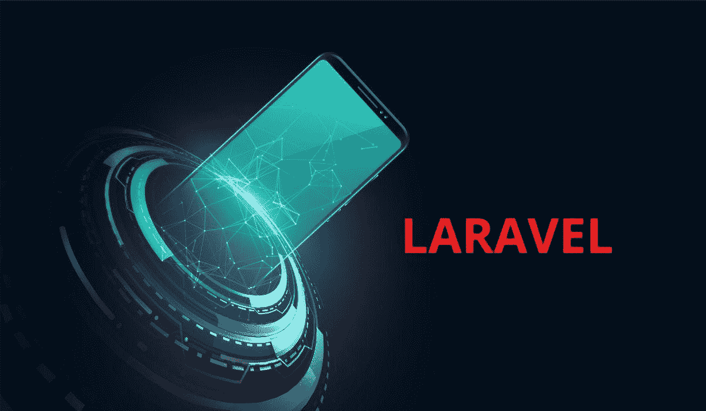
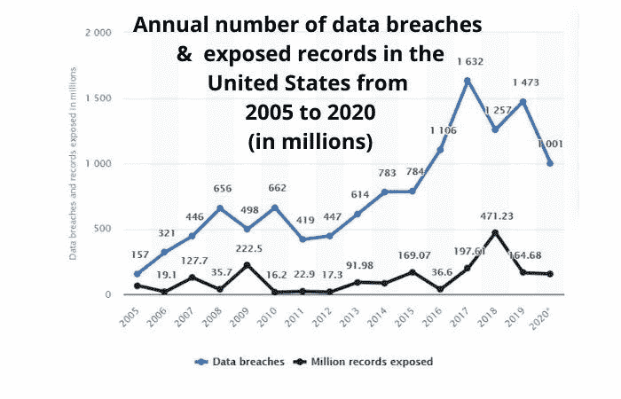
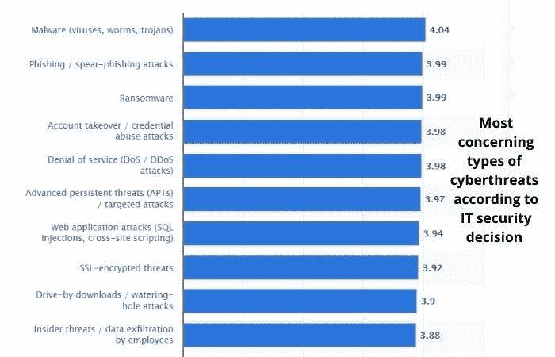

# 您认为应用程序安全性最重要吗？看看拉勒维尔就知道了！

> 原文：<https://medium.com/codex/are-you-the-one-for-whom-app-security-matters-most-look-no-further-than-laravel-c50cb1223e9f?source=collection_archive---------20----------------------->

由 [Freepik](https://www.freepik.com/)

Laravel 框架席卷了 PHP 社区，原因显而易见。凭借其富于表现力的语法、强大的工具和丰富的资源，它为初学者和高级开发人员提供了他们需要的所有工具，以最少的努力**创建复杂的 web 应用程序**。

根据 Statista 的数据，在 2021 年最常用的 web 框架中，Laravel 占有相当大的 **10.12%的份额**。根据 Cyblance 的数据，它还为排名前 100 万的网站中的 0.84 %提供动力。毫无疑问，开发一个 PHP 网站首先想到的就是 Laravel。

它最受新老用户追捧的特性之一是**安全性**，考虑到网络应用的本质以及保护用户数据的重要性，这一点很有意义。

**记住这一点，让我们看看 Laravel 提供的 7 大安全特性:**

# **1)认证**

身份验证是一种验证用户身份的方法。要控制访问，首先需要知道用户是谁；这就是认证。例如，假设您只希望管理员更新应用程序中的数据。

您可以根据用户是否具有管理员角色进行身份验证:**【admin authentic ation::class】->allow(function($ user))；**此方法将使您能够基于角色保护应用程序的各个部分。如果用户拥有管理员角色，他们可以编辑其他非管理员用户不能编辑的页面。

默认情况下，[**Laravel developers on hire**](https://www.pixelcrayons.com/hire-laravel-developers)使用**几种认证方法**为您提供应用安全。它支持记住用户并将信息安全地存储在数据库中。如果您将社交媒体网站用于鉴定目的，您可以将它们配置为自动同步用户信息，如姓名和电子邮件地址。

您也可以选择只允许经过身份验证的用户访问特定的页面或资源，这样访问者就需要一个帐户来查看重要的内容。确保您的网站对用户和管理员来说都是完全安全可靠的，这是一项挑战。

身份验证有助于确保其他人无法访问您网站上的任何信息。一旦用户登录，你可以更清楚地了解他们是谁，他们用你的网站做什么。

可用数据有助于您根据人们的使用方式确定安全修补程序的优先级或改进功能。*例如，如果大多数用户每周创建一个新帖子，但是一个用户在一天之内创建了 1000 个帖子，这是一个很好的迹象，表明帐户可能已经被破坏。*

# **2)守卫路线**

路由中间件是一种简单的方式来**保护你的应用程序的一部分**，而不需要修改你现有的路由。它使您能够通过仅在用户满足特定条件时才允许访问来保护特定的路由。例如，您可以设置一个课程，当用户登录时允许访问，否则返回 false。

**注意:**重要的是要记住，无论中间件处于什么样的位置，先前通过身份验证的用户总是被允许访问。这种方法是会话(需要在服务器上存储信息)的替代方法。如果你选择走这条路，**少用会话**并存储最少的信息。

# **3)加密**

在一个数据泄露变得越来越普遍的世界里，加密应该是理所当然的。无论是当地的咖啡店、大公司还是政府，没有人能免受黑客和安全威胁的影响。但是你可以保护自己。只要加密你所有的文件并确保使用安全的 VPN 就能保证你的安全。

加密对于纳税申报表或财务信息等敏感文档至关重要，但对于保护密码和私人谈话也同样重要。保护您的密码数据库免受窥探的最佳方式是通过 OpenSSL 使用 **256 位 AES 加密。**

请看下面的信息图，它描绘了美国从 2005 年到 2020 年的数据泄露率。

来源:[Statista-数据泄露](https://www.statista.com/statistics/273550/data-breaches-recorded-in-the-united-states-by-number-of-breaches-and-records-exposed/)

**注意:**根据 Statista 的数据，2020 年有 1.558 亿美国公民受到数据泄露的影响。

# **4)密码哈希**

Laravel 的密码散列是它最好的安全特性之一。哈希生成一个你的密码的唯一表示，并存储在你的数据库中，而不是保存你的实际密码。

如果黑客进入你的数据库，他们只会看到你的密码的散列版本(而不是实际的密码)。但是即使他们破解了那个散列，他们也不能用它做任何事情。例如，只要你使用一个健壮的哈希算法——像 **bcrypt 或者 argon 2**——你的网站将会被保护免受暴力攻击。

此外，即使黑客从另一个网站窃取了散列密码(这是可能的)，他们也必须**逆向工程**精确的散列算法来恢复用户数据。

# **5) CSRF 保护**

CSRF(跨站点请求伪造)是一种典型的攻击，可以对您的网站造成严重损害，包括窃取数据，修改用户帐户和支付细节，甚至关闭服务。

CSRF 之所以如此危险，是因为它来自你信任的网络内的**。为了保护自己免受 CSRF 攻击，请确保在所有敏感的 POST 操作上使用令牌验证。**

Laravel 通过其内置的 VerifyCsrfToken 特性默认保护用户。嵌入的 CSRF 特性确保任何传入应用程序的请求都是真实的，而不是潜在的 XSS 攻击。当 VerifyCsrfToken 特性意识到请求是一种攻击时，它会拒绝请求& **返回一个 HTTP 500 错误。**

**注意:**HTTP 500 错误表示由于意外情况，服务器无法满足请求。

**跨站点脚本**是最令人担忧的网络安全威胁之一，其严重性为 **3.94 分(满分 5 分)。**这是一张描述常见潜在 IT 威胁的信息图，包括跨站点脚本。

来源:[Statista-网络威胁](https://www.statista.com/statistics/500946/worldwide-leading-it-security-threats/)

聘请 Laravel 开发人员将高级安全功能集成到您的应用程序中，以确保其安全，免受潜在威胁。

# **6)会话管理**

用户会话对于任何 web 应用程序都是至关重要的，尤其是当我们讨论用户登录的时候。默认的 Laravel 会话提供程序使用 cookies 来存储您的用户信息，这意味着一旦他们的会话到期，他们重新登录， **Allstate 就会丢失。**

这意味着如果您想要保护任何类型的有状态信息(包括用户是否登录)，您将需要设置您的会话。通过使用加密 cookie 而不是标准 cookie 来存储您的会话信息，您可以防止它被任何可能访问您的服务器配置文件的人篡改。

# **7)饼干保护**

在前一点上我们已经讨论过了，但这是一个值得详细讨论的问题。Cookies 用于存储重要数据，如加密密码或令牌。如果攻击者找到了访问这些 cookies 的方法，他们就可以窃取您的身份并对您的系统造成严重破坏。

好消息是，Laravel 通过为每个会话生成随机密钥，内置了针对这些攻击的保护。每个密钥都是一次性使用的，当您离开页面时，它会自动被丢弃。

# **结束**

以上是 Laravel 提供的顶级安全特性。我希望这篇博客能够成功地回答为什么 Laravel 是创建和开发安全 web 应用程序的最佳选择。

联系印度的一家Laravel [**网络开发公司**](https://www.pixelcrayons.com/web-development/) 以合理的预算创建一个高度安全的应用程序。