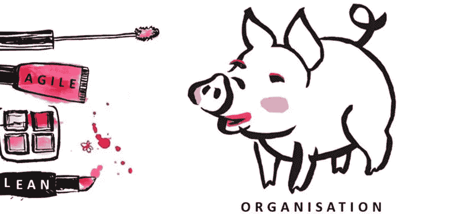
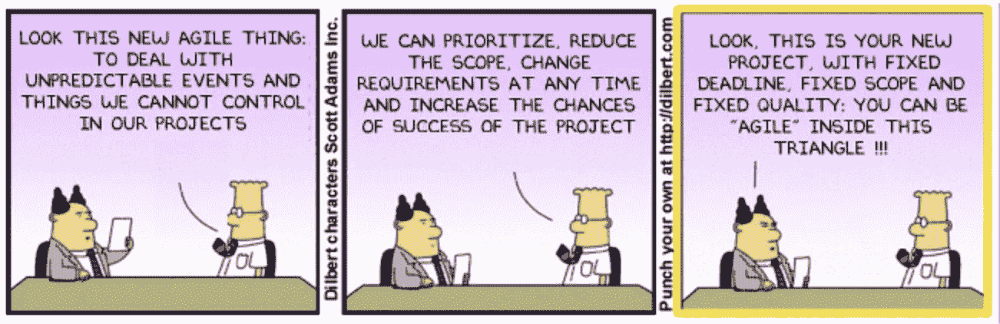
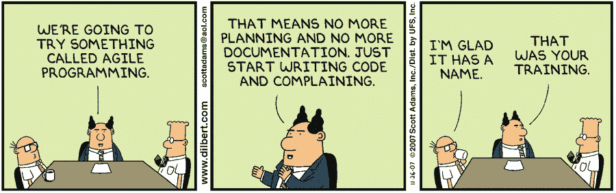
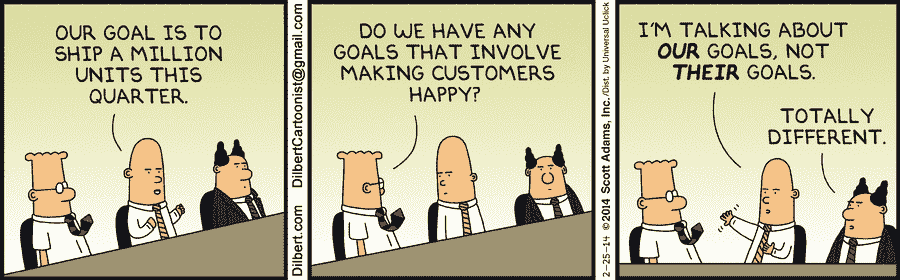
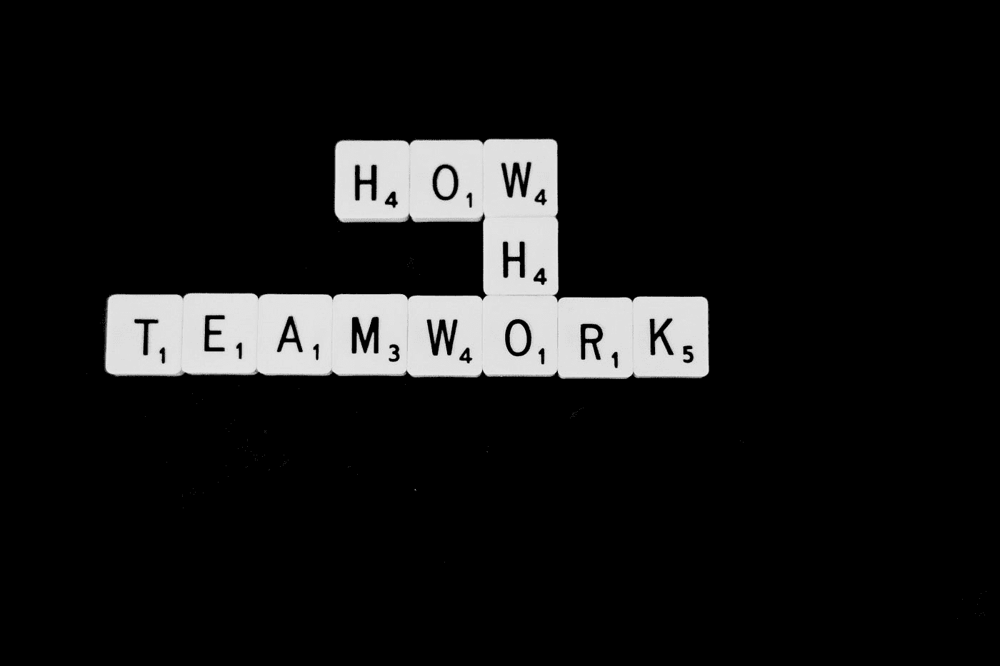
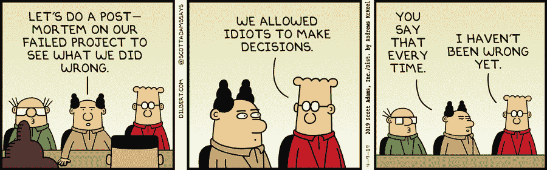
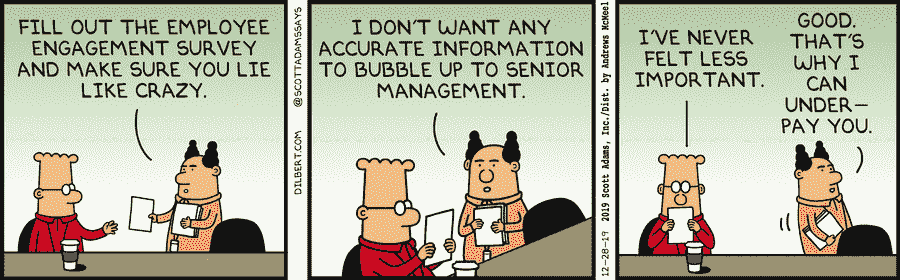

# 你是在追随敏捷还是口红敏捷？

> 原文：<https://medium.com/codex/are-you-using-agile-or-lipstick-agile-9daa68280963?source=collection_archive---------4----------------------->

敏捷方法创建于 2000 年初，但在 2010 年开始加速发展。

从那时起，越来越多的组织试图在他们的核心价值观和实践中变得敏捷(人们称之为“生活敏捷”)，但其他跟随他们的人只是吹嘘自己是敏捷的，并到此为止，而没有解决核心问题并遵循其原则。(称之为“口红雅居乐”)

在本文中，我们将围绕 Lipstick Agile 回答以下问题:

**为什么我们称之为“口红雅居乐”？**

**它的特点是什么？**

**什么时候你应该警惕？和**

**怎么克服？**

那我们开始吧！！！

# 为什么？

首先，我们来过一遍“口红雅居乐”这个名词。

我很抱歉从 Stefan Wolpers 那里借用了这个术语，但是这个术语既简单又复杂。

为什么它被称为“口红敏捷”的一个基本解释是这个故事中的第一个图像的简单说明，其中一只猪被迫涂口红和化妆，以使它看起来很好。很明显，即使我们涂了同样多的口红，猪的本质仍然是猪，即使我们预期它涂了口红后会更好，它也会做得和猪一样好。

> 同样地，如果你试图强迫个人接受敏捷宣言，而不解决组织和个人的静态和僵化的思维模式，你就落入了唇膏式敏捷的陷阱。

虽然这是一个非常简单的术语解释，这个术语的复杂性在于找出你是否在使用口红敏捷？

因此，我将在下一部分尝试解决和理清这种复杂性。

# 什么？

现在，口红敏捷的特质是什么？如何鉴别自己是否陷入口红雅居乐？

为此，作为个人/领导者，你需要通过对自己真实来问自己这些问题。不要用你的理论知识来回答，而是用你的实践来回答。

照片由[迈特·沃尔什](https://unsplash.com/@two_tees?utm_source=medium&utm_medium=referral)在 [Unsplash](https://unsplash.com?utm_source=medium&utm_medium=referral) 上拍摄

准备好了吗？

他们在这里:

1.  你的团队或个人的思维模式是否僵化？他们或你是欢迎变化还是抵制变化？
2.  你对收入、合同和客户保持率等数字的胃口大吗？或者能不能对负数灵活一点？
3.  你坚持你的组织/团队设定的流程和工具吗？或者你授权或激励个人去探索各种过程和工具吗？
4.  与票证和文档的历史相比，工作软件对您来说重要吗？

如果你内心给出的答案是在没有到中性的尺度上，那么你绝对是在用口红雅居乐。即使你大部分都同意，我也会马上戳破这个泡沫。但在此之前，你可能会想，这些问题似乎很熟悉。你是对的！！！这些直接来自于敏捷宣言。

所以，即使你对上述问题的回答是肯定的，让我们把这些问题进一步分解。

1.  即使敏捷仪式没有取得成果，你还会坚持吗？即使只是状态更新，你还会坚持开会吗？你甚至从回顾中找出好的、不好的或改进的地方吗？
2.  你认为增加收入或新合同或客户保持率是衡量成功的主要标准吗？你认为这些数字比顾客满意度更重要吗？
3.  对你来说，燃尽图、速度、吞吐量、时间日志、错误计数、吉拉报告和坚持组织/团队设定的过程比功能和个人的商业价值更重要吗？对你来说，在一次冲刺中匆忙地完成所有承诺的项目以显示生产力比那次冲刺的交付质量更重要吗？
4.  你是否希望所有的东西都被记录下来，无论是文档、吉拉票证、Sharepoint、OneNote 还是提交？比起担心已完成工作的影响，您是否更严格地维护个人所做工作的历史记录？

现在我假设，你的答案可能已经改变了，因为这是大多数“自我训练的敏捷组织”所做的。

> 现在，不要误解我的意思，我并不是说收入、合同、留存率等数字和燃尽、速度、报告等指标不重要。的确如此。但是只有当团队和个人在敏捷转型中足够成熟时，它才会发生。

**当你的团队或个人仍然没有敏捷思维或者没有受过敏捷思维的训练时，严格地遵循它们并据此做出决策是没有用的。事实上，这可能会对你的团队/组织产生负面影响。**

唇膏式敏捷适用于大多数以敏捷为荣的团队和组织，即使这是虚假的敏捷。只有当事情开始变糟时，它才会开始变得痛苦。这时候你就应该警惕了。我们将在下一节讨论这些警报。

# 什么时候？

照片由[埃利斯·陈嘉炜](https://unsplash.com/@eilisgarvey?utm_source=medium&utm_medium=referral)在 [Unsplash](https://unsplash.com?utm_source=medium&utm_medium=referral) 拍摄

当你实际上在使用口红敏捷的时候，你应该从使用敏捷的虚假骄傲中清醒过来。那个叫醒电话的信号是什么？

> 首先，第一个也是最主要的指标是你的客户。如果他们对你所交付的不满意，或者他们没有发现你所交付的特性的商业价值，那么你应该警惕了。

第二是个人的满意度。如果个人觉得他们正在做的工作没有任何意义，或者他们觉得会议或几个敏捷仪式是在浪费他们的时间而没有给出任何有成效的结果，或者他们觉得他们正在使用的过程和工具比设施更大的杀伤力，那么你应该警惕了。

第三是你对交付和团队表现的感觉。如果你认为烧毁，吞吐量，错误计数，错误严重性等。(是的，我在这里承认，度量是相关的)最重要的是，交付的商业价值偏离了方向，或者团队或个人与他们自己或与利益相关者不同步，并且他们仍然在孤岛中工作，那么你应该警惕了。

现在，我们知道了什么是叫醒电话的信号，我们如何克服它呢？这就是我们将在下一节讨论的内容。

# 怎么会？

照片由 [Unsplash](https://unsplash.com?utm_source=medium&utm_medium=referral) 上的[尼克·费因斯](https://unsplash.com/@jannerboy62?utm_source=medium&utm_medium=referral)拍摄

现在，让我们回到我在“什么？”部分。因为克服口红敏捷陷阱的最佳方案就在那里。

我问的问题是:你是否从回顾中找出好的、坏的或改进的地方？

回顾是一个非常重要的仪式，它让团队专注于哪些进展顺利，哪些进展不顺利，以及我们需要改进的地方。

> 大多数使用 Lipstick Agile 的组织/团队要么完全避开这个重要的仪式，要么只是为了……嗯，执行它而执行它。

是因为他们害怕个人会说出类似呆伯特的话吗？

我当然不希望如此。😁

回顾是为了名字而进行的，主要原因是随着时间的推移，个人和利益相关者对执行它失去了兴趣，比如哪些进展顺利，哪些进展不顺利，哪些需要改进等等。仅留在 retrospect 板中。它不会转化为未来冲刺的行动项目。

> 为了克服口红敏捷的陷阱，一个人应该授权并信任他们的团队、个人、利益相关者和最终用户来提供实际的反馈，而不是强加恐惧或让他们对没有成果的仪式失去兴趣。

另一个克服它的方法是设想和处理现实世界的商业价值。在商业价值尺度上衡量团队所做的工作。当个人觉得他们所做的工作没有增加任何价值时，授权他们提出危险信号。

要求个人记得举起红旗通过要求他们记住:
**“如果对你没有任何意义，它就不应该在那里”**

一旦你解决了这两个问题，第三个警报就会自动响起。

希望你觉得有用和实用。

快乐学习！！！