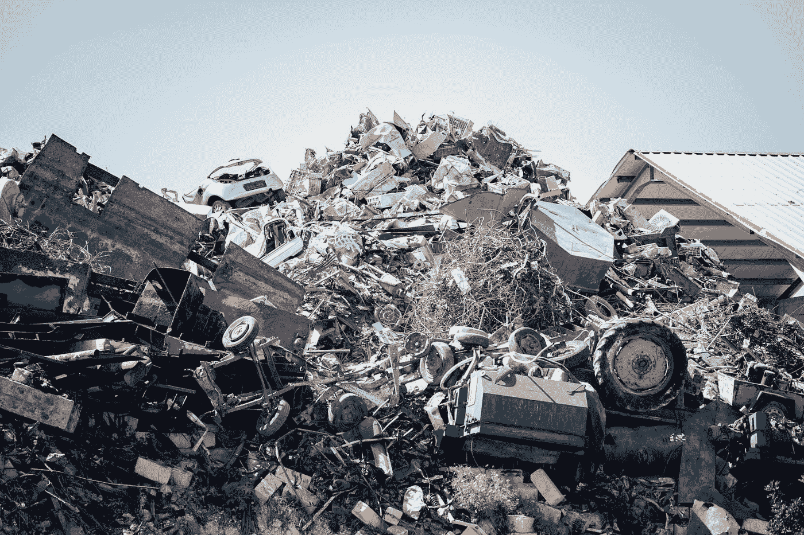

# Aria 角色是安慰剂代码膨胀垃圾，第 2 轮

> 原文：<https://medium.com/codex/aria-roles-are-placebo-code-bloat-garbage-round-2-b6bd5fcba8b?source=collection_archive---------5----------------------->

埃文·德米科利在 [Unsplash](https://unsplash.com?utm_source=medium&utm_medium=referral) 上拍摄的照片

一段时间前，我写了关于[咏叹调角色是代码膨胀肥料](/codex/are-aria-roles-ignorant-code-bloat-manure-97b3ad747a9f)。我不认为我需要写一个后续，但我们在这里。我已经看到越来越多的人不仅使用 ARIA，而且以一些最愚蠢、最糟糕的方式使用它。大部分这只是误解如何/什么/为什么某些咏叹调角色甚至存在，其他的只是更多的证明如何愚蠢的纯粹…