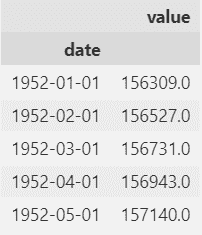
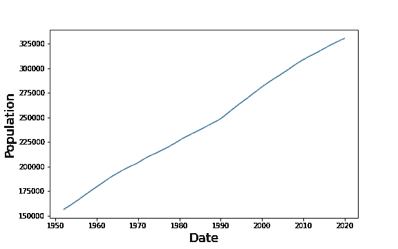
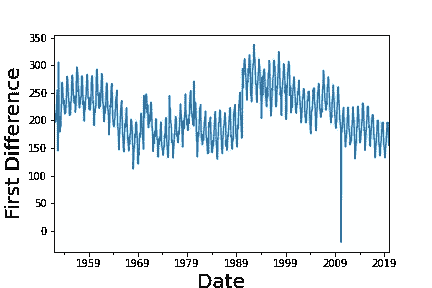
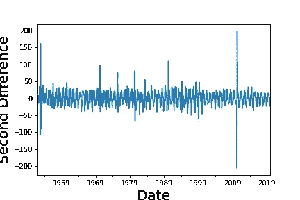
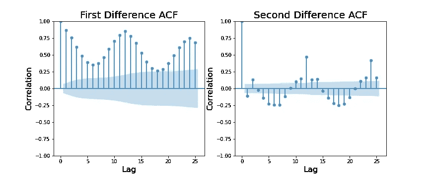
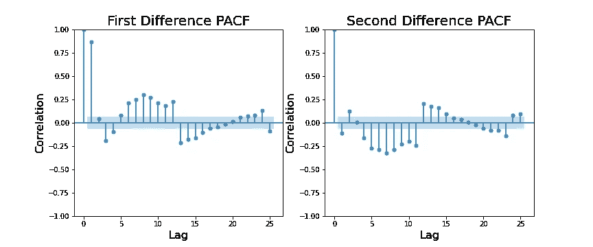
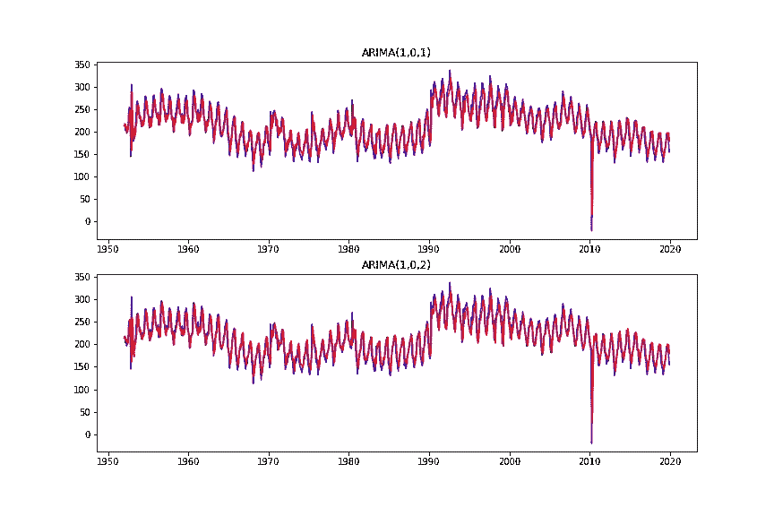
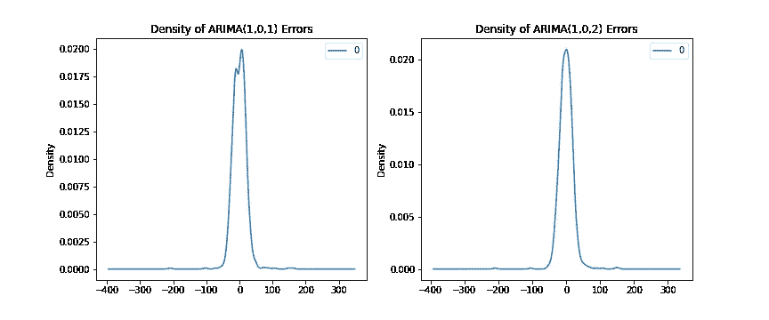
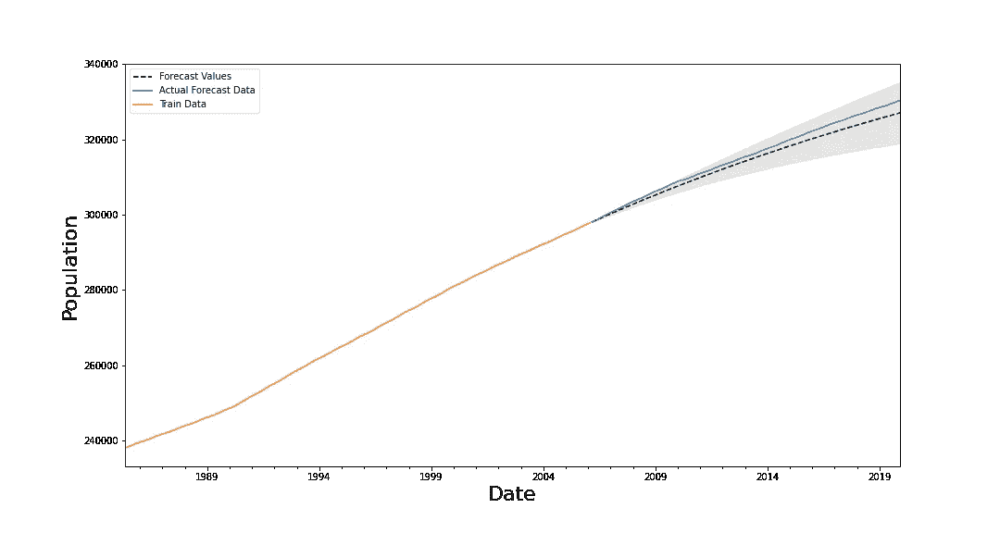

# 时间序列分析和预测的 ARIMA 模型

> 原文：<https://medium.com/codex/arima-models-for-time-series-analysis-and-forecasting-508c4a060f85?source=collection_archive---------7----------------------->

萨姆·穆格迪钦在 [Unsplash](https://unsplash.com/s/photos/pocket-watch?utm_source=unsplash&utm_medium=referral&utm_content=creditCopyText) 上拍摄的照片

# 摘要

ARIMA 模型是经济和金融中常用的预测未来的时间序列模型。在这里，我大致介绍了一下 ARIMA 模型，并展示了一个使用 Python 中的 ARIMA 来预测美国未来人口增长的例子。

我进行以下分析的 Jupyter 笔记本可以在我的 GitHub [这里](https://github.com/cbarger233/ARIMA-Population-Analysis)找到。

# ARIMA 到底是什么？

ARIMA 是一个首字母缩写词，描述了一种结合统计技术来建模和预测时间序列数据的方法。首字母缩写代表自回归综合移动平均。它在一个广义模型中结合了自回归和移动平均中使用的技术。

*   **自回归**是一个利用一个与其自身相关的序列的过程。简而言之，对于时间序列数据，我们通常有一个变量，而在线性回归中，我们建立两个变量之间的关系。自回归使用序列的过去值来预测未来值。我们使用的过去值的数量表示为 *p* 。
*   **综合**是指对数据进行差分，使时间序列*平稳*的技术。为了对数据求差，我们找到当前值和之前值之间的差。我们需要对数据集进行差分以使其稳定的次数表示为 *d* 。
*   **移动平均**是一种模型，它考虑了数据集的平均值以及当前和过去的误差项来预测未来。我们在 MA 模型中使用的过去误差项的数量表示为 *q* 。

这三种方法结合起来形成了我们的 ARIMA(p，d，q)模型。我发现学习的最好方法是通过例子(然后做)，所以让我们来看一个例子。

我们正在看的数据来自美国人口普查局在 T21 发现的数据。将数据加载到 pandas 数据帧中，并将日期设置为索引，如下所示:

人口数据集的前五行。

老实说，从 Kaggle 上的描述来看，这些数字是什么意思还不太清楚。我怀疑这些数字要么代表了几个月来美国的移民人数，要么只是总的人口增长/出生人数。无论哪种方式，人口数据很容易成为时间序列模型。这些数字从 1952 年 1 月开始，到 2019 年 12 月结束，我们总共可以处理 816 行数据。这些值按月递增。数据随时间变化的图表如下所示。

人口数据随时间变化的图表。

# 平稳性

从图中可以看出，随着时间的推移，有明显的上升趋势。然而，对于 ARIMA 模型，我们需要我们的数据具有所谓的*平稳性*，这是上面提到的。为了使数据集被认为是稳定的，它需要在一段时间内具有恒定的均值和标准差。从上面的图表中，我们的数据显然不满足这个条件，因为它只是随着时间的推移而增加。

为了使数据变得稳定，需要对数据进行变换。通常这是通过对数据求差来完成的。为了区别数据，我们只需要找到当前时间段的值和前一时间段的值之间的差异。这个概念可以推广到求第二差、第三差等。将差分方法应用于人口数据，我们发现我们的数据现在看起来像这样:

人口数据的第一个差异。

有人可能会说，这个数据比我们以前得到的数据更加稳定。有一个更明显的平均值，很可能在 200 左右，尽管它不是常数。标准偏差似乎也小于非差异数据的标准偏差。但是我们怎么知道我们的数据是否足够不同，可以用在 ARIMA 模型中呢？一种方法是使用扩展的迪基-富勒测验，该测验于 1979 年以统计学家大卫·迪基和韦恩·富勒的名字命名。简单地说，扩展的 Dickey-Fuller 检验(ADF)有一个零假设，即我们检验的数据是非平稳的。这意味着如果我们可以拒绝零假设，我们的数据就有必要的平稳性。

Python statsmodels 库有一个内置的 ADF，我在非差异和差异数据上使用它。对非差异数据执行 ADF 测试会产生-0.665 的测试统计值和 0.855 的 p 值。在 95%的置信度下，我们需要 p 值小于 0.05 才能拒绝零假设。因此，我们得到了预期的结果，即原始的、未修改的数据是不稳定的。

对差异数据执行 ADF 测试得到的测试统计值为-2.01，p 值为 0.282。p 值仍然不够低，不足以让我们拒绝零假设，尽管它明显低于非差异数据。这表明数据具有某种平稳性。让我们再次对数据进行差分，希望我们有一个更稳定的数据集来处理。第二次求差导致我们的数据看起来像:

人口数据的第二个差异。

上图更能说明一个稳定的数据集。它有一个明显的平均值 0，没有任何明显的趋势，除了一些向上和向下的尖峰。这表明它始终保持不变。此外，对转换后的数据进行 ADF 测试会产生一个接近于零的 p 值(2.11e-10)。由于我们的 p 值小于 0.05，我们有足够的统计证据表明我们的数据现在是稳定的。基于这一发现，我们可以考虑在我们的 ARIMA(p，d，q)模型中使用 d=2 的值，因为我们对数据进行两次差分以使其稳定。为了找到 p 和 q 的值，我们需要查看 ACF 和 PACF 图。

# ACF 和 PACF 图

ARIMA(p，d，q)模型中的“p”项告诉我们，我们将在时间序列数据中使用多少时间段的滞后。为了找到 p，我们看一下自相关函数(ACF)的曲线图。ACF 图告诉我们时间序列中的值之间的相关程度。在 y 轴上我们绘制了相关系数，在 x 轴上我们绘制了时间周期滞后量。我们的数据中有每个月的人口测量，因此一个滞后值等于过去的一个月。

# ACF 图

让我们看看一阶和二阶差分人口数据的 ACF 图。Python 中的 statsmodels 包有一个内置函数来完成这项工作:

一阶和二阶差分数据的 ACF 图。

为了澄清，在任何 ACF 图上，0 的滞后将总是具有 1 的相关性，因为数据点将总是与它们自身完全相关。

查看一阶差分 ACF 图，我们可以发现人口时间序列中的一些季节性。该图类似于正弦图，在每 12 个滞后周期后有另一个峰值。该图表明，任何 p 值高达 25 都可以很好地工作，因为对于不同的滞后期，数据与自身相关。尽管我们需要更多的信息来精确地缩小 p 值的范围。

对于二阶差分 ACF 图，看着它让我想到我们的数据是*过度差分*。我这样说是因为对于 1 滞后的时间周期，我们立即得到负的 ACF 值。在这种情况下，ACF 图上的负值意味着如果我们的人口在某个时间点增加，很可能在下一段时间我们的人口会减少。了解我们数据集的性质，这是没有意义的，因为我们的人口一直在增长。因此，查看这些 ACF 图，建议使用 d=1 的值，而不是我们之前确定的 d=2。

就第一个和第二个不同点而言，我们被困在了中间地带。虽然第一次差异不够，也显示了一些季节性，第二次差异的数据是过度差异。在尝试进行预测时，我们更倾向于使用差异稍小的数据，而不是差异过大的数据。

# PACF 地块

偏相关函数(PACF)图显示在控制了其他滞后变量的影响后，变量与其滞后值之间的相关性。它捕捉到了一个序列与其滞后值之间的相关性，而这些相关性是之前绘制的其他滞后变量所没有捕捉到的。

这可能有助于我们缩小在我们的模型中使用的 p 值，因为我们得出结论，许多值可以从一阶差分 ACF 图中工作。

一阶和二阶差分数据的 PACF 图。

从上述一阶差分数据的 PACF 图中，我们可以说，只有序列中的第一个滞后值具有显著的相关性。这意味着上个月的人口对预测本月的人口具有最显著的影响。由于其他值具有低得多的相关值，这表明 ACF 图中的高值可以简单地解释为仅仅是第一个滞后值。因此，我们可以为我们的 ARIMA(p，d，q)模型尝试一个 p=1 的值。

# 查找“q”

寻找 q 的最佳值包括查看 ACF 和 PACF 图上最先超出有效范围的点。基于一阶差分数据的 PACF 图，我们应该尝试 q=1 的值，因为这似乎是最后一个显著相关的滞后值。然而，建立模型非常简单，我们不妨同时尝试 q=1 和 q=2。

# 构建模型

我们的发现建议我们尝试以下模型:

我将在第一个差异数据集上训练模型，因此在训练中，我将设置 d=0，因为当我将数据馈送到 statsmodels API 时，数据已经是差异的。下图显示了模型如何拟合一阶差分数据。

ARIMA(1，1，1)和 ARIMA(1，1，2)模型的拟合。

要比较这两种方法，我们可以看看它们的误差密度:

模型的误差密度。

误差的密度图非常相似。不过，看起来 ARIMA(1，1，2)模型可能更倾向于 0，因为 ARIMA(1，1，1)模型看起来有偏差，预测值略高于其应有值。虽然我不认为这有什么关系。我将任意使用 ARIMA(1，1，1)模型来进行未来预测。

# 做预测

我将前 80%的数据分成一个新的 ARIMA(1，1，1)模型的训练集，后 20%的数据将用于进行预测和测试。结果可以在下图中看到。

人口数据的未来预测。

黑色虚线是预测的人口值，而蓝色线代表实际的人口值。灰色区域是模型预测的 95%置信区间。经检验，该模型的性能一点也不差。它捕捉到了总的趋势，并且实际人口完全在预测的置信区间内。

*原载于 2022 年 4 月 18 日*[*【https://cbarger.com】*](https://cbarger.com/projects/arima_modeling/)*。*