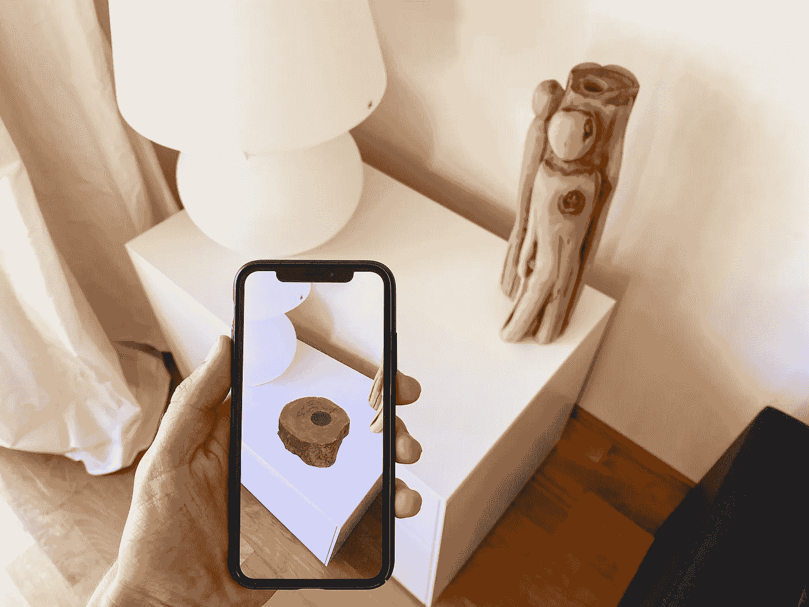

# Swift 中的 ARKit 框架

> 原文：<https://medium.com/codex/arkit-framework-in-swift-17f52ad970e0?source=collection_archive---------7----------------------->

## 如何为一个项目设置 ARKit？

图片由 [UNIBOA](https://unsplash.com/@uniboa) 在 [Unsplash 拍摄。](https://unsplash.com)

*增强现实(AR)描述了将 2D 或 3D 元素添加到设备摄像头的实时视图中的用户体验，使它们看起来像是真实世界的一部分。*ARKit API 通过结合设备运动跟踪、相机场景捕捉、高级场景处理和显示便利性，简化了构建 AR 体验。iOS 的前置或后置摄像头…