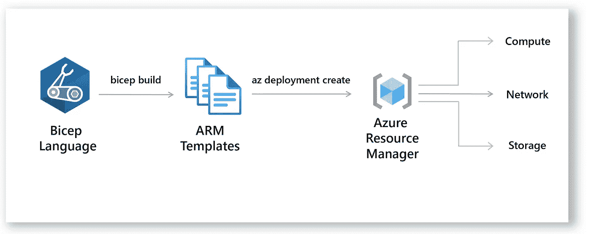

# 💪手臂模板或 Azure 二头肌——我应该使用什么？

> 原文：<https://medium.com/codex/arm-templates-or-azure-bicep-what-should-i-use-14e8662d3f27?source=collection_archive---------0----------------------->

比较 ARM 模板和 Azure 二头肌的奇偶性。

如果你是 Azure Bicep 的新手，这是一个新的开源项目，将基础设施的 Azure 原生语言定义为代码。

天蓝色二头肌

ARM 模板不会消失，但它们是以 JSON 格式表达的，对于我们中的一些人来说，它可能不是一种很好的以声明方式创作资源的语言…