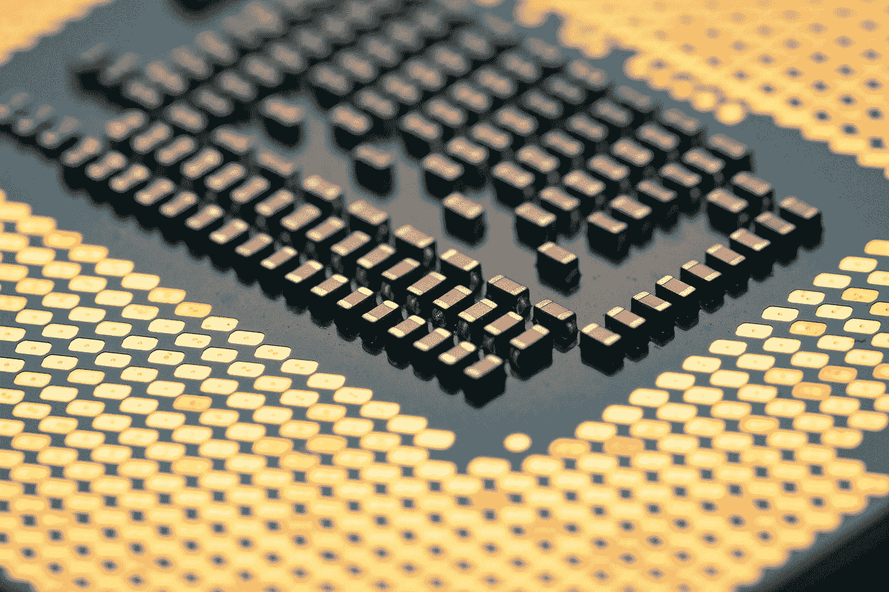

# ARM 争夺 CPU 霸主地位

> 原文：<https://medium.com/codex/arms-race-for-cpu-supremecy-b8b75b45b4c6?source=collection_archive---------1----------------------->

## 英特尔/CISC 终于要消亡了 ARM 会接管吗？

瑞安在 [Unsplash](https://unsplash.com?utm_source=medium&utm_medium=referral) 上的照片

**ARM** (曾经被称为高级 RISC 机器，现在只是 **arm** )对处理器市场采取了一种有趣的方法——与英特尔不同，他们不出售芯片，相反，他们授权一套设计，以便合作伙伴/客户可以构建称为 SOC(片上系统)的半定制解决方案。不要认为它是开源的(因为 ARM…