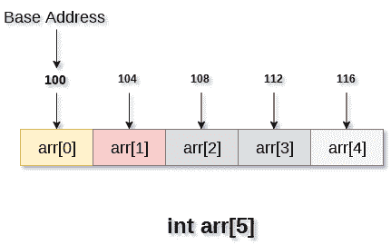

# Java 中的数组

> 原文：<https://medium.com/codex/array-in-java-3ff1df59081a?source=collection_archive---------16----------------------->

在今天的这一集里，我们将看到如何用 java 实现数组。

米歇尔·勒恩斯在 [Unsplash](https://unsplash.com?utm_source=medium&utm_medium=referral) 拍摄的照片

## **什么是阵列？**

数组是相似数据类型的集合。

像 int 的数组只能存储整数元素，string 的数组只能存储字符串元素。

一些现实生活中的例子是

1.  学生记录
2.  图书馆里的书
3.  盒子里的彩色钢笔
4.  排着长队的人

> **数组**是基于**索引的**和**第一个元素**存储在第 0 个索引的**处，第二个元素**存储在第 1 个索引的**处，依此类推。**

如果你不明白 index 的意思，那我们就通过一个例子来理解一下。

例如:**学生出勤记录，**你被标识为你的点名号，所以你的索引就是你的点名号，第一个学生一般点名号为 1，但是在**数组**中第一个元素的索引是 0(记住这个)。

在数组中，元素被存储在一个 ***连续的内存位置*** 。

**你说的*连续*内存是什么意思？**

这意味着如果整数数组的第一个元素在地址 100，那么下一个元素将存储在 104，依此类推。见下图。

在 Java 中，Array 是一个对象，它也可以存储原始数据类型和对象。现在我希望你知道对象，因为 Java 是面向对象的编程语言，但是，如果你不明白什么是对象，让我用一个例子来解释:

对象的标准定义是**“是类的实例”。**现在让我们假设你是学生，你的朋友也是学生，但是你是唯一的，因为你的属性，比如你的名字和你的学号。所以**学生是类**而**你是对象。**

从类创建对象/实例的过程称为**实例化。**

如果您仍然不理解类和对象，您可以尝试其他资源并花自己的时间，即使花了 1-2 周来熟悉这些概念。

让我们回到正题，看看如何在 java 中声明一个数组。

## 如何在 Java 中声明数组？

这里你有三个选择，但推荐第一个。

1.  int[]arr；
2.  int[]arr；
3.  int arr[]；

所以现在如果你知道 c/c++，那么你可能会想为什么我们在这里没有提到大小。

这是因为 java 中的数组继承了 Object 类，所以我们必须使用一个新的操作符来分配内存，这被称为实例化(创建一个类的对象)。

## 数组是一个怎样的对象？

这是因为当你声明一个数组时，一个类是动态生成的，所以我们必须使用一个 **new** 操作符来创建内存。

## 如何实例化数组？

1.  int[]arr = new int[size]；
2.  int[]arr = new int[size]；
3.  int arr[]= new int[size]；

现在你已经明白了，如何在 java 中创建一个数组。

## Java 中数组的大小可以增长吗？

不，数组的大小在 Java 中是固定的，但是你可以使用 Java 中**集合框架**中的 List。

> 如果你是 Java 新手，那么首先尝试自己实现所有集合的类，比如自己实现 List、Stack、Queue、Set、Map。

## 如何访问数组元素？

这与您在 C/C++或任何其他编程语言中所做的是一样的。因为数组是从 0 开始索引的。这意味着第一个元素在第 0 个索引处。

arr[0]是第 1 个元素。

arr[1]是第 2 个元素。

可以参考上图。

假设您有一个大小为 2 的数组，那么 arr[0]是第一个元素，arr[1]是第二个/最后一个元素。

**如果你做 arr[2]呢？**

因为最后一个元素在大小为 2 的 arr[1]处。

你会得到一个异常(**ArrayIndexOutOfBoundsException**)。

现在让我来讨论一下异常，**异常是一种告诉用户代码哪里出错的方式。**

> 现在，如果你用 c 写了代码，你可以把它联系起来，无论何时你试图编译代码，如果它给出错误，它只告诉你错误发生在哪一行，这个错误可能是分号错误或者访问索引外的数组。
> 
> 但 Java 不是这样，Java 中有预定义的异常。
> 
> 每当错误发生时，就会抛出相应的异常，这样用户就可以知道他们的代码出了什么问题。
> 
> 您也可以抛出自己的自定义异常。

## 如何设置/更新数组元素？

它也和其他编程语言一样。

arr[0]= 2；现在，数组中的第一个元素(索引为 0)是 2。

## 如何获得数组的大小/长度？

**arr.length** 将返回数组的长度。

int[]arr = new int[5]；

所以**数组长度**将返回 5。

## 如何打印/遍历数组元素？

如你所知，arr[0]将返回第一个元素，然后 arr[size-1]将返回最后一个元素。

因为你知道如何计算数组的大小。

您可以使用 for 循环运行 0 到 n-1(其中 n 是数组长度)并打印数组元素。

这里有一个反转数组的示例代码，这样你就可以熟悉这篇博客中提到的所有操作。

 [## Java -输入和输出(扫描仪和缓冲阅读器)

### 因为每个程序都有与用户交互和提供自定义行为的基本输入和输出需求…

vikasss-7663.medium.com](https://vikasss-7663.medium.com/java-input-and-output-scanner-and-buffered-reader-38b93e4d7f4e)  [## 用 Java 设置

### 大家都知道 java 里的 List，是用来存储条目的。

vikasss-7663.medium.com](https://vikasss-7663.medium.com/set-in-java-2e6c7db887de)  [## Java 中的 MaxHeap 和 MinHeap

### 我没有解释什么是堆以及它是如何工作的，我希望你已经知道了。

vikasss-7663.medium.com](https://vikasss-7663.medium.com/maxheap-and-minheap-in-java-8fac9949104c) 

谢谢你…