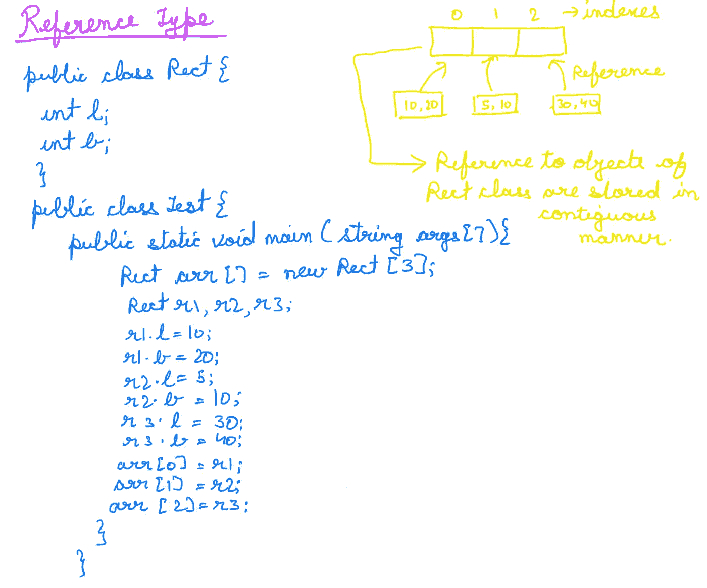

# JAVA 中的数组

> 原文：<https://medium.com/codex/arrays-in-java-faafc1552b6b?source=collection_archive---------35----------------------->

# 数组

当我们必须将同一数据类型的多个值存储在一起时，就会用到数组。由于数组是引用类型，所以内存是在堆中分配的，然后对该内存位置的引用被赋给一个数组变量。

这些是在 Java 中声明和初始化数组的方法。如果我们试图在一个数组中给一个超出其索引范围的值赋值，比方说我们试图给 b[3] = 40 赋值，那么我们会得到一个***ArrayIndexOutOfBoundsException***。

Java 中的数组有两种声明方式:

*   int a[]
*   int []a

第一种是首选方式。第二个将 int []之后出现的每个变量视为一个数组。比如 ***int []a，b*** ，这里 a 和 b 都是数组。

*   未初始化的数组元素有默认值。
*   基本类型存储在连续的位置，而非基本类型引用存储在连续的位置。

## 阵列的优势

*   ***随机存取:*** 我们可以在 O(1)的时间复杂度内存取索引范围内的任意值。
*   ***缓存友好:*** 缓存是存储数据的硬件或软件组件，以便更快地满足未来对该数据的请求。CPU 将提取元素的邻居存储在缓存中，因此由于数组的元素存储在连续的位置，缓存未命中的机会较少。

## 数组的缺点

*   数组中的搜索、插入和删除操作代价很高。

## 多维数组

我们在开发和编码过程中最常用的多维数组是二维数组。Java 中的内存分配不是连续的。我们不在数组名中指定维度。int arr[3][2]是错误的。正确的做法是:

int arr[][] = new int[3][2]

