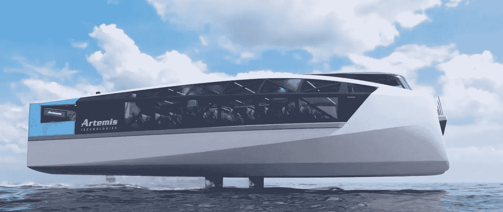

# Artemis Technologies EF-24 客轮——零排放的 100%电动飞行轮渡

> 原文：<https://medium.com/codex/artemis-technologies-ef-24-passenger-ferry-a-100-electric-flying-ferry-with-zero-emissions-924aac76d48f?source=collection_archive---------4----------------------->

## 水翼艇变得更有趣了

[Artemis EF-24 侧视图(Artemis Technologies 媒体)](https://www.artemistechnologies.co.uk/site/wp-content/uploads/2022/09/EF-24-Passenger-Animation-captions.mp4)

使用[Artemis Technologies](https://www.artemistechnologies.co.uk/)EF-24 客轮告别排放，迎接交通运输的未来。EF-24 客轮是一种 100%电动飞行轮渡，使用水翼船技术将自己升出…