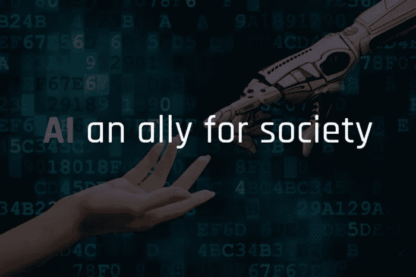

# 人工智能:社会的盟友？

> 原文：<https://medium.com/codex/artificial-intelligence-an-ally-for-society-169f4ef55aa7?source=collection_archive---------13----------------------->

## [法典](http://medium.com/codex)

根据字典的解释，智力“是大脑的一种能力，它让我们能够学习、理解、推理、决策并形成对现实的某种想法。”然而，“人类智能”和“人工智能”之间的区别在于，后者被赋予一系列技术，这些技术具有以前人类独有的特征或能力…