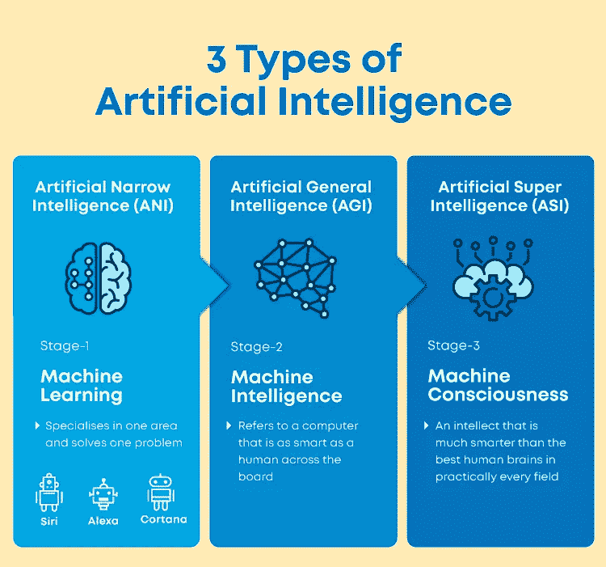
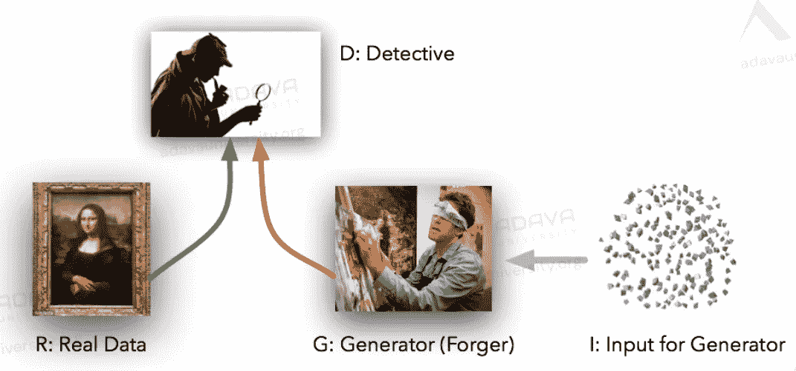

# 人工智能:家庭宠物还是未来主人？

> 原文：<https://medium.com/codex/artificial-intelligence-family-pet-or-future-owners-9ade500d6973?source=collection_archive---------13----------------------->

这张图片是媒体如何选择戏剧化人工智能的含义的一个例子，纯粹是为了没有确凿理由的观点。英国广播公司新闻

> “成功创造人工智能将是人类历史上最大的事件。不幸的是，这也可能是最后一次，除非我们学会如何规避风险。”— *理论物理学家斯蒂芬·霍金*

每个人都听说过这场冲突。AI 将如何在相对较短的时间内大幅提高社会的效率和能力，或者人类将如何按照这种机器的意愿成为宠物。人类如何最终实现乌托邦，或者我们如何在机器入侵时被迫生存。这个难题的简单答案是:不。准确的答案是:除了我们的想象，没有人知道。

对于那些没有时间阅读的人来说，下面是这篇文章内容的简要解释。

人类的未来取决于我们自己的决定。这是自古以来就有的。然而，在一个快速变化的世界中，我们日常决策的影响力似乎越来越大。继续推动人类统治地位和效率进一步提高的驱动技术之一过去是，现在仍然是人工智能。由于其惊人的成就以及其在媒体上作为威胁的突出形象，刻板和不可持续的错误观念充斥着这个行业。最常见的是，人们倾向于质疑人工智能一旦跨越一定程度的“智能”，是否会对人类社会产生积极影响。

这个问题的答案是否定的；至少现在是这样。这个问题不是无效的，而是不确定的，因为仍然缺乏关于智能模型开发的可靠信息。关于这种模型是否可能，以及人工智能能够达到的智能程度(人工狭义智能/人工通用智能/人工超级智能)，存在广泛的分歧。在这次对话中的异议包括但不限于关于智能发展速度的次级分歧，目前是否有任何模型能够迭代自己的智能，以及人工智能发展的时间框架，以及其他各种相关的次级讨论。

信用~伟大的学问

然而，人工智能对人类社会影响的长期不确定性不应限制其目前对人类几乎每个方面无可争议的有效影响。由于机器新发现的计算能力，人工智能以令人难以置信的速度带来了复杂数学模型的组合。这有助于创建能够完成各种任务的机器学习模型，具有各种应用，如预测模型、决策模型和数据合成模型。总之，长期的不确定性不应该限制 AI 的当代实施，因为缺乏任何潜在结果的主要证据。

学分~阿达瓦大学

例如，强化学习——最前沿的机器学习模型之一——在从经济到医学等领域有无数的现代应用。强化学习利用对代理环境的探索来收集关于代理的状态和相关行为的数据。通过重复和惩罚，代理人能够制定导致最大数量奖励的行为。这可以应用于制定交易算法，通过模拟确定理想的行为选择，以获得最大的货币价值。其他应用包括识别各种疾病、轨迹优化、动态路径、政策分析和运动规划，以及受程序员想象力限制的各种其他解释！

虽然这些例子是简单的介绍，但强化学习算法的一个常见决策是它们的风险倾向——探索新的行动与利用已被证明的行动(尽管这些探索的决策可能不是最有效的)。学分~阿达瓦大学

另一个突破性的机器学习模型是甘。甘主张生成性对抗网络，这是一个相当利基，但强大的利用。该模型通过将随机输入向量插入到发电机模型中来工作。基于这个输入向量(最明显的是多元高斯)，生成器模型创建一个假图像。通过在现实生活中收集的数据样本，生成的假图像和真实图像都被插入到鉴别器模型中。鉴别器模型然后试图准确地确定假图像和真实图像。这导致了对这组伪图像和真实图像的二进制分类。生成器和鉴别器模型都试图基于它们的准确性/成功性来修改它们自己。因此，通过这些模型之间的竞争导致的自我改进，生成器模型学习创建逼真的图像，而鉴别器模型学习识别图像集之间的微小细节。这样一个复杂的模型可以描述为两个机器学习模型之间的竞争。gan 有助于创建超现实的图像、视频以及其他媒体格式(尤其是声音和文本)。

与以前建立的机器学习模型相比，GAN 的结构非常新颖，因为它通过两个不同的机器学习模型之间的竞争来工作，所以两者都可以提高他们的技能！学分~阿达瓦大学

尽管上面提到的示例模型非常强大，并且在机器学习领域占据头条位置，但它们距离能够摧毁现代社会的人形机器非常遥远(如果这种人工智能甚至是可能的话)。机器学习的当前状态被称为 ANI 或人工狭义智能。作为参考，人类可以与人工智能相媲美。这些 ani 能够掌握相对特定标准的狭窄任务。当给定更广阔的环境而没有必要的训练时，模型试图利用不适用于当前情况的智能。例如，可以下棋的人工智能，如果没有必要的训练，就不能玩井字游戏。这是关键的区别。人工智能还没有能力应用通用知识来获取狭义知识。

人工智能行业最近的突破之一是 CNN(卷积神经网络)。他们致力于与不同格式的媒体互动，如图像、声音、视频、文本等。信用~研究门户

我个人觉得 AI 的发展应该以更结构化的方式继续。据专家介绍，如果这种普遍智能能够被创造出来，那么它就有可能通过重复学习获得超人的智能。一般来说，这样的时间框架预计将是指数级的。然而，人工智能的直接好处对无知来说太重要了，因此，我认为我们应该监督人工智能的发展。我的意思是，应该制定官方立法，要求人工智能突破以记录的方式进行，以便在发生这种灾难性事件时能够更快地做出反应。这种结构将实现更结构化的研究和开发，以及人工智能领域国际领导者之间的更多联系。

纵观历史，人类总是偏执于未被探索的事物。几十年前，核能也出现了类似的情况。虽然核能领域还没有被探索到极致，但与人工智能相比，这是一个更有经验的子课题。我们对它对人类影响的不确定性以及它给周围地区带来的风险充满疑虑。没有探索；然而，除了世界上 10%的电力之外，我们永远也不可能了解更多关于物理学的深度！另一个例子是工业革命。当时，人们认为这些机器会增加失业，但相反，它会随着就业的增加(通过创造新的就业行业)而导致迅猛发展。这些场景并不完美，没有什么是完美的。工业革命导致了全球变暖，核能已经造成了几起伤亡。然而，与它们的积极影响相比，我觉得我们不能忽视人工智能给我们提供的难以置信的机会。

信用~ Adobe 股票

就像所有的刻板印象和过度概括一样，成为更有见识的公民的唯一方法是从多方面来看待这个故事。与其接受媒体上不合理的主张/观点，不如通过专家意见、前沿研究或可靠来源来了解自己。看看人工智能未来的各种投入，以及他们各自对该行业应如何继续发展的建议。作为读者，通过观察这个相关故事的各个方面，你可以更好地理解人类的未来，并为自己做出明智的决定。

至于人工智能的未来，我觉得我们最好不要犹豫不决，而要过早做出决定。如果人类继续走多条对立的道路，唯一可以想象的结果就是各种形式的冲突。因此，无论人类选择反对还是支持人工智能，我们坚持这个决定是非常重要的，至少有一点点建设性影响的机会。

更多参考资料了解机器学习的未来:

畅销书

信用~ Amazon.in 和 Max Tegmark

广泛回顾:[https://www . yales scientific . org/2018/01/life-3-0-Review-be-human-in-the-age-of-artificial-intelligence/](https://www.yalescientific.org/2018/01/life-3-0-review-being-human-in-the-age-of-artificial-intelligence/)

Life 3.0 是一本写得非常好的书，它是一个被各种形式的人工智能包围的世界中社会未来各个方面(道德含义、意识、犯罪、司法系统、影响、发展以及人工智能的各种其他决定因素)的综合指南。这本书列出了依赖于人工智能发展的几个因素的各种理论和结果。这本书是以相当公正的方式写的，以使读者能够形成自己的观点，以便有助于关于人工智能的讨论。

其他值得注意的必读书目:

信用~亚马逊. in 和尼克博斯特罗姆

广泛回顾:[https://medium . com/@ Ross rco/book-Review-super intelligence-paths-dangers-strategies-by-nick-bostrom-19675475 d31f](/@rossrco/book-review-superintelligence-paths-dangers-strategies-by-nick-bostrom-19675475d31f)

信用~亚马逊. in 和佩德罗多明戈斯

广泛回顾:[https://inside bigdata . com/2016/01/12/book-Review-master-algorithm/](https://insidebigdata.com/2016/01/12/book-review-master-algorithm/)

人工智能实验室

credit ~[one zero Medium](https://onezero.medium.com/openai-sold-its-soul-for-1-billion-cf35ff9e8cd4)——“open AI 是一家 AI 研究和部署公司。我们的使命是确保人工通用智能造福全人类。”Open AI 的官方网站

广泛回顾:[https://www . technology Review . com/2020/02/17/844721/ai-open ai-moon shot-elon-musk-Sam-Altman-Greg-Brock man-missy-secretary-reality/](https://www.technologyreview.com/2020/02/17/844721/ai-openai-moonshot-elon-musk-sam-altman-greg-brockman-messy-secretive-reality/)

OpenAI 既向初学者介绍了人工智能，也提供了深入研究人工智能可能产生的实质性影响的前沿模型。它为读者提供了对人工智能最新方面的概念性理解，但也有助于引导公众了解人工智能世界可能会是什么样子。作为一个非营利组织，OpenAI 为其追随者提供了广泛的媒体和互动，以实现关于人工智能的最大限度的建设性和信息性讨论(图像、视频、博客、文章、出版物、API、代码、研究)。

其他著名人工智能实验室:

credit ~ VentureBeat——“我们的长期目标是解决智能问题，开发更通用、更有能力的问题解决系统，被称为人工通用智能(AGI)。在安全和伦理的指导下，这项发明可以帮助社会找到一些世界上最紧迫和最基本的科学挑战的答案。”DeepMind 的官网。

credit ~ etc centric——“我们正在通过与社区开放合作的基础和应用研究，推进人工智能的最新发展。”—博览会的官方脸书页面。

进一步探索的主题:

*   神经图灵机—[https://towardsdatascience.com/tagged/neural-turing-machine](https://towardsdatascience.com/tagged/neural-turing-machine)

> 神经图灵机(NTMs)是图灵机的递归神经网络模型。该方法由 Alex Graves 等人于 2014 年发表。NTMs 结合了神经网络的模糊模式匹配能力和可编程计算机的算法能力。—NTM 维基百科

神经图灵机是最近在人工智能方面取得的主要突破之一。ntm 的工作原理是使机器能够创建自己与计算机内存的基本交互，而不是预定义的能力(如智能地读写内存)。