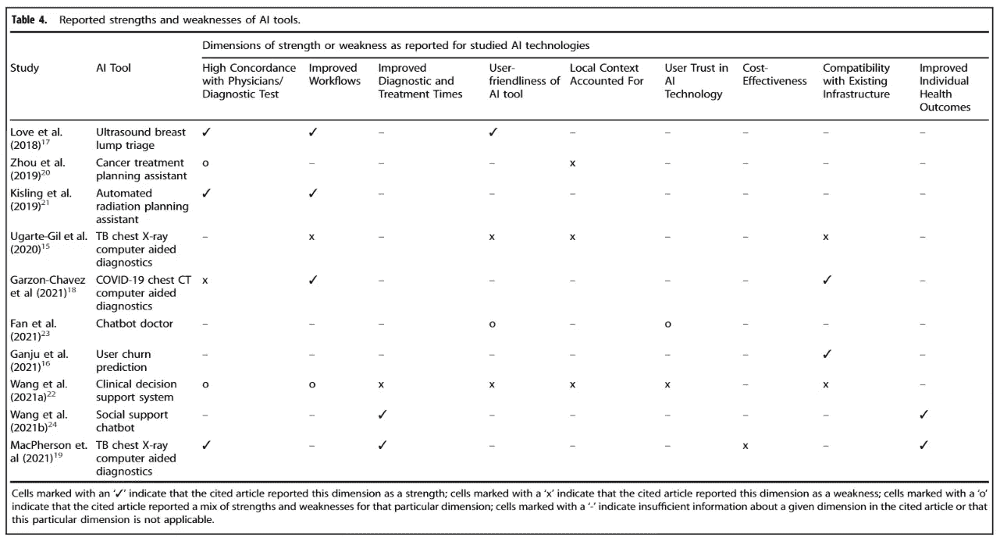
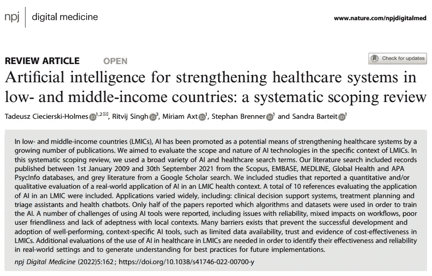

# 人工智能用于加强中低收入国家的医疗保健系统

> 原文：<https://medium.com/codex/artificial-intelligence-for-strengthening-healthcare-systems-in-low-and-middle-income-countries-e08661a66ac4?source=collection_archive---------15----------------------->

## ai4 健康文章评论#09

人工智能在医疗保健方面有许多有益的方面。显然，在将人工智能视为直接的帮助者和利益提供者之前，重要的是要意识到这里的局限性。

我已经阅读了这篇文章，并希望与您分享，这篇文章是通过汇编 2009 年至 2021 年期间发表的关于中低收入国家(LMICs)人工智能应用的文章而创作的。

这就是为什么我发现这项研究非常有信息量，它通过以下 9 个重要维度来处理人工智能应用的优势、劣势和感知。

# **在低收入国家实施人工智能的优势、劣势和看法**

## **AI 工具的可靠性**

**✅** 一些工具是根据其应用环境之外的数据进行培训的，因此没有完全考虑当地的疾病发病率和可用的治疗方案。

**✅** 基于高收入国家数据训练的人工智能模型可能会在人工智能输出中引入偏差，导致糟糕的表现，甚至更糟糕的是，错误的结果——这在卫生领域是有害的，在医疗保健领域建立人工智能也是有害的，因为信任可能会被打破。人工智能模型频繁地接收特定上下文和更新的数据是至关重要的；否则，人工智能模型的性能可能会随着时间的推移而恶化。这可能会导致螺旋式下降，因为糟糕的性能可能会导致对 hcw 的不良接受以及对基于人工智能的系统的信任丧失。

**✅** 人们还注意到，在某些情况下，IBM Watson 为肿瘤学推荐的治疗方案过于昂贵、不可用、被认为过于激进或对患者不方便，或者更倾向于使用当地可用的替代方案。

## **对治疗和诊断工作流程和时间的影响**

**✅** 虽然所使用的人工智能应用缩小了从业者的经验差距，加快了决策，但也观察到它增加了适应期临床的工作量。

## **用户友好性和与现有基础设施的兼容性**

**✅** 临床决策支持系统被发现需要医生提供太多信息，这在大多数情况下被认为太耗时。缺乏与现有 IT 系统的集成也导致关键的实验室信息没有被纳入人工智能的决策过程。

**✅** 诊所内糟糕的互联网连接、应用程序崩溃或误译以及 x 射线浏览器的整体可用性有限是这里的其他重要限制因素。

## 对人工智能系统的信任

**✅** 不信任临床决策支持系统，因为诊断或治疗决策的基础不够透明。

**✅** 人们发现，如果一项技术和算法是可以理解的，并能帮助用户实现他们的目标，那么他们对人工智能应用的信任就会更强。

## **节约成本和改善健康状况**

✅:可以看出，只有一篇文章是关于成本的。(AI ' CAD 4 TB ' TB-筛查工具)文章中提到，在马拉维的背景下，计算出的费用被认为超出了支付意愿。

## **人工智能的局部充分性**

**✅** 在本节中，提到了人工智能使用区域的不当治疗建议、必要的 x 光和移动设备不足等话题。

报告了人工智能工具的优点和缺点。

> 我认为，这里的一个关键点是确保人工智能用户接受足够的培训，并确保这些实践确实符合该国和该地区条件下的临床实践。
> 
> 否则，人工智能的结果不足以解释，用户避免了额外的工作量，这就变成了减少使用的恶性循环。

因此，这两个主题在用于 LMICs 的产品设计中占有非常重要的位置，并产生我们在上述所有其他主题中讨论的结果。

🌺感谢这篇有价值的论文:
[塔德乌什·西切尔斯基-霍姆斯](https://www.linkedin.com/feed/#)，[里特维吉·辛格](https://www.linkedin.com/feed/#)，米丽娅姆·阿克斯特[斯蒂芬·布伦纳](https://www.linkedin.com/feed/#)和[桑德拉·巴特伊特](https://www.linkedin.com/feed/#)

📑 [**点击此处获取 p**aper](https://www.nature.com/articles/s41746-022-00700-y)Ciecierski-Holmes，t .、Singh，r .、Axt，M. *等*人工智能用于加强中低收入国家的医疗保健系统:一项系统性范围审查。 *npj 数字。医学。*5162(2022)。https://doi.org/10.1038/s41746-022-00700-y