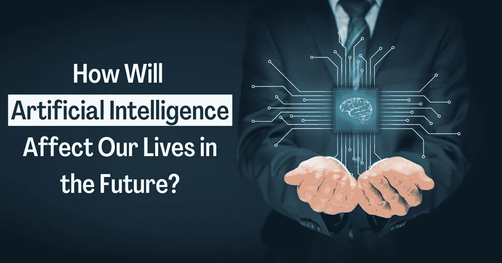

# 人工智能将如何影响我们未来的生活？

> 原文：<https://medium.com/codex/artificial-intelligence-future-def0b452059a?source=collection_archive---------17----------------------->

作为一个精通技术的极客，就在几天前，我在看 21 世纪的热门话题，人工智能。看到人工智能发展的速度很有趣，它可能会改变人类在这个星球上的体验。这就是为什么我决定将这篇博客献给人工智能的未来，让我们来看看使用人工智能的新时代的可能性。

**注意:**如果您需要任何[人工智能作业帮助](https://www.javaassignmenthelp.com/Artificial-Intelligence-Assignment-Help)，您可以聘请专家来做您的人工智能作业。

以下是人工智能未来将影响我们生活的不同领域:

# 网络安全

网络安全是许多企业高管的头等大事，特别是由于网络安全相关的违规事件将会增加，而且在未来还会继续发生。由于黑客利用在家工作的人，使用不太安全的技术或 Wi-Fi 连接，网络攻击的数量在疫情中有所增加。

机器学习和人工智能是识别和预测安全威胁的重要工具。人工智能也可以成为金融安全的重要资产，因为它能够处理大量数据，以预测和发现欺诈事件。

# 卫生保健

在医疗领域使用人工智能的好处已经在研究中。医疗专业人员拥有大量数据，可用于开发与医疗保健相关的预测模型。此外，在特定的诊断情况下，人工智能已被证明比医生更有效。

# 汽车的

由于自动驾驶汽车和自动导航的发展，我们已经见证了人工智能影响交通和汽车世界的方式。人工智能预计也将对制造业产生重大影响，特别是在汽车行业。

# 电子商务

人工智能将在该行业所有领域的电子商务未来中发挥不可或缺的作用，从客户体验到营销，再到履行和分销。随着我们走向未来，人工智能很可能会继续提高电子商务的效率，例如聊天机器人和针对购物者的个性化，针对特定区域的基于图像的广告，以及库存和仓库自动化。

# 娱乐

在不久的将来，你可以坐在家里看一部由你选择的虚拟演员定制的电影。与此同时，电影制片厂可能会看到一个没有失败的光明未来。先进的预测软件将评估电影的叙事，并预测潜在的票房收入。

# 工作机会

“人工智能会抢走我们的工作！”是人们最常提到的对人工智能未来的担忧。虽然人工智能将使几乎所有事情自动化，但我们可以想象一个更加美好的未来，它将创造就业机会，但不会取代它们。

根据一份报告，到 2030 年，人工智能很有可能在大多数认知任务中超过人类，但这并不意味着它将终结乔布斯。

# 最后的话

人工智能未来即将到来！现在是为人工智能的未来做准备的最佳时机。希望在读完这篇博客后，你明白人工智能将如何改变我们未来的世界和生活方式。