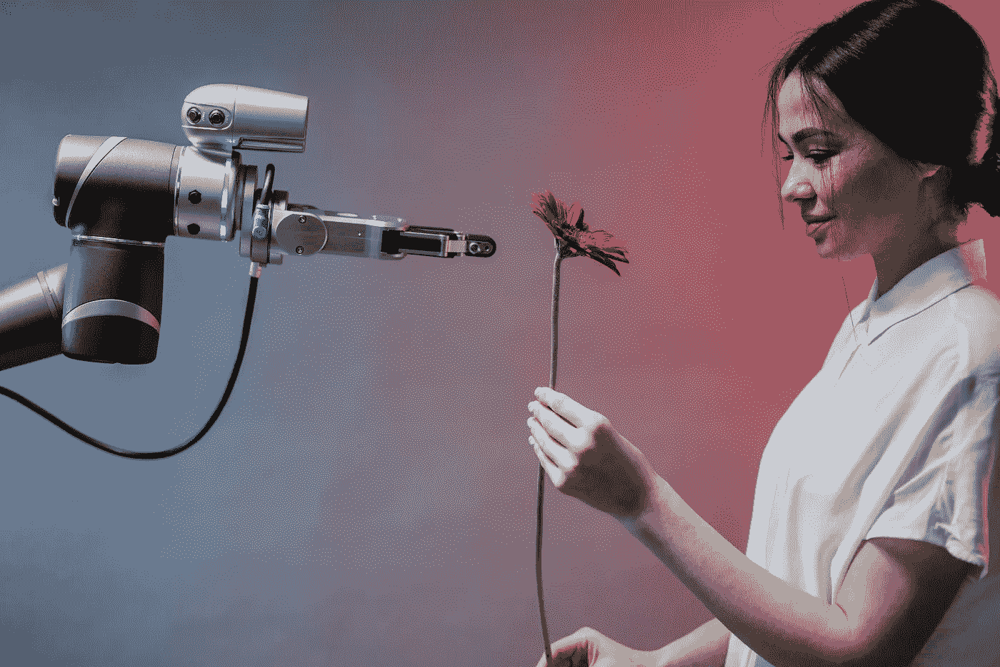
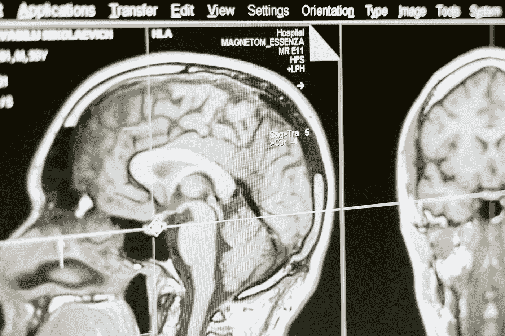
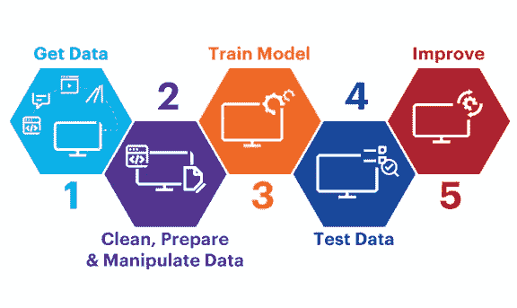
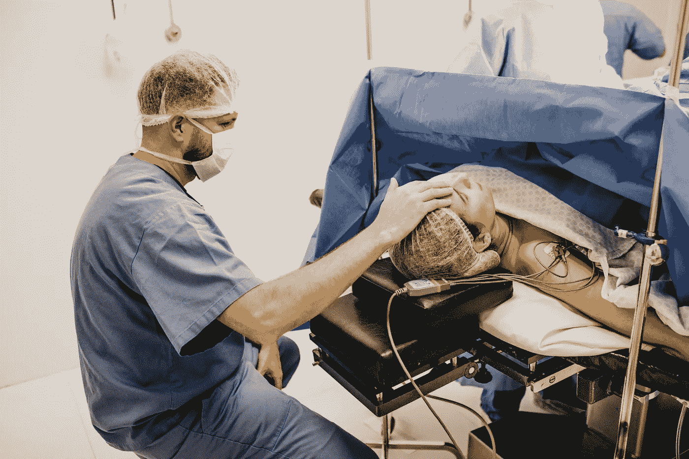
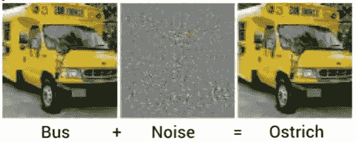
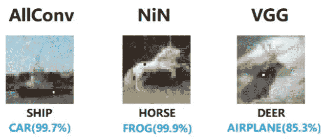

# 电脑可以成为你的医生

> 原文：<https://medium.com/codex/artificial-intelligence-in-healthcare-70197a351fde?source=collection_archive---------11----------------------->

## 医疗保健中的人工智能:效用和伦理限制

图片来自 [Pexels](https://www.pexels.com/fr-fr/photo/homme-gens-femme-jeune-fille-8438969/?utm_content=attributionCopyText&utm_medium=referral&utm_source=pexels) 的 Pavel Danilyuk

T 感谢最近在[机器学习](https://en.wikipedia.org/wiki/Machine_learning)， [AI](https://en.wikipedia.org/wiki/Artificial_intelligence) 技术专家已经找到了利用[算法](https://en.wikipedia.org/wiki/Algorithm)解决通常由人类承担的问题的创新方法。由于这些进步，越来越多的人开始相信大规模劳动自动化的想法。然而，如果你认为自动化只是用机器代替工人做简单而平凡的工作的同义词，那么让我告诉你今天的现实是多么的不同。

在计算医学领域，[深度学习](https://en.wikipedia.org/wiki/Deep_learning)算法已经证明了其在放射学、皮肤病学甚至心脏病学等领域与医疗专业人士竞争的能力(Mesko 医学未来学家)。在最近由加州大学的 Ali Madani 和他的同事进行的一项研究中，一个被训练来对超声心动图进行分类的神经网络已经接受了专业超声心动图专家的测试。

> 在分类期间建立诊断的关键步骤之一中，该算法已经证明了 91.7%的准确性，而委员会认证的超声心动图医师的平均准确性为 79.4% (Madani 等人)。

虽然这些结果令人惊讶，甚至让那些认为放射科医生等专业人员将很快被人工智能取代的人感到恐惧，但值得注意的是，这些自动化技术远远没有达到医生在治疗病人时所需的多维专业知识。前面提到的计算机程序仅在建立挽救生命的诊断的一个孤立步骤中证明了优越性。

图片由 [MART 出品](https://www.pexels.com/fr-fr/@mart-production?utm_content=attributionCopyText&utm_medium=referral&utm_source=pexels)来自 [Pexels](https://www.pexels.com/fr-fr/photo/technologie-ordinateur-tete-sante-7088489/?utm_content=attributionCopyText&utm_medium=referral&utm_source=pexels)

根据这一创新，如果医疗保健服务通过自动化变得更加有效，如果医生能够借助计算机辅助提供更好的诊断，如果人工智能有一天能够独立地为原本不可能提供优质医疗保健的人群提供优质医疗保健，我们就可以帮助实现一场了不起的革命:医疗保健的民主化。

## 机器学习

计算机可以被设计成独立学习一项任务。如果我们给一台计算机大量的数据，我们可以要求它以一种为我们完成任务的方式进行分类。这是最有前景的医疗用人工智能类型之一。例如，放射学需要医生进行大量的图像分析和模式识别工作，这是一项[机器学习](https://en.wikipedia.org/wiki/Machine_learning) [算法](https://en.wikipedia.org/wiki/Algorithm)可以学习完成的任务。我们确实可以训练一个人工智能模型来分析医学扫描的像素，以识别与疾病同义的模式。

程序员设法训练一个人工智能模型来完成这些任务，方法是首先标记数据，然后将这些数据输入给它。在我们的案例中，他们会将医学扫描标记为显示疾病或不显示疾病，当他们将数据提供给机器学习算法时，它会学习内在的视觉特征，如像素的精确排列，这表明医学扫描中存在疾病。在了解了第一批图像的特征后，人工智能模型可以通过向它显示更多扫描并要求它对它们进行分类来进一步优化；从本质上说，模式识别算法[得到的实践越多，它们就能变得越准确。具体来说，](https://en.wikipedia.org/wiki/Pattern_recognition)[深度学习](https://en.wikipedia.org/wiki/Deep_learning)专门用于[模式识别](https://en.wikipedia.org/wiki/Pattern_recognition)的算法被用于肿瘤学和放射组学等领域，作为在医学影像上检测癌症的预测模型(Davenport 和 Kalakota)。

[图片来源于 Robert Kress 的文章](https://www.accenture.com/th-en/insights/security/board-primer-artificial-intelligence)

# 第 1 部分:它能给我们提供的巨大帮助

## 我们应该在 AI 中寻找什么？

在立即将人工智能集成到我们的医疗保健系统之前，我们应该首先调查它在患者和医生共享的强大信任关系中可能占据的位置。更重要的是，我们必须审视使用这种革命性技术的实际风险和道德层面。

如果我们让医生的判断部分或最终完全依赖人工智能，我们应该做些什么来培养信任并确保医疗保健的安全？遵循[可信人工智能](https://digital-strategy.ec.europa.eu/en/library/ethics-guidelines-trustworthy-ai)的道德准则，可信人工智能需要[人类机构](https://en.wikipedia.org/wiki/Agency_(philosophy))和监督，公平和非歧视的能力，技术[鲁棒性](https://en.wikipedia.org/wiki/Robustness_(computer_science))，安全性以及[透明性](https://en.wikipedia.org/wiki/Algorithmic_transparency)。

最近在社会中实现人工智能的尝试中，许多程序未能尊重这些需求的完整性。通过观察这些尝试，可以确定常见的技术限制，特别是在机器学习算法中:易受[算法偏差](https://en.wikipedia.org/wiki/Algorithmic_bias)的影响，由于[黑箱](https://en.wikipedia.org/wiki/Black_box)问题而缺乏[透明性](https://en.wikipedia.org/wiki/Algorithmic_transparency)，以及由于[对抗性攻击](https://en.wikipedia.org/wiki/Adversarial_machine_learning)而缺乏[健壮性](https://en.wikipedia.org/wiki/Robustness_(computer_science))。这些技术限制都是人工智能在医疗保健领域大有可为的主要障碍；这就是它们值得分析的原因。

## 自动化的好处

为了支持在我们的医院和诊所使用人工智能，我们可以从承认这样一个事实开始，即它可以通过节省我们的时间和资源来帮助我们在世界各地民主化医疗保健。由于自动化，医疗程序可以变得更便宜，从而更容易为全球人口所接受。这种大规模效率的能力是由人工智能如果实现可以承担或协助的多种类型的有偿人类劳动来解释的。如果通过一种经过微调的算法来完成数据输入和医疗记录管理等重复性管理任务，这些任务可能会变得更快。

## 人工智能用于诊断

在人工智能目前在医疗保健领域的应用中，[监督机器学习](https://en.wikipedia.org/wiki/Supervised_learning)算法已经在进行精准医疗。例如，这些算法能够根据患者的当前状况来预测治疗成功的可能性；但是，请注意，它们仅用于帮助医疗从业者建立诊断(Davenport 和 Kalakota)。

图片由来自 [Pexels](https://www.pexels.com/fr-fr/photo/stetoscope-bleu-et-argent-40568/?utm_content=attributionCopyText&utm_medium=referral&utm_source=pexels) 的 [Pixabay](https://www.pexels.com/fr-fr/@pixabay?utm_content=attributionCopyText&utm_medium=referral&utm_source=pexels) 拍摄

医院收集的大量患者信息构成了庞大且具有相当代表性的数据集，可以提供给机器学习算法，以产生准确的预测模型，从而简化了此类技术在医疗保健领域的安装。另一个让我们相信这项技术在不久的将来会得到广泛应用的原因。(自由思考媒体)

## 人工智能促进医疗民主化

总之，如果前面提到的人工智能的医疗应用可以为所有医疗保健专业人员所用，甚至直接为患者所用(这种例子已经存在，如使用聊天机器人进行远程医疗)，那么世界可以帮助医疗保健的全球化(达文波特和卡拉科塔)。

然而，这些有用的人工智能模型的精度和范围与在它们训练期间提供给它们的数据的代表性和数量成比例；他们接触的场景越多，获得的经验越多，面对现实环境时，他们就能更好地应对。

如果我们为了评估的目的而假设各国将在各自的人口中部署精确和适应良好的人工智能模型，那么可以得出结论，医疗保健全球化所创造的快乐程度将是巨大的；例如，如果普通消费者可以通过应用程序获得它们，那么获得这种快乐几乎是瞬间的。

劳拉·詹姆斯从[派克斯](https://www.pexels.com/fr-fr/photo/homme-en-veste-blanche-tenant-un-smartphone-6097958/?utm_content=attributionCopyText&utm_medium=referral&utm_source=pexels)拍摄的图片

此外，如果人们能够获得可靠的医疗服务，能够做出准确的诊断并建议适当的治疗，许多可预防的死亡就可以避免。事实上，预防威胁生命的疾病最好通过早期发现疾病症状来完成。人工智能可以在这方面提供很大帮助，特别是在预防全球最重要的死亡原因:心血管疾病方面(世界卫生组织)。

> “由于研究表明心血管疾病的标志经常会在眼睛中表现出来，科学家们正在使用深度学习方法来识别风险因素，如年龄、性别、吸烟状况和血压，只需看眼睛。这些新研究仍然需要在更多人身上进行验证和重复，才能获得更广泛的接受，但由于视网膜图像可以快速、廉价和非侵入性地获得，这可能会在医疗保健领域开辟新的视野。”(梅斯科)

# 第 2 部分:要避免的潜在危害

## 偏差和设计

与这些有希望的好处形成对比的是，由不具代表性的数据集或人工智能算法的不当设计导致的[算法偏差](https://en.wikipedia.org/wiki/Algorithmic_bias)可能会导致预测模型做出错误的决定。人工智能模型可能会建议对少数群体进行不适当的处理，因为他们在用于训练模型的数据集中代表性不足。如果一个人工智能没有机会学习如何对特定的场景做出反应，因为它没有被充分地包括在训练数据集中，那么它可能没有足够的信息来在现实世界中部署后做出正确的决定。

这种偏见很可能发生在医疗机构中，并由于患者的年龄组、残疾或肤色代表性不足而影响患者。如果用于建议治疗或进行诊断的人工智能模型受到偏见的影响，它可能会对呈现给它的医疗场景做出不正确的反应，从而危及患者的健康(Gerke 等人)。

图片来自[Pexels](https://www.pexels.com/fr-fr/photo/internet-technologie-ordinateur-texte-4164418/?utm_content=attributionCopyText&utm_medium=referral&utm_source=pexels)Antonio batini

例如，Ziad Obermeyer 和他的同事在分析美国医疗保健系统中用于评估存在健康风险的患者护理需求的流行算法的性能时发现，“被算法分配了相同风险水平的黑人患者比白人患者病情更重”；事实上，作者确定，这种由于算法设计导致的种族偏见的表现“将被确定需要额外护理的黑人患者数量减少了一半以上”。

> “弥补这一差距将使接受额外帮助的黑人患者比例从 17.7%提高到 46.5%。这种偏见的出现是因为该算法预测的是医疗费用而不是疾病，但不平等的医疗服务意味着我们花在黑人患者身上的钱比白人患者少。因此，尽管从某些预测准确性的角度来看，医疗保健费用似乎是健康的一个有效指标，但还是出现了很大的种族偏见。”(Obermeyer 等人)

## [可交代性](https://en.wikipedia.org/wiki/Explainable_artificial_intelligence)和透明性

为了信任用于提供护理的人工智能模型，同样重要的是，它的功能应该对医疗专业人员和他的病人是可解释和可理解的。

最近开发的越来越精确但难以解释的深度学习算法可能缺乏这种透明度。这些[黑盒](https://arxiv.org/ftp/arxiv/papers/1903/1903.04361.pdf#:~:text=The%20Black%20Box%20Problem%20is,problems%20in%20AI%20are%20opaque.&text=Unlike%20their%20colleagues%20working%20within,the%20relevant%20problems%20are%20solved.)人工智能模型用于解决问题的过程可能由于其数学复杂性而无法为医疗保健专业人员所理解，但仍然能够为他们解决的问题提供准确的答案。

一些人会认为这个问题是不可避免的，只要这些算法被证明是准确的，就应该被信任，就像使用一种在成功的临床试验后得到验证的药物一样(Gerke 等人)。

图片由来自 [Pexels](https://www.pexels.com/fr-fr/photo/homme-tenant-la-tete-d-un-autre-homme-3279196/?utm_content=attributionCopyText&utm_medium=referral&utm_source=pexels) 的 Jonathan Borba 拍摄

## 稳健性

进一步影响我们信任这些工具的能力，这些[黑盒](https://arxiv.org/ftp/arxiv/papers/1903/1903.04361.pdf#:~:text=The%20Black%20Box%20Problem%20is,problems%20in%20AI%20are%20opaque.&text=Unlike%20their%20colleagues%20working%20within,the%20relevant%20problems%20are%20solved.)算法可能存在缺陷，这些缺陷可能会影响它们的[健壮性](https://en.wikipedia.org/wiki/Robustness_(computer_science))或抵抗[敌对攻击的能力](https://en.wikipedia.org/wiki/Adversarial_machine_learning)。其中一个缺陷出现在深度神经网络中，这是由苏佳薇和她的同事进行的一项研究的背景。一般来说，图像识别算法可以让它们的输入自动改变以产生错误；在这项研究中，这是通过向图像添加噪声来改变组成图像的许多像素来实现的(fehér；Szegedy)。虽然这种变化我们几乎看不到，但足以骗过算法。在下面一个专门进行图像识别的例子中，它确定公共汽车是一只鸵鸟，因为算法的输入(见图 1)的原始图像中添加了噪声。

图一。资料来源:Fehér，2018；塞格迪，2014 年

考虑到为了成功地进行一次攻击而必须改变的大量像素，这些对抗性攻击在实际设置中似乎不太可能发生。然而，苏和她的同事在他们的研究中确定，这种攻击可以通过仅改变一个像素而成功(苏等人；Fehér)。事实上，如果选择了正确的像素，图像识别算法可以以 85.3%的确定性将鹿误认为飞机(见图 2) (Su 等人)。知道这些单像素攻击是可能的，就有必要质疑在放射学等医疗保健环境中使用这种复杂算法的相对安全性，在这些环境中，人们可能会受益于人工智能的图像识别能力，以分析疾病的医疗扫描。尽管如此，当面对这种正常情况下精确的人工智能模型(其功能几乎无法解释)时，医生如何能够完全相信这种人工智能的判断，因为它知道自己对这种微小扰动的敏感性？

图二。资料来源:苏等人，2019 年

# 我们仍然有一些进展要做

使用人工智能自动化可以通过使程序更便宜和更容易获得来帮助我们在世界各地普及医疗保健。人工智能已经在社会的许多领域构成了一个伟大的工具，然而，人工智能在医疗保健中的使用提出了关于人工智能在实践中可以证明的准确性、[鲁棒性](https://en.wikipedia.org/wiki/Robustness_(computer_science))和偏差的问题。

# 参考

达文波特、托马斯和拉维·卡拉科塔。“人工智能在医疗保健中的潜力。”未来医疗保健杂志第 6 卷，第 2 期(2019):94–98。doi:10.7861/未来

“可信人工智能的道德准则。”欧盟委员会，2019 年 4 月 8 日，EC . Europa . eu/digital-single-market/en/news/ethics-guidelines-trust worthy-ai。

Fehér，Károly Z .，“一个像素攻击击败神经网络|两分钟论文#240”，YouTube，两分钟论文上传，2018 年 3 月 31 日，【https://youtu.be/SA4YEAWVpbk 

Freethink media，“用人工智能拯救生命| Freethink”，YouTube，由 Freethink 与英特尔合作上传，2018 年 11 月 7 日，【https://youtu.be/VePHPymCy2U 

人工智能驱动的医疗保健的伦理和法律挑战。医疗保健中的人工智能(2020):295–336。doi:10.1016/B978–0–12–818438–7.00012–5

使用深度学习对超声心动图进行快速准确的视图分类。自然新闻，自然出版集团，2018 年 3 月 21 日，[www.nature.com/articles/s41746-017-0013-1.](http://www.nature.com/articles/s41746-017-0013-1.)

梅斯科，伯塔兰。“医疗保健中的人工智能:医疗保健中的顶级人工智能算法——医疗未来学家”，YouTube，由医疗未来学家上传，2019 年 3 月 18 日，[https://youtu.be/G1IsZeFR_Rk.](https://youtu.be/G1IsZeFR_Rk.)

剖析用于管理人口健康的算法中的种族偏见。2019 年 10 月 25 日，science.sciencemag.org/content/366/6464/447.full.

苏，贾伟，等。愚弄深度神经网络的单像素攻击。arxiv.org/abs/1710.08864\. ArXiv.org，2019 年 10 月 17 日

《神经网络有趣的特性》。arxiv.org/abs/1312.6199\. ArXiv.org，2014 年 2 月 19 日

医学未来学家。医疗保健领域的顶级人工智能算法。2019 年 2 月 7 日，medicalfuturist.com/top-ai-algorithms-healthcare/.

世界卫生组织。“十大死因”世界卫生组织，2020 年 12 月 9 日，www . who . int/news-room/fact-sheets/detail/the-top-10-causes-of-death。