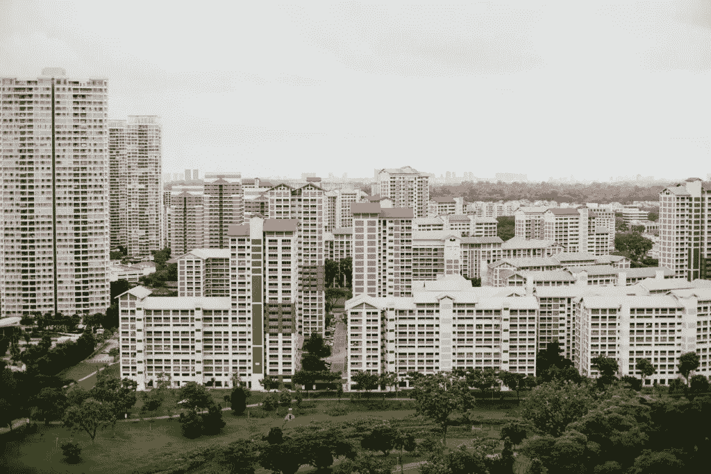
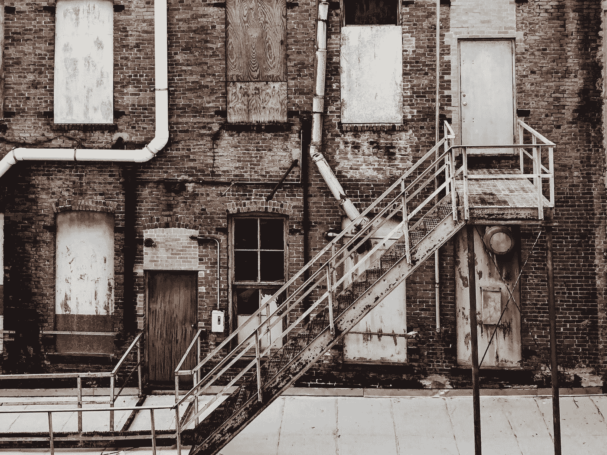
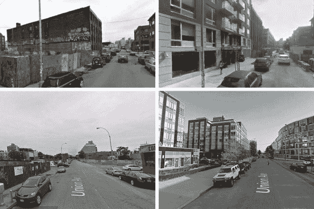
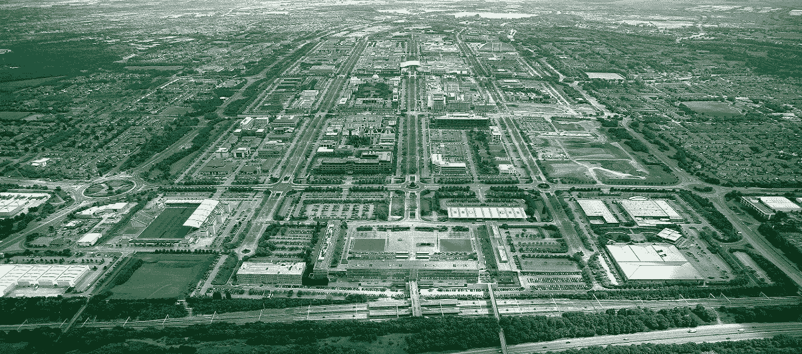
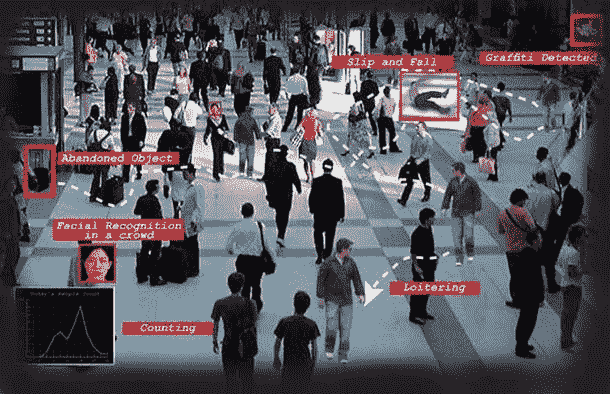
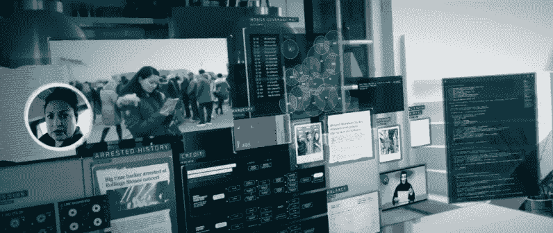

# 城市规划中的人工智能

> 原文：<https://medium.com/codex/artificial-intelligence-in-urban-planning-9d94aebaa098?source=collection_archive---------20----------------------->

城市规划对我来说很近，很重要。虽然我目前住在特拉华州，但我是在纽约市长大的，那里的人口在持续增长。

仅仅在我的旧社区，我就看到有优势的房主和开发商如何继续拆除独栋住宅，建造四户住宅。停车场正被改造成六层或六层以上的大楼。更少的停车场和更多的人意味着我住在那里时就存在的停车问题只会恶化。我记得晚上开车四处寻找停车位，最终决定冒着被拖走的风险把车停在白色城堡餐厅的停车场。

问题不止于此。公园的数量减少了。运输和交通问题依然存在。学校人满为患。这些因素甚至不包括其他城市规划领域的可持续性、现有和潜在的污染、犯罪、土地价值、经济发展、社会公平、分区法规和其他立法。如果人工智能能够更有效地管理这些问题，那我就全押了。

# 防止邻居崩溃

用木板封住的窗户、破旧的建筑、涂鸦的墙壁。这些是世界各地多个社区城市衰退的迹象。但是，如果有一种方法可以预测一个街区的下降趋势，并做出改变以避免以后情况恶化，那会怎么样呢？有很多人在用人工智能来解决这个问题。

麻省理工学院(MIT)和哈佛大学开发了一个人工智能系统，能够预测美国多个城市的城市衰退。研究结果指出，受教育程度高的居民在商业和有吸引力的社区附近的密度，而不是收入和住房成本，是振兴的关键因素。在那些已经发生严重衰败的地区，旧建筑的拆除和新建筑的建造极大地振兴了这个街区。

据麻省理工学院新闻报道，“研究人员使用一种叫做语义分割的计算机视觉技术，根据组成图像的对象，对他们数据集中 160 万张图像中的每一张图像的每一个像素进行分类。如果像卡车或行人这样的东西构成了太多的图像，则系统拒绝该图像，而是比较与同一块上的不同坐标相关联的图像。同样，在评估街景的感知安全性时，该系统忽略了图像中太容易受季节变化影响的部分，如树木和天空。

为了验证这些发现，文章继续说道，“研究人员还向通过亚马逊的 Mechanical Turk 众包平台招募的审查人员展示了从他们的数据集中随机选择的 15，000 对图像，他们被要求评估所描绘的社区的相对安全性。72%的情况下，评论者的评估与计算机系统相吻合。"

这种水平的研究只有随着人工智能的进步才成为可能。随着在五个美国城市的初步案例中发现的成功，毫无疑问这可以在全球范围内实现。

# 改善交通运输

总部位于英国的公司 Vivacity Labs 已经将使用人工智能来改变运输行业作为自己的使命，通过使用全面的数据来驱动运输网络的实时优化。在阅读关于该公司的资料时，他们在相对较短的时间内所做的工作表明，通过使用先进的数据、人工智能和物联网，我们可以在交通方式上取得很大的改善。

以我们如何使用 GPS 系统为例。在开始旅行之前，我们可能会使用谷歌地图或 Waze 来寻找到达目的地的最佳方式，并避免交通堵塞。然而，这些系统使用当前的交通状况来提出建议。另一方面，Vivacity Labs 使用人工智能来预测交通模式将如何发展，从而指导司机一旦到达特定街道将有多繁忙。此外，这些见解还将控制像交通灯这样的事情，这将缓解交通流量，并优先考虑紧急车辆和公共交通。

# 预测和预防犯罪

虽然我将此列为人工智能如何用于城市规划的一个例子，但我不能完全支持这个用例。一方面，城市已经将人工智能用于安全目的。信用卡和网络犯罪是人工智能被成功用于打击犯罪的两个例子。但随着这项技术的进步，城市官员和规划者正在研究如何将人工智能用于监控和预测性警务。这引发了一系列问题:

*   在不剖析人的情况下，人工智能将如何用于预测分析？
*   威胁公民自由和隐私的可能性有多大？
*   市政官员如何让居民相信这项技术是公正和安全的？
*   你如何消除人类的感情和偏见，使技术成为这些工具的一部分？

因此，虽然我确实认为人工智能在信用卡欺诈等白领犯罪中有一席之地，但使用人工智能来观察或监视人们有点过了。有一些公司和团体正致力于创建一个结构来回答上述问题，但是现在，我还不能支持它。

# 城市规划的未来

随着世界人口越来越多，技术越来越智能，两者之间有着明显的伙伴关系。人工智能和其他随之而来的技术，如机器学习，可以给我们带来其他方式无法获得的洞察力。负责任地使用这项技术将有助于缓解当前的问题，并为未来的增长带来更好的模式。