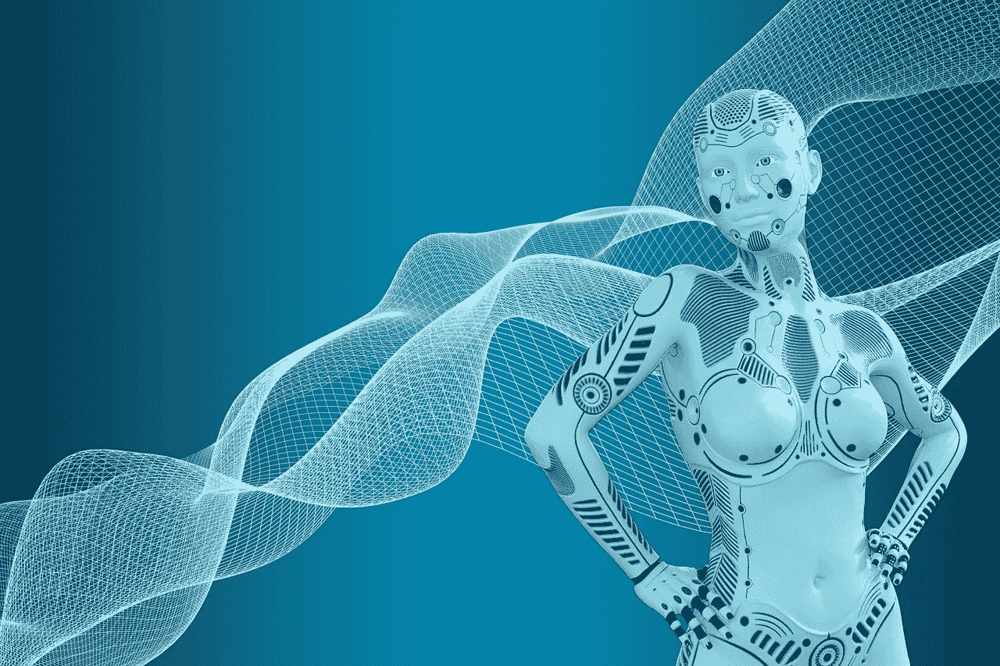

# 人工智能没有意识！

> 原文：<https://medium.com/codex/artificial-intelligence-is-not-conscious-41851a2b894d?source=collection_archive---------6----------------------->

## 可能永远也不会

图片来自[Pixabay.com](https://pixabay.com/illustrations/technology-robot-futuristic-android-3940066/)

## 精神哲学

如果你关注我的内容，你就会知道我对心灵哲学很感兴趣。在这篇博客中，我想简单总结一个著名哲学家约翰·塞尔的思想实验。这可能是你在这个分类中读到的第一个项目…