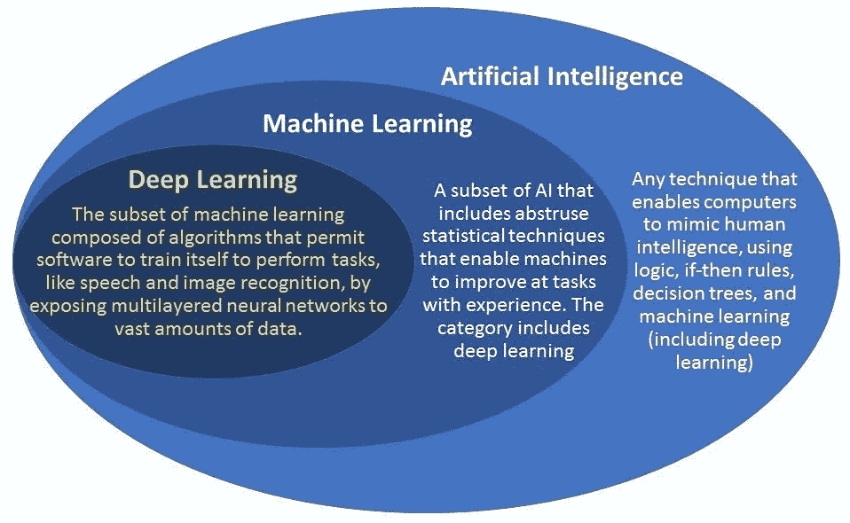
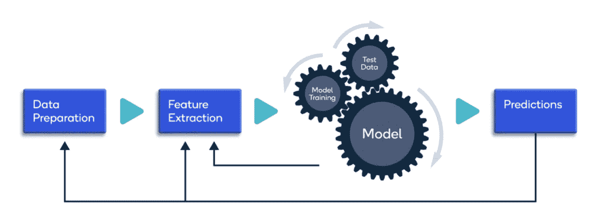
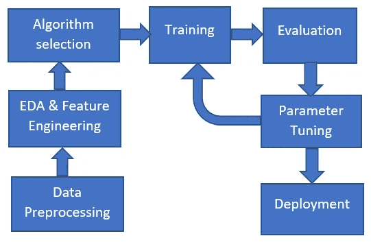
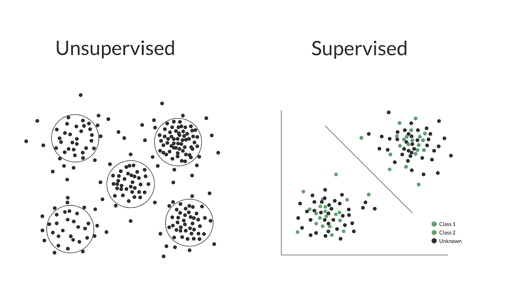
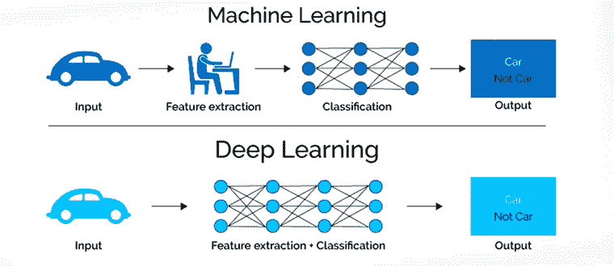
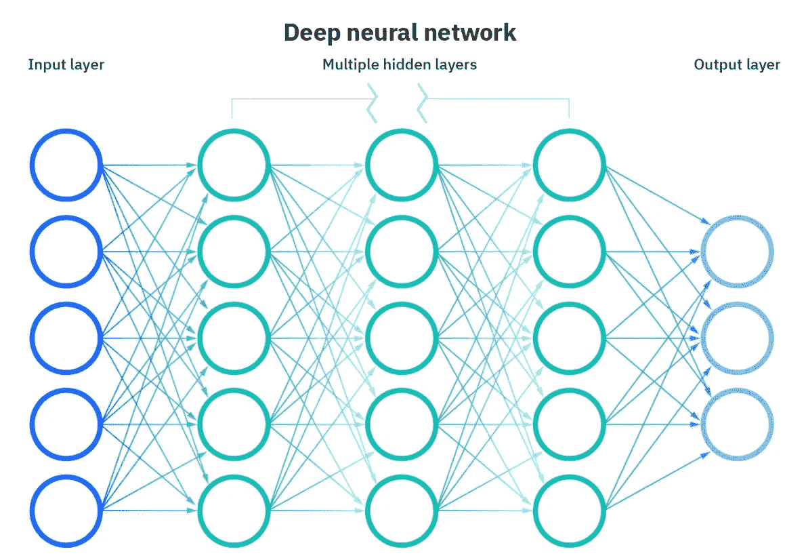
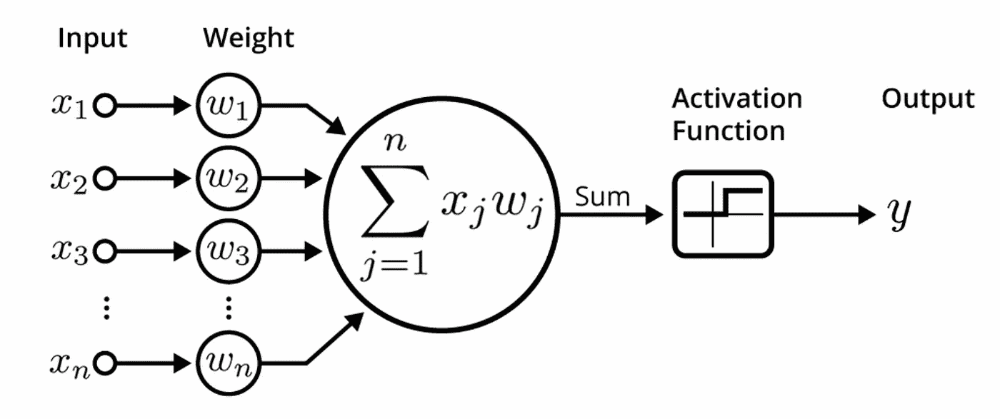
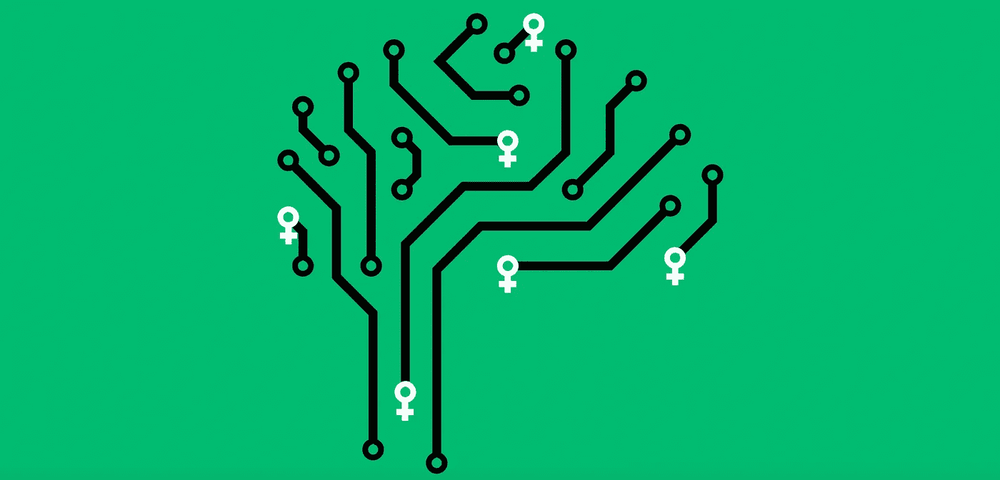
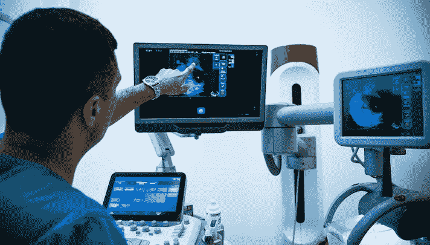

# 人工智能正在开创女性健康的下一波浪潮。

> 原文：<https://medium.com/codex/artificial-intelligence-is-pioneering-the-next-wave-of-womens-health-71acb2290200?source=collection_archive---------1----------------------->

[来源](https://www.bcg.com/publications/2019/artificial-intelligence-ai-help-hinder-women-workforce)

> 男人来自火星，女人来自金星。

在过去几十年最著名的一本书里，*男人来自火星，女人来自金星*，约翰·格雷用这个比喻来描述那些认为自己是男性的人和那些认为自己是女性的人之间的各种心理差异。为此，格雷的书提供了帮助伴侣改善关系的见解。

然而，心理差异并不是唯一持续存在的。

当我们想到那些认为自己是男性的人，以及那些认为自己是女性的人时，我们会不由自主地想到身体特征或认知过程中的差异。

然而，我们很少想到两性之间的健康结果和不平等。

个人的健康严重依赖于几个关键因素，这些因素是健康的 [**社会决定因素**](https://manasikkm.medium.com/the-social-determinants-of-health-the-unspoken-variables-of-health-inequities-5a8c85e567fd) 。

然而，性别在妇女如何体验健康的社会决定因素中发挥了作用。

从医疗保健中的性别歧视到全球教育差异，女性健康的[未言明的变量](https://manasikkm.medium.com/the-unspoken-variables-of-womens-health-fb7b27e469ce)以我们刚刚开始量化的方式影响着女性。

但即使从生物学角度来看，女性也更容易受到一定范围内的各种疾病的影响。

从自身免疫性疾病到痴呆症，从乳腺癌到生殖障碍，我们的医疗保健系统并没有针对这些差异进行优化。

*然而，人工智能在医疗保健领域的兴起使女性能够获得更快的诊断、更个性化的资源和广泛的治疗选择。*

# 人工智能不是科幻小说。

想象一下。

这是一个普通的星期三早晨。没什么异常。你睁开眼睛，伸出手，拿起手机，用面部识别解锁。时钟显示上午 7 点 16 分。

你注意到你有一些通知，于是你点击了 Instagram，在你意识到之前，30 多分钟已经过去了。早上 7 点 48 分。

起床穿好衣服后，你点击 Spotify，打开 Discover Weekly 播放列表，关闭你开始播放音乐时出现的广告。但是很快，你意识到你要迟到了。现在是早上 8:07。

当你匆忙上车去办公室时，你疯狂地在谷歌地图上输入方向，试图找到哪条路线交通流量最少，能最快到达那里。上午 8 点 18 分。

在任何一天，即使只是在一个普通的周三早上，几乎我们每个人都与某种形式的人工智能互动。

仅仅在一个早上，你已经与至少 5 种不同形式的人工智能进行了互动，更不用说你在给同事发信息或在亚马逊上下单时可能与之互动的人工智能了。

当我们听到“人工智能”这个词时，我们许多人都倾向于想到科幻小说，甚至是日常生活中并不普遍的技术，从机器人到自动驾驶汽车。

但在现实中，人工智能无处不在。它几乎以某种形式存在于社会的各个领域，是我们日常生活的一部分，尽管我们很少承认这一点。

## 但是什么是真正的人工智能呢？

[来源](https://www.geospatialworld.net/blogs/difference-between-ai%EF%BB%BF-machine-learning-and-deep-learning/)

尽管在过去的几十年里，“人工智能”一词的许多定义已经浮出水面，但本质上，它是能够执行通常需要人类智能的任务的计算机系统的理论和发展。这些包括视觉感知、语音识别和决策。

人工智能需要计算机科学和数据的顶点来解决问题，并包含机器学习和深度学习的子领域。

虽然术语**人工智能、机器学习、深度学习、**和**神经网络**通常使用时没有什么区别，但注意到这些不同的人工智能子集之间的差异至关重要。

## 机器学习

机器学习是人工智能的一个分支，它使用数据和算法来模仿人类学习的方式，逐步提高其准确性。

通过统计方法，算法被训练来进行分类或预测，并被证明在从运输到营销到医疗保健的各种应用中是有用的。

从制造自动驾驶汽车到药物发现，机器学习正在引领下一波创新。

[来源](https://developer.qualcomm.com/software/qualcomm-neural-processing-sdk/learning-resources/ai-ml-android-neural-processing/data-collection-pre-processing)

制作机器学习模型的第一步需要定义模型的目标，通过它可以建立和收集相关类型的数据。

接下来，通过消除数据集中的不一致并执行**探索性数据分析**来准备数据。这需要删除重复项，纠正错误，并处理丢失的值。此外，必须对数据进行随机化，以消除收集和/或准备数据的特定顺序的影响。数据还必须分成训练集和评估集。

探索性数据分析需要理解数据中的模式和趋势。在这个阶段，所有关于数据及其相关性的有用见解都被理解，这使得它在机器学习过程中非常重要。

第三步是选择和训练一个模型。训练该模型是为了尽可能频繁地回答问题或做出预测，从而提高其准确性。收集的数据被分成训练和测试数据以训练算法。

然后，通过使用一些度量或者度量的组合来“测量”模型的客观性能，从而对模型进行评估。这将根据以前未见过的数据测试模型。看不见的数据在某种程度上代表了真实世界中的模型性能，但仍然有助于调整模型。另一方面，测试数据无助于数据调优。

[来源](https://sqlrelease.com/building-first-machine-learning-model-using-logistic-regression-in-python-step-by-step)

第五步是超参数调整，这需要调整模型参数以提高性能。这些模型超参数可以包括训练步骤的数量、学习速率和初始值。

建立机器学习模型的最后一步是进行预测。使用来自测试集的进一步的数据，这些数据到目前为止还没有从模型中得到，这些数据被用来测试模型，以便更好地近似模型在现实世界中的表现。

然而，有多种不同类型的机器学习模型。其中包括**监督**和**非监督学习。**

监督学习使用带标签的数据集来训练算法，以对数据进行分类或准确预测结果。当输入数据被输入到模型中时，它调整其权重，直到模型被适当地拟合，以避免过拟合或欠拟合，其中数据在训练数据上表现不佳，或者在训练数据上与在评估数据上表现不同。监督学习用于大规模的真实世界应用，例如对垃圾邮件进行分类。

[来源](https://www.extrahop.com/company/blog/2019/supervised-vs-unsupervised-machine-learning-for-network-threat-detection/)

另一方面，无监督学习使用机器学习算法来分析和聚类未标记的数据集。他们能够在没有人工干预的情况下发现模式或数据分组，并根据相似性对数据进行排序。无监督学习通常用于探索性数据分析、图像和模式识别等。它还可用于减少给定模型中的特征数量。无监督学习的一个现实世界的例子是面部识别。

虽然经常被忽视，但**半监督学习**提供了监督和非监督学习之间的媒介。在训练过程中，它使用较小的已标记数据集从较大的未标记数据集进行分类和特征提取。当没有足够的标记数据来训练监督算法时，这种类型的机器学习是有用的。

机器学习的另一个主要类别是**强化学习**。

[来源](https://www.kdnuggets.com/2018/03/5-things-reinforcement-learning.html)

强化学习是一种行为机器学习模型。它类似于监督学习，但不是使用样本数据进行训练，而是通过试错进行学习。该算法学会在“类似游戏”的环境中做出一系列决策。

为了让算法得出最佳结果，模型对其执行的操作进行奖励或惩罚。它的目标是最大化总报酬。通过反复试验，完全由模型决定如何执行任务以获得最大回报。强化学习的一个现实世界的例子是在游戏行业，算法计算出如何在游戏中实现最佳结果。

## 深度学习

深度学习是机器学习的一个子集，本质上是一个具有三层或更多层的神经网络。神经网络试图通过允许人脑从大量数据中学习来模拟人脑的行为。虽然单层神经网络仍然可以做出近似的预测，但深度学习中使用的额外隐藏层有助于优化和完善更准确的结果。

深度学习在处理的数据类型和学习的方式方面不同于机器学习。机器学习算法是结构化的，并利用数据进行预测。这意味着从模型的输入数据中定义特定的特征，并组织成表格。即使机器学习模型使用非结构化数据，它也会对其进行预处理，以便将其组织成结构化格式。

另一方面，深度学习消除了机器学习涉及的一些预处理。这些算法可以处理非结构化数据，如文本和图像，并自动进行特征提取。

[来源](https://blog.thinkwik.com/insights-of-the-machine-learning-and-the-deep-learning/)

例如，如果我们试图对一组不同宠物的照片进行分类，深度学习算法可以确定哪些特征对于区分一种动物和另一种动物很重要，例如它们的耳朵。然后，深度学习算法调整并适应自身的准确性，并以更高的准确性对动物的新照片进行预测。然而，在机器学习中，照片中特征的重要性是由个人手动建立的。

深度学习是许多人工智能应用和服务不可或缺的一部分，特别是那些提高自动化和在没有人类干预的情况下执行任务的应用和服务，如数字助理和自动驾驶汽车。

## 神经网络

本质上，神经网络反映了人脑的行为，允许计算机程序识别模式并解决人工智能、机器学习和深度学习领域的常见问题。

他们可以预测任何事情，从某人下次去医院时感染细菌的概率到一本书的下一章。

神经网络可以是强大的工具，因为它们允许我们非常快速地对数据进行分类和聚类。语音和图像识别不再需要几个小时，而是只需要几秒或几分钟，就像谷歌的图像搜索算法一样。

神经网络的名称和结构受到人脑的启发，因为它们模拟了大脑中神经元相互通信和发信号的方式。

神经网络由不同的**节点层、**组成，每个节点层包含一个输入层、一个或多个隐藏层和一个输出层。

每个节点连接到另一个节点，并且具有相关联的权重和阈值。如果任何单个节点的输出高于指定的阈值，则该节点被激活。这将数据发送到网络的下一层。

神经网络依赖于训练数据，以便随着时间的推移学习和提高其准确性。迭代训练过程找到**参数**，或模型权重，当评估数据集中的例子时，其导致最小的误差或损失。

神经网络的四个主要组件是*输入*、*权重*、偏置或*阈值*和*输出*。

[来源](https://www.freecodecamp.org/news/deep-learning-neural-networks-explained-in-plain-english/)

在输入数据后，添加权重以确定重要性，然后考虑阈值并将其应用于公式。然后，它可以插入到激活函数中，以便接收相应的输出。

由于函数的隐藏层，这个特定的过程被重复多次，以便接收最终的输出。每个隐藏层都有自己的激活功能，使其有可能将信息从上一层传递到下一层。隐藏层的所有输出生成后，它们将被用作计算最终输出的输入。

有许多不同类型的神经网络，从由用于图像处理、计算机视觉和语音识别的神经元的三维排列组成的**卷积神经网络**，到将特定层的输出反馈到输入以预测该层输出的**递归神经网络**，并用于包括文本处理和情感分析在内的应用中。

[来源](https://www.wired.com/story/artificial-intelligence-researchers-gender-imbalance/)

现在，我们已经深入了解了人工智能是什么，以及它在我们日常生活中的普及程度，我们可以开始了解它与医疗保健的交叉之处，进而开创下一波女性健康。

人工智能提出了广泛的可能性，它可以彻底改变医疗保健部门。从诊断和治疗到患者参与和坚持，从管理应用到药物发现，可能性似乎是无限的。

特别是，艾提出了一个戏剧性的变化，以*妇女的健康，*因为妇女在生理上更容易受到一定范围的各种条件，疾病和疾病；从自身免疫性疾病到老年痴呆症，从乳腺癌到生殖障碍。

通过利用人工智能，我们有潜力为患有这些疾病的女性开发更先进的诊断和治疗选择。

> 人工智能可能是彻底改变数百万女性诊断和治疗方式的关键。

世界各地的研究人员和创新者已经找到了应用人工智能更好地为医疗保健系统中的女性服务的方法。

从麻省理工学院的研究人员，[创建深度学习算法来读取乳房 x 光片和医生的数据](https://www.npr.org/sections/health-shots/2019/04/01/707675965/training-a-computer-to-read-mammograms-as-well-as-a-doctor)，减少假阴性和阳性的数量，到美国国家卫生研究院和全球公益组织的研究人员，他们开发了一种算法来[分析女性子宫颈的数字图像，并识别癌前病变。](https://www.nih.gov/news-events/news-releases/ai-approach-outperformed-human-experts-identifying-cervical-precancer)

然而，人工智能可以应用于癌症诊断之外。研究人员已经找到了使用人工智能来[改善 PCOS](https://jartms.org/admin/uploads/JcgPN1.pdf) 或多囊卵巢综合征的诊断的方法，通过可以分析超声图像的机器学习模型，开发 [ML 模型来预测狼疮疾病活动](https://www.nature.com/articles/s41598-019-45989-0)，这是一种自身免疫性疾病，其中 10 名患者中有 9 名是 15 至 44 岁的女性。

甚至新兴公司也在彻底改变我们对待影响女性的疾病和状况的方式。

以 [Whiterabbit](https://www.whiterabbit.ai/) 为例，这是一家成立于 2017 年的初创公司，致力于重新定义乳腺癌筛查和诊断体验，以改善患者的结果。该公司在乳房 x 线摄影领域开发了一系列产品，实现了早期和准确的乳腺癌检测，目标是到 2025 年在美国根除晚期乳腺癌。

[来源](https://www.mobihealthnews.com/news/whiterabbit-emerges-stealth-fda-clearance-ai-breast-cancer-screening-tool)

Whiterabbit 的 WRDensity 软件在 2020 年 10 月获得了 FDA 510(k)许可。该软件提供客观数据，帮助放射科医生更快地确定乳房密度的水平，这是患乳腺癌的一个重要风险因素，需要放射科医生更多的关注，因为它更难以评估。

Whiterabbit 还开发了一款名为 ACT 的工具，这是一款人工智能服务，可以让患者更容易地安排乳腺癌筛查，还可以发送提醒，并教育女性有关乳房健康的知识，以做出更明智的决定。它已经在美国 400 多家诊所实施。

甚至那些解决方案不完全基于人工智能的公司也采用了人工智能，以便更好地为女性服务，特别是在生育领域。

其中一家公司是 Inne T1，他们开发了一个家庭生育监控系统，使用 T2 唾液 T3。Inne minilab 由**条**和**阅读器**组成；该条收集个人的唾液，阅读器使用先进的图像处理分析快速捕捉几个图像。基于摄像头的技术测量唾液流动的速度，并捕捉特定一天个人的激素测量值。

[来源](https://www.inne.io/en/home/)

在收集唾液并测量激素水平后，该设备连接到用户设备上的一个应用程序，通知用户他们的生育窗口、排卵日和孕酮趋势，让用户更好地了解自己的身体和生育能力。

在仅仅一毫升的唾液中，Inne minilab 能够**检测到** **0.0000000001 克孕酮**的变化。虽然浓度非常小，但这些微小的变化可以引发实质性的生理变化，包括排卵。

为了向用户提供准确的见解，Inne 开发了一种算法，该算法考虑了激素的可变性，并定义了一个对用户来说独特的激素基线。从那里，该应用程序可以准确预测用户的生育能力、激素波动，甚至帮助用户仅从他们的唾液中了解月经周期症状。

# 价值 11 亿美元的产业。

尽管研究和众多新兴公司正在利用人工智能促进女性科技和女性健康，但在利用人工智能更好地为女性服务方面，仍有大量工作要做。

尽管目前人工智能在女性健康领域的许多应用都是针对诊断和检测的，但人工智能也有可能用于治疗，特别是在药物发现和为患有生殖疾病、自身免疫疾病和某些神经疾病的女性开发解决方案方面。

下一波女性健康和女性科技创业公司正在崛起，2019 年，女性科技行业产生了**8.206 亿美元** **的全球收入**；到 2024 年，该行业预计将达到 11 亿美元。

随着该行业的发展，我们可以期待看到技术(即人工智能)和女性健康之间的融合，因为研究人员、科学家和企业家致力于研究和开发产品和资源，以服务于更大范围的女性。

# 由人工智能推动的下一波女性健康浪潮已经开始。

[来源](https://techcrunch.com/2020/04/07/five-ceos-on-their-evolution-in-the-femtech-space/)

> 非常感谢您阅读这篇文章！如果你从这篇文章中学到了什么，请分享！一定要把[和我](https://linktr.ee/manasigajjalapurna)联系起来，留下这篇文章一个拍手👏如果你喜欢的话！

# 来源:

 [## 什么是人工智能(AI)？

### 人工智能利用计算机和机器来模仿解决问题和决策的能力…

www.ibm.com](https://www.ibm.com/cloud/learn/what-is-artificial-intelligence#toc-what-is-ar-DhYPPT4m)  [## 什么是神经网络？

### 了解允许程序识别模式和解决人工智能中常见问题的神经网络…

www.ibm.com](https://www.ibm.com/cloud/learn/neural-networks)  [## 什么是强化学习？完全指南- deepsense.ai

### 人工智能预计市场规模为 73.5 亿美元，正在突飞猛进地发展…

deepsense.ai](https://deepsense.ai/what-is-reinforcement-learning-the-complete-guide/)  [## 成为人工智能专家的终极指南

### 学会利用当今最强大的技术之一:人工智能。没有…

adam-maj.medium.com](https://adam-maj.medium.com/the-ultimate-guide-to-becoming-an-artificial-intelligence-expert-db5124dc8ae0)  [## “女性科技”是医疗保健领域的下一件大事吗？

### 初创企业和科技公司正在创造产品来满足女性的医疗保健需求。它仍然是……的一小部分

www.nytimes.com](https://www.nytimes.com/2021/04/07/health/femtech-women-health-care.html)  [## 解决女性健康问题的“女性科技”有望增长到 1B 工业的 10 亿美元

### 女性占全球人口的一半，但只有一小部分技术面向女性。…的增长

www.beckershospitalreview.com](https://www.beckershospitalreview.com/digital-transformation/femtech-to-address-women-s-health-expected-to-grow-to-1b-industry.html)  [## 创新女性健康技术如何改变医疗保健| CB Insights

### 从“数字”节育到可穿戴式吸奶器，女性健康市场正准备迎接一场前所未有的…

www.cbinsights.com](https://www.cbinsights.com/research/report/womens-health-technology-transforming/#forward)  [## 什么是机器学习？|工作原理、技术和应用

### 办公楼、医院和其他大型建筑中的供暖、通风和空调(HVAC)系统

www.mathworks.com](https://www.mathworks.com/discovery/machine-learning.html)  [## 跟随白兔:人工智能开发者退出隐形模式，FDA 批准乳腺癌筛查…

### 在秘密运作了大约四年后，一家开发人工智能技术来改善乳房的初创公司…

www.fiercebiotech.com](https://www.fiercebiotech.com/medtech/follow-whiterabbit-ai-developer-exits-stealth-mode-fda-ok-for-breast-cancer-screening-tool)