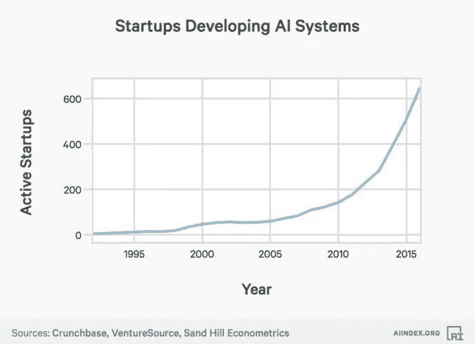

# 人工智能:它的类型和含义

> 原文：<https://medium.com/codex/artificial-intelligence-its-types-and-implications-b95d5a4b9959?source=collection_archive---------0----------------------->

马库斯·温克勒在 [Unsplash](https://unsplash.com?utm_source=medium&utm_medium=referral) 上的照片

## 最近几天的热门话题是人工智能(AI)。人工智能带来了人力资本和劳动力的巨大变化。请继续阅读，了解人工智能及其类型，以及它对现实世界的影响。

# **什么是人工智能？**

想象一台机器或一个程序，在人类之间充当中介，而不直接接触。这就是所谓的人工智能(AI)。然而，AI 推出时人们对它的反应是失败的。但在最近几天，人们完全依赖于谷歌、脸书、苹果等科技巨头。而这些公司利用人工智能来改进他们的技术，以便赶上人们的思维。你能相信一个人一生的梦想就是买一部 iPhone 吗？这种情况在 21 世纪初并不存在。这怎么可能呢？

# **AI 对人的影响**

你可能想知道机器如何取代人，但它正在发生。例如，在谷歌，如果你输入任何东西，它都会给你最好的结果。可能你不会命令它给出最好的结果，那怎么可能呢？这是因为 AI。让我给你详细解释一下，谷歌在你搜索结果的搜索栏里设置了一个人工智能程序，它会分析你以前的搜索并优化结果，给你最好的。从这个案例中，你可以观察到 AI 减少了我们的劳动力以一种精心制作的方式打字。这可能看起来是小规模的，但也有人工智能大规模应用的情况。例如，许多公司正在使用高度先进的人工智能程序来管理他们的数据库环境，他们也将它们用于软件开发。这影响了人们生产更多的人工智能程序来管理工作和其他开发工作。

作者图片

这张图代表了开发人工智能程序和系统的初创公司的数量。它清楚地代表了人工智能多年来对人们的影响，并且在 2015 年及其后达到了顶峰。许多人被鼓励为企业做人工智能系统来管理他们的工作，今天许多公司依赖人工智能进行工作流程和开发。人工智能的发展在继续，随着期望的继续，许多新的应用程序被发现具有有效性和能力。

# **人工智能的应用**

任何人都可以根据自己的灵活性创建自己的 AI 程序或系统。因为任何人都可以创建他们的人工智能程序，它被称为用户定义的系统。作为一个用户定义的系统，人工智能在世界各地有许多应用。一些突出的应用是机器学习和深度学习。

## 机器学习

机器学习是人工智能的一个应用，它处理计算机算法。你可能会问什么是计算机算法？它是计算机中预先建立的一组序列，用于解决案例和问题。机器学习为计算机或软件提供了自动学习的能力。用于机器学习的程序不必以精确的方式进行，这被认为是机器学习的优点。机器学习可以用来做什么？机器学习专注于计算机程序的开发，也用于识别数据模式(告诉我们数据是如何提取的)。作为一个自动化的学习程序，机器学习识别数据模式，并为我们提供理想的决策，也用于预测。一些众所周知的例子是苹果的 Siri 和亚马逊的 Alexa。

## 深度学习

深度学习被认为是机器学习的一个子集，其中人工神经网络(一系列模仿人脑功能的算法)和受人脑启发的算法为计算机提供了更广泛的数据。随着计算机的接入，大量的数据深度学习帮助机器解决复杂的问题，即使是在使用非结构化的数据模式时。你可以观察到我把人脑和深度学习联系起来。为什么会这样呢？我们的人脑和深度学习有很多关系。首先，深度学习的功能与人脑的高级功能密切相关。深度学习存在一些大型元素，这些元素与我们人类大脑中存在的神经元最相似。最后，深度学习由人工神经网络组成，这些网络的设计与人脑中的网络非常相似。深度学习的主要优势之一是能够独立执行程序，它使用网络结合数据，使程序更快。

# **人工智能的种类**

有许多人工智能程序，但在这里，我们将看看三种主要类型的人工智能。这三种类型是:

*   人工狭义智能
*   人工通用智能(AGI)
*   人工超级智能(ASI)

作者图片

## 人工狭义智能(ANI):

ANI 是人工智能，它一次只执行一个狭窄或简单的任务。它用于天气预报、下棋、数据分析等领域，也有助于开发 Siri 和 Alexa 等软件。这种智能由于其功能和能力也被称为弱智能。在这一分类中，ANI 被视为 1 级。

## 人工通用智能(AGI):

AGI 是一台机器的假想智能，它有能力理解或学习人类能做的任何任务。与功能相比，它的智力与人脑相当。人工智能的首要目标是未来的研究。最好的例子之一是 IBM 的沃森，这是一个被认为是世界上最聪明的程序之一的人工智能程序。

## 人工超级智能(ASI):

人工智能被认为是人工智能的未来。当计算机和机器的能力远远超过人类时，这个愿景就实现了。这种即兴发挥的智慧将成为世界主要部门的主导形式或地位。然而，技术研究人员和统计学家不同意这种机器超越人类智能的理论。人工超级智能的一个主要缺点是，它无法匹配人类的认知感官和人类的感知技能。这两者在决策过程中起着至关重要的作用。例如，假设有一家受欢迎的公司有一位首席执行官。现在，公司首席执行官必须做出一个对全球员工都有影响的重要决定，我们目前无法进行任何分析。因此，在这一点上，我们不能期望从一个程序中得到什么，这是人类使用他们的认知和感知技能来找到解决方案的地方。ASI 的优势在于它们有能力生成即时报告，并且在人类不具备的任何时刻都很聪明。

# **人工智能对金融的影响**

人工智能在金融行业有许多应用。AI 是数据挖掘的佼佼者之一。这种优势可以用于财富管理和投资银行等行业，在这些行业中，他们使用数据挖掘进行情绪分析，这意味着公司的状态，如表现良好、表现突出、较差等。人工智能通过提高交易计划和决策的准确性，帮助财富管理部门提高效率。如今，像高盛、摩根大通和先锋集团这样的顶级财富管理公司正在使用人工智能来获得更好的洞察力。由于人工智能是一个用户定义的系统，金融公司正在使用利用情绪分析和其他公共数据源构建的交易算法，这有助于处理数据。银行使用人工智能来识别欺诈案件，并为客户提供个性化的计划和建议。人工智能通过提供优化的模型和范例(方法)在风险管理方面非常有帮助。因此，通过将人工智能转向技术创新，人工智能已经成为金融界的“游戏规则改变者”，尽管如此，人工智能在金融领域仍有许多影响。

# **AI 能改变世界吗？**

世界在快速发展，有一种趋势是在瞬间得到任何东西。例如，在板球比赛中，人们不喜欢看测试赛，而是对 T20 比赛感兴趣。作为一个匆忙的世界，人们没有耐心在很长时间内完成一项工作，这就是人工智能让人们在瞬间完成工作的地方。人工智能有这种能力，它的功能与我们的大脑竞争。例如，如果我们把手放在火上，我们会很快把手从火上拿开，这个活动会在几秒钟内发生，这就是人工智能的表现。这就是 AI 变得更受欢迎的原因。但问题是 AI 能改变世界吗？我的答案是否定的，因为全球最丰富、最重要的资源是人力资本，而机器或程序又如何能取代它。人类的情感在这个世界上起着至关重要的作用。你能想象一个有一系列算法程序的世界吗？如果你问人工智能的未来是什么，那会是机器人设备、智能、人类互动等等。但是人类的未来是他们的愿景，没有什么能够取代它。除此之外，AI 也有好的一面。人工智能在未来的生产力中起着关键作用。人工智能完全基于自动化过程，有助于分析和预测。根据一份报告，公司的市场支出主要在认知技术和人工智能方面。这反映了公司如何依赖人工智能来提高生产力。人工智能也被认为是对未来的良好投资，因为它是世界上增长最快的技术链之一。因此，人工智能不能通过在各个领域取代人类来改变世界，但可以通过将人们转向技术方面来改变世界。