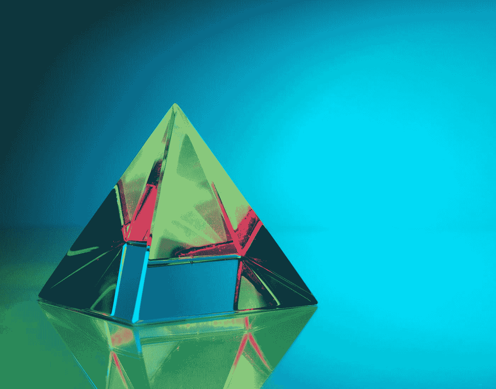

# 人工智能开启网络安全新时代

> 原文：<https://medium.com/codex/artificial-intelligence-to-launch-a-new-age-of-cybersecurity-fda2ed5115d7?source=collection_archive---------14----------------------->

*#TechWatchbySeb 周刊第 23 期—2011 年 5 月 17 日*

你好，我的朋友🖐，

欢迎回到周一的#TechWatchbySeb ☕️.本周，我们将在分享人工智能如何提高网络安全应用程序性能的见解后，穿越英国🇬🇧。

由[迈克尔·泽兹奇](https://unsplash.com/@lazycreekimages?utm_source=medium&utm_medium=referral)在 [Unsplash](https://unsplash.com?utm_source=medium&utm_medium=referral) 上拍摄的照片