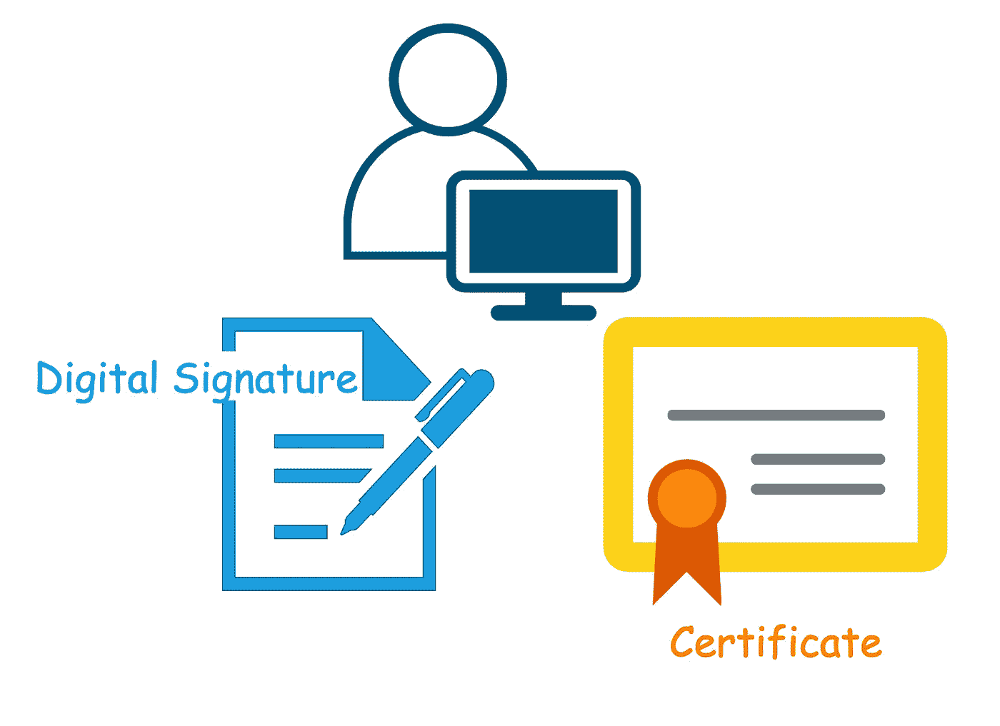

# 作为开发人员或 DevOps，您应该知道数字签名和证书概述和工作流程。

> 原文：<https://medium.com/codex/as-a-developer-or-devops-you-should-know-the-digital-signature-and-certificate-overview-and-d1ee50463b1b?source=collection_archive---------12----------------------->

*   细节将在图表中显示。

最近我一直忙于为项目建立微服务和中间件之间的安全通信，这涉及到 SSL/TLS，mTLS。解决了项目的安全通信问题后，终于有时间整理其中一个知识点了…