# 作为一个黎曼的想法，它是革命性的信息理论(集成形理论，熵编码)

> 原文：<https://medium.com/codex/as-one-riemann-idea-it-is-revolutionizing-information-theory-set-shaping-theory-entropy-coding-f9e0549e9c29?source=collection_archive---------5----------------------->

马库斯·斯皮斯克在 [Unsplash](https://unsplash.com/s/photos/data-compression?utm_source=unsplash&utm_medium=referral&utm_content=creditCopyText) 上的照片

哥廷根 1854 年 6 月 10 日对数学来说是一个历史性的日子，这一天，黎曼提出了他的教学资格论文，题目是“优步·迪·假说，祖莪·格伦德·列根”(论几何学中的假说)。他的导师是高斯，另一个数学传奇，是他在三个可能的论点中选择了关于几何的题目。

这次展示被认为是世界范围内展示的最重要的作品之一。汉斯·弗勒登塔尔在词典中称，他的论述是“数学史上的顶点之一”然而不幸的是，当黎曼提出它时，只有高斯能够理解它的真实值，它几乎被当时的数学家忽略了。黎曼提出的观点非常先进，以至于过了几十年才被完全接受，又过了 60 年才找到自然的物理应用，作为爱因斯坦广义相对论的数学框架。此外，令人惊奇的是，文章几乎不含数学符号，平均每页不到一个符号。老实说，这样一篇充满反思、未经证实的猜想和革命性想法的文章，即使在今天也很难被接受。某些文章只是需要集体意识来达到文章的水平，然后才能被理解并获得应有的成功。

黎曼提出的最重要的方面之一涉及几何图形之间等价概念的重新定义。这个主题不仅在几何学中是基本的，而且在拓扑学中也是基本的，事实上这个数学领域也被称为“等价科学”例如，在拓扑学的意义上，一个甜甜圈相当于一个只有一个把手的杯子，一个球体相当于任何一个三维封闭表面，一个双甜甜圈(有两个孔的甜甜圈)相当于一个有两个把手的杯子。

正是在这个时期，黎曼说了下面这句名言:

> *“包含相同数量元素的两个集合可以解释为观察同一现象的两个观点”。*

这句简单的话展示了思想的巨大深度，并代表了拓扑学发展到物理学的概念的延伸。这种思维方式是黎曼的典型，事实上他的每一个想法总是被设计用于几个科学领域。

要了解这个想法如何革新资讯理论，我们必须回答下列问题:我们如何模拟由系综 X =(X；a；p)？

X 中的源可以被视为骰子，其中 P 确定每个面的退出概率，A 表示字母表，因此骰子的面中存在符号。

例如，传统的 6 面骰子代表一个源 X =(X；a；P)，其中 P 是均匀概率分布，A={1，2，3，4，5，6}，x 表示掷骰子的结果。

因此，使用这种表示法，如果我们想生成一个由 X 生成的 10 个符号的序列，我们只需要投掷骰子 10 次。还有其他方法可以生成 X 的 10 个值吗？

还有一个非常简单的方法，一个 6 面骰子投掷 10 次可以产生 6 个⁰可能序列，每个序列的概率相等(分布均匀)。因此，如果我们写下所有 6 个⁰序列，并将它们放入一个包中并随机提取一个，我们有另一种方法来生成 x 的 10 个值。如果我们用数学方法形式化该方法，则该包表示集合 XN，其包括由源生成的所有 6 个⁰可能序列。

> 还有其他方法吗？如果我们使用黎曼思想，任何其他大小等于 XN 的集合都可以用来生成 x 的 10 个值。事实上，我们可以定义一个双射函数，它将 new 的元素与 XN 集合的元素连接在一起。

新集合中出现的序列应该具有什么特征？它们的长度 N2 不能小于 10，因为这样一来，新集合的元素数量将少于集合 XN，所以我们不能在两个集合的元素之间定义一个双射函数。它甚至不能有相同的长度，因为实际上我们将有一个等于 XN 的集合。因此，唯一的可能性是 N2 大于 10，在这种情况下，我们得到一个比集合 XN 更大的集合 XN2。因此，我们必须从新集合 XN2 中选择一个与集合 XN 大小相同的子集。因为该理论的目标是数据压缩，所以以这样的方式选择子集，使得它包括属于 XN2 的具有较少信息内容的序列。

因此，我们要做的是用新的骰子替换骰子。然而，这种替换迫使我们滚动骰子更多次。因此，这种类型的变换将源 X 改变成新的源 f(X ),其概率分布取决于所定义的子集。

为了理解这种转换的好处，我们需要理解序列的信息内容是如何计算的。

让我们以滚动六面骰子产生的 10 个值的序列为例。

**1345633266**

首先，我们需要计算每个面退出的概率 p(x)。

**p(1)=1/10**

**p(2)=1/10**

**p(3)=3/10**

**p(4)=1/10**

**p(5)=1/10**

**p(6)=3/10**

序列元素的信息内容定义如下:

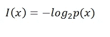

例如，序列的第一个元素是 x=1，所以我们有:

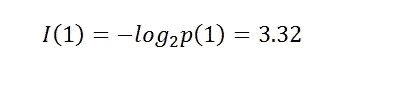

如果我们取第二个数 x=3，我们有:

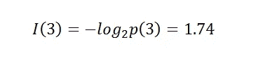

因此，序列 S 的信息内容是:

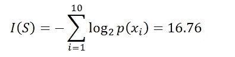

因此，我们示例序列的信息内容是 16.76 位。

现在让我们考虑一个源 X =(X；a；p)可以生成。如前所述，我们的源可以被视为一个骰子，其面的数量等于基数 A，所以如果序列的长度 N 为 3，字母表为 A = {0，1}我们的集合 X3 包含 2 个序列 X3 = {000，111，001，010，100，011，110，101}。8 个序列的信息内容是:

**S1 000 I(S1)=0**

**S2 111 I(S2)=0**

**S3 001 I(S3)=2.75**

**S4 010 I(S4)=2.75**

**S5 100 I(S5)=2.75**

**S6 011 I(S6)=2.75**

**S7 110 I(S7)=2.75**

**S8 101 I(S2)=2.75**

现在，我们计算属于 X3 的序列的信息内容的平均值。

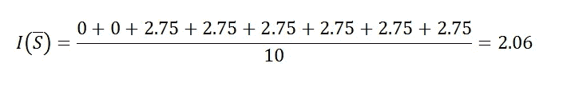

这个公式可以这样概括:

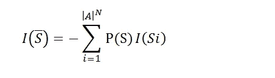

其中 P(S)是序列 Si 的退出概率，A 的 N 次幂的模表示源 X 可以生成的长度为 N 的序列的数量

对所示的公式进行一些考虑是很重要的。当 N(如在示例的情况下)非常小(短序列)时，该等式倾向于低估 NH(X ),源的 H(X)熵定义如下:

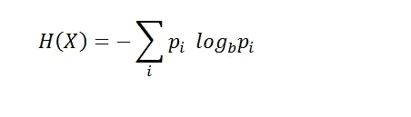

在示例 H(X)=1 的情况下，NH(X)=3 是大于 2.06 的值。这是因为当 N 很小时，具有比 NH(X)低得多的信息内容的序列的贡献变得相关。然而，这不是问题，因为如果我们增加序列的长度，报道的公式趋向于接近 NH(X)。事实上，当 N 变大时，产生一个信息量与 NH(X)相差很大的序列的概率几乎为零。

> 在信息论中，由源 X 产生的序列集合被分成两个集合，一个被称为典型集合，包含具有接近 NH(X)的信息内容的序列，另一个被称为非典型集合，包含具有不同于 NH(X)的信息内容的序列。根据渐近均分原理，当 N 较大时，我们只能考虑典型集，因为非典型集的贡献可以忽略不计。

事实上，当 N 增加 I( S)/N 时，它接近 H(X ),如下表中报告的数据所示。

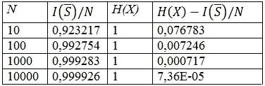

> 如你所见，只要增加序列的长度，所用的公式就能很好地逼近 NH(X)。所以，我们不必担心与 NH(X)有很大不同信息内容的序列，因为它们的贡献可以忽略不计。

现在让我们举一个使用这个理论的例子。我们取一个源 X =(X；a；p)具有均匀的概率分布，A={1，2，3}生成长度为 3 的序列。因此，可以产生 3 =27 个序列，我们称包含所有这些序列的集合为 X3。现在，我们将序列的长度增加到 4，这样就可以生成 3⁴=81 序列，我们称包含所有这些序列的集合为 X4。集合 X4 包含比集合 X3 多得多的序列，因此我们开发了一对一函数 f，其将 X3 的 27 个序列连接到属于 X4 的具有较少信息内容的 27 个序列。实际上，我们从 X4 中定义了一个包含 27 个序列的子集。下表显示了属于 X3 的所有序列的这种变换。第一列是序列 S，第二列是 I(S)，第三列是变换序列 f(S)，最后第四列是变换序列 I(f (S)的信息内容。

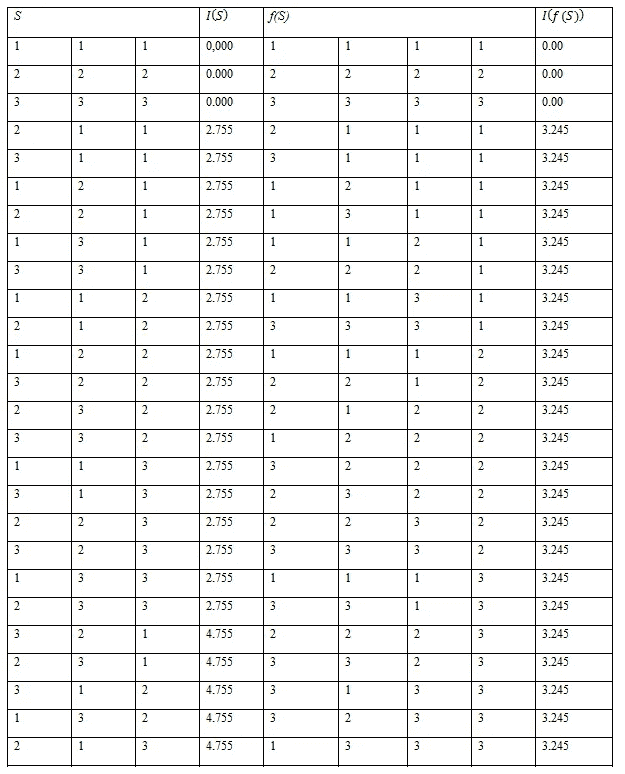

现在我们计算序列 S 及其变换 f (S)的平均信息量。

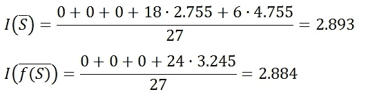

现在，我们做出了改变:

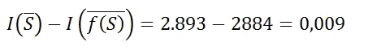

> 可以看出，变换后的序列具有较低的平均信息量。在这一点上，我们首先可以想到的是，这个结果是由于我们取了一个非常短的序列，其中我们有一个从具有少得多的信息内容的序列到 NH(X)的相关贡献。现在，我们将看到当我们增加序列的长度时，这个结果如何不改变。

我们将序列的长度增加到 100，因此，变换后的序列长度为 101。正如我们所看到的，这个长度的平均信息量约为 NH(X)。在这种情况下，我们考虑基数 A 从 2 到 10 变化的序列。在第一列中，我们有基数 A(信源发出的符号数)，在第二列中是序列 S 的平均信息量，在第三列中是序列 f(S)的平均信息量，在第四列中是差值。

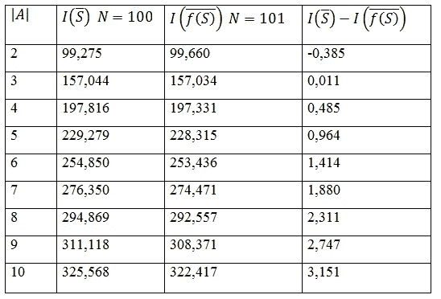

通过分析上表，我们注意到，当消息包含两个以上的符号(基数大于 2)时，转换后的序列的平均信息量较少。还要注意的是，随着 A 的基数增加，获得的增益也增加。在接下来的文章中，我将展示这个结果是如何一致的，因为这个方法用来减少熵编码 中存在的 [**低效。**](https://levelup.gitconnected.com/the-inefficiency-of-entropy-coding-set-shaping-theory-fcbf1ccb40bc)

> 这种低效率是由描述源所需的信息量决定的。因此，如果 A 的基数(发出的符号数)增加，描述源所需的位数也会增加。

这个新理论的目标是研究将一组字符串转换成由更长的字符串组成的大小相等的一组字符串的双射函数，它的名字叫做 [**集合成形理论 SST**](https://www.scienceopen.com/hosted-document?doi=10.14293/S2199-1006.1.SOR-.PPPWXAY.v1) 。该名称源于将源视为一个集合，该集合被转换成另一个模型集合，以便获得最大可能的压缩。

如你所见，这个理论是革命性的，完全改变了数据编码的方式。这只是这个理论的一个演示，在接下来的文章中，我将详细分析它，展示信息论最重要的定理的结果。

**集合成形理论的更新**
已经发表了一篇文章，其中理论预测得到了实验验证，并且使用的 Matlab 代码已经公开。

文章《集合成形理论在霍夫曼编码中的实际应用》。

 [## 集合成形理论在霍夫曼编码中的实际应用

### 对集合成形理论的最大批评之一是缺乏实际应用。这是由于…

arxiv.org](https://arxiv.org/abs/2208.13020) 

Matlab 代码。

 [## 测试-SST-霍夫曼编码

### 版本 10.0.0 (23.5 KB)如果你没有 Matlab，你可以注册并申请一个月的免费试用版…

www.mathworks.com](https://www.mathworks.com/matlabcentral/fileexchange/115590-test-sst-huffman-coding) 

[这个结果对香农第一定理的影响](https://www.academia.edu/88056303/Consequences_of_the_practical_application_of_set_shaping_theory_on_Shannon_s_first_theorem)

参考书目:

*   C.E .香农，《传播的数学理论》。
*   盖和托马斯，“信息论的要素”。
*   大卫麦凯，“信息论，推理和学习算法”。