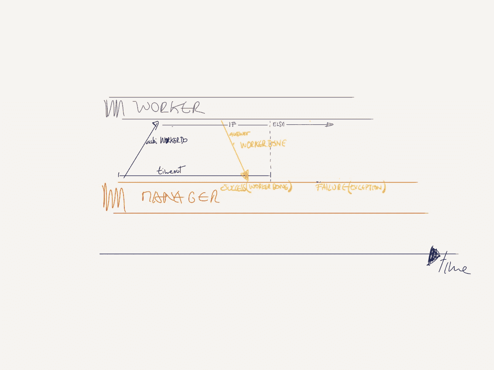
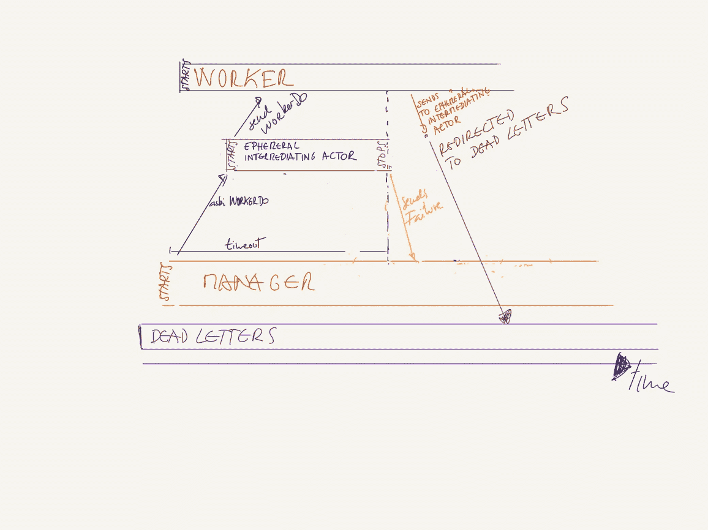

# 用阿卡语询问

> 原文：<https://medium.com/codex/asking-in-akka-439fec603f64?source=collection_archive---------6----------------------->

## 文章

## *摘自* [*阿卡在行动，第二版*](https://www.manning.com/books/akka-in-action-second-edition?utm_source=medium&utm_medium=organic&utm_campaign=book_abraham2_akka_9_17_21) *作者弗朗西斯科·洛佩兹-桑乔·亚伯拉罕*

*这篇文章简单介绍了 Akka 中“提问”的基本原理。*

将 **fccabraham2** 输入[manning.com](https://www.manning.com/?utm_source=medium&utm_medium=organic&utm_campaign=book_abraham2_akka_9_17_21)结账处的折扣代码框，享受 35%的折扣 [*Akka in Action，第二版*](https://www.manning.com/books/akka-in-action-second-edition?utm_source=medium&utm_medium=organic&utm_campaign=book_abraham2_akka_9_17_21) 。

## **询问。或者期待回复。**

用 Akka lingua 语来说，询问就是发送信息并提供处理响应的方法。发送消息后会发生两件事。要么您得到一个指示消息已经被处理的响应，要么您没有。如果你没有，那么你需要决定你该怎么办——就像寄一封信一样，就像在美好的旧时光一样。如果你需要一个回应，但你没有得到，在你采取行动之前，你愿意等多久？

答案是用时间和两种可能的结果来表述的。在 Akka 中，当我们要求某样东西时，我们还必须提供我们愿意等多久，以及我们将要做什么，不管我们是否收到答复。这两件事都很容易设置。对于计时，我们使用类超时，对于事实，我们可以得到或得不到答案。这是对两个选项`Success`和`Failure`的模式匹配。这是抽象类`Try[T]`仅有的两个实例，其中`T`是我们期望得到的对象类型，如果答案及时返回，因此被认为是成功的。当我们查看管理器的新实现时，我们将立即看到一个示例，但是在此之前，我们可以先看一下图 1，以便对它有所了解。



图 1 经理询问员工的可能结果

在这里，我们描述了一个经理在某个时间范围内向一个工人请求一项任务，然后工人停止等待响应。根据应答是在超时之前还是之后出现，管理器处理成功或失败。

在我们深入实现之前，最后一个想法是记住，我们将看到这种询问的两种情况:一种更简单，作为问题发送的消息不包含任何内容；另一种更完整，我们发送的对象包含一些工人使用的信息。

在这两种情况下，我们将有相同的应用程序和一个监护人来传递经理获得的任务列表。在清单 1 中，我们可以看到程序开始时的初始输入。

**清单 1 ManagerWorkerApp 和 Guardian**

```
import akka.actor.typed.scaladsl.Behaviors
 import akka.actor.typed.{ ActorRef, ActorSystem, Behavior }
 import scala.concurrent.duration.SECONDS
 import akka.util.Timeout
 import scala.util.{ Failure, Success }

 object ManangerWorkerApp extends App {

   val system: ActorSystem[Guardian.Command] =
     ActorSystem(Guardian(), "example-ask-without-content")
   system ! Guardian.Start(List("task-a", "task-b", "task-c", "task-d"))      #A
 }

 object Guardian {

   sealed trait Command
   case class Start(tasks: List[String]) extends Command

   def apply(): Behavior[Command] =
     Behaviors.setup { context =>
       val manager: ActorRef[Manager.Command] =
         context.spawn(Manager(), "manager-1")
       Behaviors.receiveMessage {
         case Start(tasks) =>
           manager ! Manager.Delegate(tasks)
           Behaviors.same
       }
     }
 }
```

**#A 输入，任务列表**

**#B 向下传递输入**

**更简单的问题**

如果我们运行前面清单 1 中的`App`，我们可以看到两种类型的结果。第一种类型在这里，如清单 2 所示。

**清单 2 响应及时返回时的输出**

```
[Worker$] - My name is 'worker-task-c'. And I've done my task
 [Manager$] - task-c has been finished by worker-task-c
```

这里可以补充的不多。在这种情况下，`Worker`及时完成了任务，`Manager`记录了这个事实。这是一只`Success`。

另一方面，我们可以在清单 3 中看到另一种输出。

**清单 3 响应没有及时返回时的输出**

```
[Manager$] - task 'task-a' has failed with [Ask timed out on [Actor[akka://example-ask-without-content/user/manager-1/worker-task-a#-450068248]] after [3000 ms]. Message of type [ask.simple.Worker$Do]. A typical reason for `AskTimeoutException` is that the recipient actor didn't send a reply.
 [Worker$] - My name is 'worker-task-a'. And I've done my task
 [DeadLetterActorRef] - Message [ask.simple.Worker$Done$] to Actor[akka://example-ask-without-content/deadLetters] was not delivered. [2] dead letters encountered. If this is not an expected behavior then Actor[akka://example-ask-without-content/deadLetters] may have terminated unexpectedly. This logging can be turned off or adjusted with configuration settings 'akka.log-dead-letters' and 'akka.log-dead-letters-during-shutdown'.
```

在最后一种情况下，发生了三件相关的事情。经理停止了等待答案，感觉回来了，报告说任务没有完成。另一方面，工人花费的时间比要求的要长，尽管经理放弃了等待，工人还是完成了任务。这就是我们看到第二条信息的原因。发生的第三件事涉及到两个新演员。当工作者完成它的任务时，它试图发送回一个回答，但是这个消息永远不会到达管理器。怎么会这样这是因为，当`ask` ing 时，一个短暂的中间参与者被创建，用于处理沿着预定义的`Timeout`的等待。最终这会在管理器中产生一个`Success`或`Failure`消息。

乍一看，这个流程可能有点复杂；让我们从图 2 中得到一些帮助。回顾一下大局。



图二。短暂的中间参与者生命周期和超时后的职责

从一开始。当经理请求时，一个短暂的参与者负责将原始消息发送给工人，并将`Success`或`Failure`发送回经理。不管是这个还是那个，这个演员立刻就进入了`Behavior.stopped`。一旦这个 actor 被停止，它的引用就不再有效，当我们的`Worker`发回消息时，已经太晚了 ActorSystem 接管，确保这个消息被传递到死信。

现在，当事情变糟时，我们至少有一些信息，但这必须持保留态度；发送消息保证尽最大努力。

如果由于某种原因，工人出了问题，抛出异常，或者它运行的机架着火，经理就会得到一个`Timeout`。来自不存在的 Worker 的消息不会被创建，也不会被发送到 deadLetters，因为默认情况下，Actor 中的任何异常都由其创建者通过监督来处理。

在清单 4 中，我们看到了我们一直在谈论的管理器。它定义了`Timeout`以及`Success`和`Failure`的对策。

**清单 4 经理询问**

```
object Manager {

   sealed trait Command
   final case class Delegate(tasks: List[String]) extends Command
   final case class Report(description: String) extends Command

   def apply(): Behavior[Command] =
     Behaviors.setup { context =>
       implicit val timeout: Timeout = Timeout(3, SECONDS)          #A

       Behaviors.receiveMessage { message =>
         message match {
           case Delegate(tasks) =>                                            #B
             tasks.map { task =>
               val worker: ActorRef[Worker.Command] =
                 context.spawn(Worker(), s"worker-$task")
               context.ask(worker, Worker.Do) {                               #C
                 case Success(Worker.Done) =>                                 #D
                   Report(s"$task has been finished by ${worker}") 
                 case Failure(ex) =>                                          #D
                   Report(s"task '$task' has failed with [${ex.getMessage()}")
               }
             }
             Behaviors.same
           case Report(description) =>
             context.log.info(description)
             Behaviors.same
         }
       }
     }
 }
```

**#一个超时含蓄地传递给了问**

**#B 任务输入**

问工人

**#D 处理可能的结果**

我们在这里如何使用`ask`非常简单。经理正在将任务`Worker.Do`委派给我们正在询问的人，即`worker`，等待时间不会超过`timeout`。

我们可以在清单 1 中看到，在 Worker 本身中,`Worker.Do(replyTo: ActorRef[Worker.Response])`如何引用它需要重放给谁以及以什么条件重放。让我们看看清单 5 中的 worker 定义。

**清单 5 工人回答**

```
object Worker {

   sealed trait Command
   case class Do(replyTo: ActorRef[Worker.Response]) extends Command

   sealed trait Response
   case object Done extends Response

   def apply(): Behavior[Command] =
     Behaviors.receive { (context, message) =>
       message match {
         case Do(replyTo) =>
           doing(scala.util.Random.between(2000, 4000))                       #A
           context.log.info(
             s"My name is '${context.self.path.name}'. And I've done my task")
           replyTo ! Worker.Done                                                       #B
           Behaviors.stopped
       }
     }

   def doing(duration: Int): Unit = {
     val endTime = System.currentTimeMillis + duration
     while (endTime > System.currentTimeMillis) {}
   }
 }
```

**#A 仿真委托任务**

**#B 回复经理**

首先，我们来关注一下`Worker.Do(replyTo: ActorRef[Worker.Response])`。你可能会问自己这个`replyTo`是如何出现在我们发送的信息中的。毕竟，当我们使用`context.ask(worker, Worker.Do)`时，这里没有提到`replyTo`。它是怎么结束的？

要回答这个问题，我们必须在清单 6 中更深入地研究一下，`ask`本身的签名。

**清单 6 询问签名**

```
// Scala API impl
   override def ask[Req, Res](target: RecipientRef[Req], createRequest: ActorRef[Res] => Req)( mapResponse: Try[Res] => T)(implicit responseTimeout: Timeout, classTag: ClassTag[Res]): Unit
```

如果这似乎有点令人生畏，这意味着我们需要走得更慢。如果我们一步一步来，这一点也不难。

当我们写`context.ask(worker, Worker.Do)`时，查看 ask 的签名`worker`对应于`target`参数。这里没什么神秘的，但是`Worker.Do`是不是`createRequest`可能不清楚。

我们可能认为我们在那里传递了一个对象，但是签名`createRequest: ActorRef[Res] => Req`，告诉我们这是一个函数，而不是一个对象。接下来的问题是，我们如何从传递的这个`Worker.Do`对象中获取一个函数？如果您不熟悉 Scala，这可能会让人感到困惑。Scala 中的对象可以被视为函数，只要它们有一个 apply 方法，这里的`case class`是一个特殊的类，它提供了这个 apply 方法。在我们的例子中，感谢编译器，case 类`Worker.Do(replyTo: ActorRef[Worker.Response])`产生了一个类似`def apply(replyTo: ActorRef[Worker.Response]): Worker.Do = new Worker.Do(replyTo)`的方法。

因为这个方法产生了，编译器现在理解了我们把`Worker.Do`放在`ask`方法中的意思。编译器推断我们引用的是我们的`case class`的`apply`函数，因为这是在`createRequest`的签名范围内唯一有意义的事情。就是这个——由于语法上的好处和编译器的聪明，我们将`Worker.Do.apply()`传递给那个方法。

现在来看一下`mapResponse`。根据它是否及时收到答案，我们代码中的`Success`或`Failure`被触发。我们已经讨论过这个问题，但现在让我们更仔细地看看。我们看到`mapResponse: Try[Res] => T`，内容如下:`mapResponse`是一个必须定义两个函数的函数——一个有输入`Success[Res]`和输出`T`，另一个有输入`Failure`和输出`T`。在我们的例子中，`Res`是`Worker.Done`，而`T`是`Manager.Command`。

最后，`implicit responseTimeout: Timeout`是我们等待响应的时间。它是一个隐式参数的事实意味着，如果在作用域中有一个隐式值，它就使用它，而不需要你显式地传递它。Scala 中定义了许多作用域，但现在不会涉及这些。可以说，在我们的方法范围内，我们有一个隐含的“超时”。

关于`classTag`，我们不会太在意。它的存在是出于历史原因和二进制兼容性。

这是你使用`ask`所需要知道的全部，但是还有一些其他的事情需要注意。当经理发送请求时会发生什么？运行时发生了什么？我们之前提到过，在提问的参与者和回答的参与者之间，有一个中间参与者。这个中间人演员就是我们的工人回复和来自`Worker.Do(replyTo: ActorRef[Worker.Response])`签名的那个。我们知道它的类型是`ActorRef[Worker.Response]`。当`Manager`请求`Worker`时，该类型的 actor 被创建，并被用作不带语法糖的方法的输入，`Worker.Do.apply(replyTo: ActorRef[Worker.Response])`。最后，这个`Worker.Do(intermediaryActor)`就是`Worker`接收到的。

## **询问有效载荷**

有时我们对演员有所了解，我们需要在这个问题中包含一些信息。在前面的例子中，工作人员唯一知道的是向谁作出回应。让我们来看一个与前一个几乎相同的例子，除了当`ask`时，我们需要传递给工人一个包含一个`id`和一个`description`的`Task`。清单 7 给出了一个例子。

**清单 7 任务对象作为有效载荷在询问时传递**

```
final case class Task(taskId: String, taskDescription: String)
 sealed trait Command
 final case class Do(task: Task, replyTo: ActorRef[Worker.Response])
       extends Command
```

在这种情况下，当我们向`ask`提供`createRequest`参数时，我们将无法像以前那样依赖`Worker.Do.apply()`。记住`createRequest`期望一个只有一个参数的函数，但是现在，我们的`Worker.Do.apply`有两个参数，`task`和`replyTo`。框架在运行时为我们提供了中介`replyTo`，我们需要提供`task`。现在我们需要一个可以接受一个`Task`作为输入的方法，我们可以将它传递给 Worker。这给了我们一个可以传递给`ask`的函数。在清单 8 中，我们有一个带有这种签名的函数。

**清单 8 辅助方法创建签名询问函数**

```
def auxCreateRequest (task: Worker.Task)(replyTo: ActorRef[Worker.Response]): Worker.Do = Worker.Do(task, replyTo)
```

让我们看看清单 9 中的管理器，看看这是如何进行的。

**清单 9 使用 auxCreateRequest 的管理器**

```
object Manager {

   sealed trait Command
   final case class Delegate(tasks: List[String]) extends Command
   final case class Report(outline: String) extends Command

   def apply(): Behavior[Command] =
     Behaviors.setup { context =>
       implicit val timeout: Timeout = Timeout(3, SECONDS)
       def auxCreateRequest(task: Worker.Task)(                               #A
           replyTo: ActorRef[Worker.Response]): Worker.Do =                   #A
         Worker.Do(task, replyTo)                                             #A

       Behaviors.receiveMessage { message =>
         message match {
           case Delegate(tasks) =>
             tasks.map { task =>
               val worker: ActorRef[Worker.Command] =
                 context.spawn(Worker(), s"worker-$task")
               context.ask(
                 worker,
                 auxCreateRequest(                                                     #B
                   Worker.Task(System.currentTimeMillis().toString(), task))) {        #B
                 case Success(Worker.Done(taskId)) =>
                   Report(s"$taskId has been finished by ${worker}")
                 case Failure(ex) =>
                   Report(s"task has failed with [${ex.getMessage()}")
               }
             }
             Behaviors.same
           case Report(outline) =>
             context.log.info(outline)
             Behaviors.same
         }
       }
     }
 }
```

**#A 辅助功能将任务传递给工人**

**#B 任务功能的使用**

如果你不习惯函数式编程，可能很难直接理解这个`auxCreateRequest`如何产生`ask.createRequest`需要的签名。

在我们的例子中，管理器从守护器中取出一个`Task`，姑且称之为`taskX`，并将其传递给我们的辅助方法。这产生了一个我们在清单 10 中看到的新函数。

**清单 10 将‘taskX’传递给 auxCreateRequest** 后的输出

```
def irrelevantName(rsp:ActorRef[Worker.Response]):Worker.Do =  Worker.Do(taskX,rsp)
```

这叫做 currying，大多数函数式语言都提供了这种功能。我们可以把它看作是函数的部分应用，它的工作原理如下。当有一个类似于`multiplication(x: Int,y: Int) = x * y`的函数时，你可以通过`multipication(4)`来调用那个函数，这意味着你只传递了`x`，而不是`y`。这样做，你得到了一个新的函数`multiplication Curried(z: Int) = 4 * z`——现在你可以把它用作`multiplicationCurried(3) = 12`。

在 Scala 中，我们需要明确地声明一个函数什么时候可以被定制。这是通过用括号将我们想要传递的输入变量分开来实现的。在这种情况下，我们会把它作为`def multipication(x: Int)(y: Int)`，我们把它作为`multiplication(4)_.`

回到清单 11 中的转换`auxCreateRequest`，我们看到如何使用函数`createRequest`，只传递任务`taskX`和我们将得到的输出函数。

**清单 11 只传递一个参数给 auxCreateRequest**

```
auxCreateRequest(taskX)(replyTo: ActorRef[Worker.Response])                  #A

 def irrelevantName(rsp:ActorRef[Worker.Response]): Worker.Do =  auxCreateRequest(‘taskX`)(rsp:ActorRef[Worker.Response])              #B

 **#A currying with taskX
 #B output**
```

现在，`irrelevantName`函数是我们可以传递给`createRequest`的函数，而`taskX`包含在工人收到的消息中。如果一个人不习惯奉承，这就有点麻烦了，但是你可能经常需要这样做。了解 ask 的签名是一项有用的知识。

本文到此为止。如果你想了解这本书的更多信息，可以在曼宁的 liveBook 平台上查看[这里](https://livebook.manning.com/book/akka-in-action-second-edition?origin=product-look-inside&utm_source=medium&utm_medium=organic&utm_campaign=book_abraham2_akka_9_17_21)。