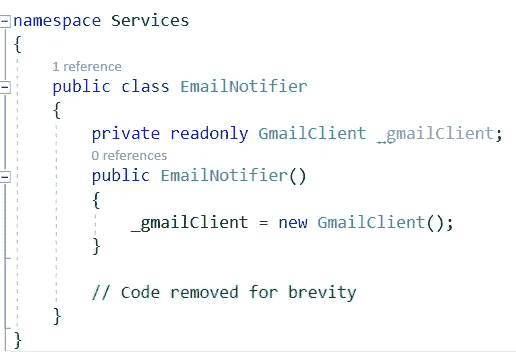
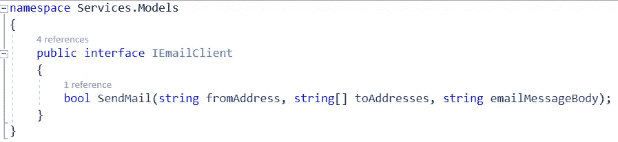
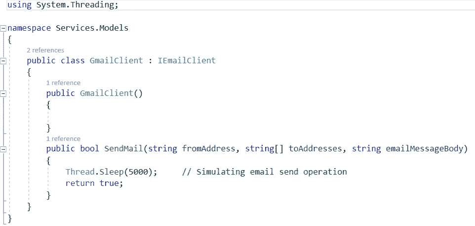
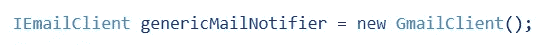
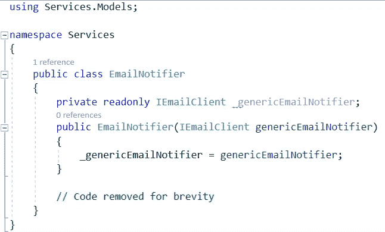
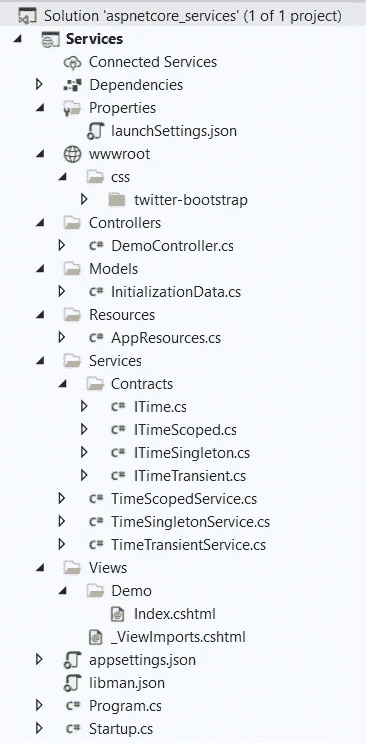
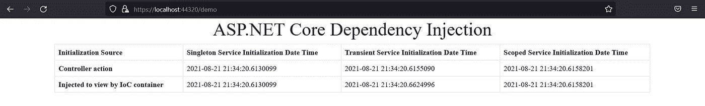
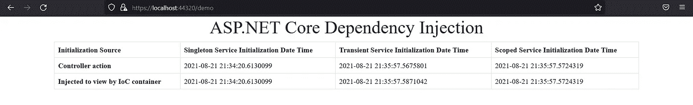

# ASP.NET 核心依赖注入

> 原文：<https://medium.com/codex/asp-net-core-dependency-injection-8c3feae161b9?source=collection_archive---------5----------------------->

# 什么是依赖注入？

简而言之，依赖注入(DI)或控制反转(IoC)是一种软件架构设计模式，它有助于管理类型(类)定义之外的依赖关系。该类型不再创建或管理其依赖项，而只是声明并使用它来提供其预期的功能。依赖项的初始化由应用框架完成，并在运行时通过*构造函数注入*或*属性注入*或*方法注入*注入到类型中。

那么，什么是*依赖呢？*考虑下面的 C#代码片段:

EmailNotifier 的紧密耦合

这里，类型 *EmailNotifier* 对类型 *GmailClient* 有明确的*依赖关系，因为 *GmailClient* 的初始化与 *EmailNotifier* 的初始化紧密耦合。明天，如果出于任何原因，决定放弃 Gmail 而使用 Outlook，那么我们必须改变实施方案。除此之外，如果我们以后再次从 Outlook 转到 Gmail，我们还必须手动修改代码。显然，这不是我们想要和需要的解决方案——依赖注入。*

依赖注入是一个非常强大的概念，它有助于创建具有清晰的**关注分离**、**解耦**、**高维护性**并且更容易**模仿**进行单元测试的软件系统。

在本文中，我们将从以下几个方面来探讨 DI。净 5(。NET Core 5)及其内置的 DI 系统，支持*构造器注入*技术*。*

在继续深入之前，让我们按照哎呀的原则绕一小段路:

*如果一个类继承&实现一个接口，那么该类的对象可以被一个与接口类型相同的变量引用。*

以上陈述是控制功能的依赖注入/反转的核心。让我们看看这是什么意思。考虑一下，我们有一个定义为:

IEmailClient 接口定义

现在，让我们在 *GmailClient:* 中继承并实现这个接口类型

用 GmailClient 类实现 IEmailClient

这样，我们现在可以通过以下方式初始化一个 *GmailClient* :

通过接口类型变量引用 GmailClient

记住这个原则，我们现在将修改原来的 *EmailNotifier* 类，以声明它对 *GmailClient* 的依赖关系，作为***构造函数参数*** *:*

构造函数依赖注入

*随着这一变化，*类型 *EmailNotifier* 不再负责其电子邮件客户端的初始化，这将由框架处理。我们现在来看看如何指导 ASP.NET 核心去做这件事。

在 ASP.NET 核心中，所有依赖项都必须在 *StartUp* 类的 *ConfigureServices* 方法中注册。有三种方法可以在中注册依赖项。网络核心:

***Singleton*** :通过这种类型的依赖关系注册，我们指示运行时使用另一个已定义类型的单个(且仅一次)已创建实例来服务特定类型的所有依赖关系解析请求。

***瞬态* :** 通过这种类型的依赖关系注册，我们指示运行时使用新创建的另一个已定义类型的实例来服务特定类型的所有依赖关系解析请求。

***作用域* :** 通过这种类型的依赖关系注册，我们指示运行时为特定类型的所有依赖关系解析请求提供相同作用域内另一个已定义类型的新创建实例(相同的 HTTP 请求)。

让我们通过一个项目来理解这些意味着什么。

以下是 ASP.NET 核心 MVC 项目结构:

MVC 核心项目结构

这里， *ITime.cs* 是一种接口类型，定义为:

ITime.cs 接口定义

*ITimeSingleton.cs* 、 *ITimeTransient.cs* 、 *ITimeScoped.cs* 都是从接口 *ITime.cs* 继承而来的接口类型。这里显示了 *ITimeSingleton* 的定义，但是三个接口定义基本相同:

ITimeSingleton.cs 接口定义

现在，我们有三个类，它们分别继承和实现这三个接口。这些类分别是*timesingletonservice . cs*、*timetransientservice . cs*、 *TimeScopedService.cs* 。这里显示了*timesingletonservice . cs*的定义，但是三个类的定义基本相同:

TimeSingleton.cs 定义

想法是记录这三个类被运行时调用的确切时刻，然后在调用方法 *GetTime* 时返回日期时间值。

现在，让我们注册三种类型的依赖项，看看效果。首先，在 *StartUp.cs* 中，找到 *ConfigureServices* 方法，并在里面添加以下几行代码:

ASP。网络核心服务注册

在这里，我们指示 ASP.NET 核心:

1.  每当类型为 *ITimeSingleton* 的依赖关系解析请求被发送到 DI 系统/ IoC 容器/运行时，第一次创建 *TimeSingletonService* **的实例**。对于下列依赖项解析请求，请使用同一个实例，不要创建新的实例。
2.  每当类型为 *ITimeTransient* 的依赖关系解析请求被发送到 DI 系统/ IoC 容器/运行时时，创建一个 *TimeTransientService* **的实例。**
3.  每当类型 ITimeScoped 的依赖关系解析请求被发送到作用域 (HTTP 请求)内的 DI 系统/ IoC 容器/运行时**时，第一次创建 *TimeScopedService* **的实例，并为同一作用域内的所有后续请求共享相同的实例。对于新的作用域，创建另一个实例。****

我们现在将验证上述陈述。

MVC 应用程序有一个控制器 *(DemoController.cs)* ，它在它的*参数化构造器*中声明了所有的*三个*接口类型依赖，并在索引动作中调用了如下的 *GetTime* 方法:

DemoController.cs 定义

按照 MVC 惯例，控制器调用名为 *Index.cshtml* 的视图，该视图除了从控制器接收数据之外，还通过 Razor 的 *@inject* 指令声明所有三种接口类型的依赖关系，并调用 *GetTime* 方法，如下所示:

Index.cshtml 视图

当应用程序运行且首次达到演示控制器的索引动作时，输出为:

首次输出

刷新此页面时，输出为:

第二输出

# 说明

由于 ***singleton*** 注册，类型*timesingletonservice . cs*只被初始化一次，因此它的 *GetTime* 方法在应用程序的整个生命周期中只被调用一次。这个相同的实例在所有后续的依赖关系解析请求之间共享。因此，尽管多次刷新页面，但*单件服务初始化日期时间*列的时间戳从不改变。

由于服务 *TimeTransientService.cs* 被注册为 ***瞬态*** 服务，每当页面被刷新时，路由系统就开始初始化 DemoController，并且通过检查其声明的构造函数依赖性，每次都继续初始化 *TimeTransientService.cs* 。除此之外，当控件到达视图时，由于视图的依赖性，相同的类被再次初始化。因此，我们看到*瞬态服务初始化日期时间*列的时间戳每次都在改变。

对于作为*服务注册的 timescopedservice . cs，每当页面被刷新时，路由系统就开始初始化 DemoController，并通过检查其声明的构造函数依赖性，每次都继续初始化 *TimeScopedService.cs* 。但是，当控件到达视图时，因为它在相同的 HTTP 范围内，所以相同的类不会再次初始化，时间戳值是共享的。因此，尽管我们看到时间戳值在每次页面刷新时都发生了变化，但是列*作用域服务初始化日期时间*的两行值是相同的。*

*这篇文章解释了依赖注入的概念，并介绍了在 ASP.NET 内核中注册依赖的三种方式。*

# *参考*

**源代码可在:*获得*

*[Shahnawaz-QI/aspdotnetcore-Dependency-Injection:ASP.NET 核心依赖注入演示(github.com)](https://github.com/Shahnawaz-QI/aspdotnetcore-dependency-injection)*

*其他参考:*

1.  *[ASP.NET 核心的基本面](https://docs.microsoft.com/en-us/aspnet/core/fundamentals/?view=aspnetcore-5.0)*
2.  **Pro ASP.NET Core 3:使用 MVC、Blazor 和 Razor Pages 开发云就绪的 Web 应用**
3.  *[ASP.NET 初学者核心教程](https://www.youtube.com/playlist?list=PL6n9fhu94yhVkdrusLaQsfERmL_Jh4XmU)*