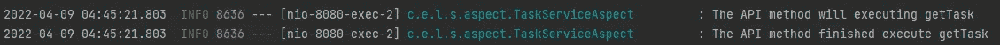

# 用 Spring boot 实例进行特征对象编程(第二部分)

> 原文：<https://medium.com/codex/aspect-object-programing-with-spring-boot-example-a2d0bf8f1578?source=collection_archive---------4----------------------->


## 简介:

在上一篇文章中，我们讨论了方面，如果你读了上一篇文章，你应该知道方面核心概念和方面的 spring boot 概念。在本文中，我将在 spring boot 项目中使用 java 编写方面代码。

> github 项目链接[https://github.com/abdalrhmanAlkraien/Aspect-example](https://github.com/abdalrhmanAlkraien/Aspect-example)

## 外观配置:

要在任何 spring-boot 应用程序中应用方面编程，您需要进行方面配置。在当前步骤中，我们需要转到两个位置:对于第一个位置，我们需要更新 pom.xml 文件并放置方面依赖关系。

我们可以使用 spring 中提供的方面依赖，但是在本文中，我将使用 AspectJ 依赖。

`**Pom.xml**` **文件:**

```
<!-- enable aspect -->
<dependency>
    <groupId>org.springframework</groupId>
    <artifactId>spring-aop</artifactId>
    <version>5.3.18</version>
</dependency>

<dependency>
    <groupId>org.aspectj</groupId>
    <artifactId>aspectjrt</artifactId>
    <version>1.9.9.1</version>
</dependency>

<dependency>
    <groupId>org.aspectj</groupId>
    <artifactId>aspectjweaver</artifactId>
    <version>1.9.9.1</version>
</dependency>
```

现在我将创建一个名为`**AspectConfig.java**` 的 java 文件，然后添加`@EnableAspectJAutoProxy`。从上一篇文章中，你可以知道为什么我在使用 **Aspect 时需要启用代理。**

`AspectConfig.java`文件

```
@EnableAspectJAutoProxy(exposeProxy = true)
public class AspectConfig {
}
```

[http://localhost:8080/swagger-ui . html](http://localhost:8080/swagger-ui.html)

现在我有了一个控制器包和服务包，我将在其中编写业务逻辑。

## 业务逻辑:

在这一节中，我们只需要定义一些 Api 来为方面采取一些行动。

**controller.TaskController.java**

```
@RestController
@RequestMapping("/api/tasks")
public class TaskController {

    private final TaskService taskService;
    public TaskController(TaskServiceImp taskService){
        this.taskService=taskService;
    }

    @GetMapping
    @ApiOperation(value = "Get all tasks")
    public void getTask(){
        taskService.getTask();
    }

    @PostMapping
    @ApiOperation(value = "save new task")
    public String saveTask(){
        return taskService.saveTask();
    }

    @GetMapping("/{id}")
    @ApiOperation(value = "get one task by id")
    public String getTaskById(@ApiParam(value = "1",required = true, example = "123") @PathVariable("id") Long id){
        return taskService.getTaskById(id);
    }

    @PutMapping
    @ApiOperation(value = "update any task")
    public String updateTask(){
        return taskService.updateTask();
    }

    @DeleteMapping("/{id}")
    @ApiOperation(value = "delete task by id")
    public String deleteTaskById(@ApiParam(value = "1",required = true, example = "123") @PathVariable("id") Long id){
        return taskService.deleteTaskById(id);
    }
}
```

**service.TaskService.java**

```
public interface TaskService {

    String getTask();
    String saveTask();
    String getTaskById(Long id);
    String updateTask();
    String deleteTaskById(Long id);

}
```

**service.Impl.TaskServiceImpl.Java**

```
@Service
public class TaskServiceImp implements TaskService {

    public  TaskServiceImp(){

    }

    @Override
    public String getTask() {
        return "execute getTask";
    }

    @Override
    public String saveTask() {
        return "execute saveTask";

    }

    @Override
    @Loggable
    public String getTaskById(Long id) throws Exception {
        if(id<1){
            throw new Exception("the id less than 1");
        }
        return "execute getTaskById ".concat(id.toString());
    }

    @Override
    public String updateTask() {
        return "execute updateTask";

    }

    @Override
    @Loggable
    public String deleteTaskById(Long id) throws Exception {
        if(id<1){
            throw new Exception("the id less than 1");
        }
        return "execute deleteTaskById ".concat(id.toString());
    }

}
```

> 现在所有的服务和 Api 都完成了。

## 方面任务:

在这个会话中，我将创建一个方面类来定义我们的切入点和建议，以记录所有执行的 API 和日志异常。

**什么方面会做？**

**方面会记录不同的事情:**

*   当进入 API 方法时，我们需要日志信息。
*   当退出 API 时，我们需要日志信息。
*   我们需要使用名为**loggeable**的注释记录服务方法返回值的信息。
*   我们需要项目中发生的异常的日志信息。

`**aspect.AspectTask.java**` **文件:**

在当前会话中，我将分解解释每个方法，完成后，我将把所有的类方法放在一个块中。

第一步，我定义了一些变量作为切入点，如下所示。

```
private final String apiPointcut="execution(* com.example.logger.springlogger.controller.*.*(..))";private final String exceptionPointcut ="execution(* com.example.logger.springlogger.*.*.*(..))";
```

实际上，我们可以用这种方式来定义点切割，或者用本文中的其他方法来定义点切割。

**作为方法的切入点**

我们可以使用`@Pointcut`来定义你的切入点，但是这样，你必须使用一个方法来定义它。比如下面的代码。

```
@Pointcut(apiPointcut)
public void APIPointCut(){}
```

现在我们有了切入点，但是我们需要使用建议来处理这个切入点。

**方面的建议**

当使用方面时，必须使用 advice，因为当特定事件发生时，我们需要记录任何事情。

要使用任何建议，我们需要为建议设置切入点。我们可以使用这种方式`@Advice(Pointcut)`在任何通知中定义切入点。

> 你可以看到这个链接来了解 Aspect 中的建议类型。

```
@Before("APIPointCut()")
public void logEnteringAPI(JoinPoint joinPoint){
    *log*.info("The API method will executing {}",joinPoint.getSignature().getName());
    if(joinPoint.getArgs().length>0){
        Object[] args=joinPoint.getArgs();
        *log*.info("the Api argument is ".concat(args[0].toString()));
    }
}
```

`JoinPoint` : Joinpoint 是对原始方法的引用，我们可以从`JoinPoint`接口知道这个方法的方法名和参数。

上面的建议`logEnteringAPI(JoinPoint joinPoint)`会在调用`pointCut`里面的方法之前执行，然后会执行里面的实现，之后会执行原来的方法，并带着愉快的场景前进。

我使用了来自连接点的`Args`对象实例，用于记录原始方法中的参数。

现在我们需要为退出 API 方法时的日志编写实现。

我们将使用同一个名为`APIPointCut()`方法的切入点，因为我们需要同一个包中的日志。我们用它和`@Before`建议。

```
@After("APIPointCut()")
public void logExitingAPI(JoinPoint joinPoint){
    *log*.info("The API method finished execute {}",joinPoint.getSignature().getName());
}
```

用上面的建议调用`Pointcut`里面的方法后会被执行。

我为日志特定的方法创建了一个新的注释，叫做`Loggable`

```
public @interface Loggable {
}
```

我在上面的`TaskServiceImp` 中使用了两个方法，分别叫做`getTaskById`和`deleteTaskById`

比如下面的代码片段:

```
@Override
@Loggable
public String getTaskById(Long id)
```

和

```
@Override
@Loggable
public String deleteTaskById(Long id)
```

并且 advice 方法必须有一个新的切入点来指向注释。

```
@AfterReturning(value = "@annotation(com.example.logger.springlogger.aspect.TaskServiceAspect.Loggable)"
,returning = "returnValue")
public void logEachReturningValue(JoinPoint joinPoint
,Object returnValue){ *log*.info("the value from method:"
.concat(joinPoint.getSignature().getName())
.concat(returnValue.toString()));}
```

上面代码中用于处理任何方法的项目里面都有`[@Loggable](http://twitter.com/Loggable)`。并将记录返回值。

现在我们需要任何异常的日志，以及哪个方法有这个异常。

我们使用变量作为`Pointcut`，在这个例子中称为`exceptionPointcut`，并将使用带有`AfterThrowing`通知的变量来捕捉项目中的任何异常。

`exceptionPointcut`将扫描项目中的所有方法，你可以从下面一行代码中看到它的价值。

`exceptionPointcut= ”execution(* com.example.logger.springlogger.*.*.*(..))”`

```
@AfterThrowing(value = exceptionPointcut ,throwing = "exception")
public void logsExceptionsFromAnyLocations(JoinPoint joinPoint,Throwable exception) throws Throwable {
    *log*.error("We have error in this method {}",joinPoint.getSignature().getName());
    *log*.error("The exception message: ".concat(exception.getMessage()));
}
```

上述建议将在应用程序中抛出任何异常时执行，并将记录该异常的方法名称和异常消息。

`**aspect.AspcetTask.java**` **文件:**

```
@Aspect
@Log4j2
@Component
public class TaskServiceAspect {

    private final String apiPointcut="execution(* com.example.logger.springlogger.controller.*.*(..))";
    private final String exceptionPointcut ="execution(* com.example.logger.springlogger.*.*.*(..))";

    @Pointcut(apiPointcut)
    public void APIPointCut(){}

    @Before("APIPointCut()")
    public void logEnteringAPI(JoinPoint joinPoint){
        *log*.info("The API method will executing {}",joinPoint.getSignature().getName());
        if(joinPoint.getArgs().length>0){
            Object[] args=joinPoint.getArgs();
            *log*.info("the Api argument is ".concat(args[0].toString()));
        }
    }

    @After("APIPointCut()")
    public void logExitingAPI(JoinPoint joinPoint){
        *log*.info("The API method finished execute {}",joinPoint.getSignature().getName());
    }

    @AfterThrowing(value = exceptionPointcut ,throwing = "exception")
    public void logsExceptionsFromAnyLocations(JoinPoint joinPoint,Throwable exception) throws Throwable {
        *log*.error("We have error in this method {}",joinPoint.getSignature().getName());
        *log*.error("The exception message: ".concat(exception.getMessage()));
    }

    @AfterReturning(value = "@annotation(com.example.logger.springlogger.aspect.TaskServiceAspect.Loggable)",returning = "returnValue")
    public void logEachReturningValue(JoinPoint joinPoint,Object returnValue){
        *log*.info("the value from method: ".concat(joinPoint.getSignature().getName()).concat(returnValue.toString()));
    }

    public @interface Loggable {
    }
}
```

## 运行应用程序后记录日志

运行应用程序并调用任何 API 后，您可以看到类似这样的内容。



# 结论

从这篇文章中，我们学习并练习了如何在 spring boot 中使用 aspect，以及如何在 aspect 中使用我们自己的注释。如果我们被前一篇文章弄糊涂了，我想这篇文章会让你清醒地思考这个问题。你可以使用这个[链接](https://github.com/abdalrhmanAlkraien/Aspect-example)来访问 GitHub 上的这个项目，你可以看到它来学习、克隆和实践它。