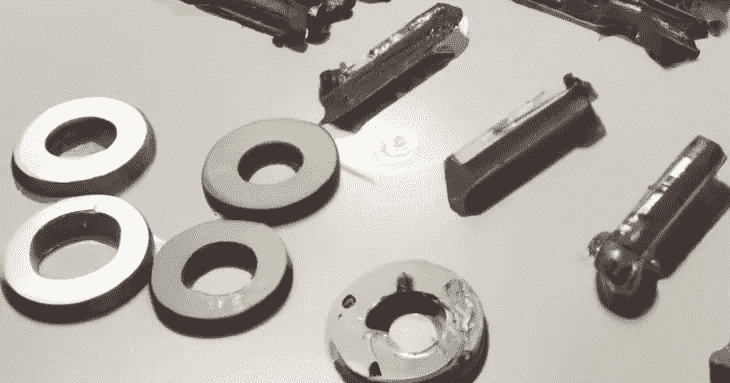

# 在最短时间内组装零件

> 原文：<https://medium.com/codex/assemble-parts-in-minimum-time-f7284d3d71a6?source=collection_archive---------5----------------------->

编写一个方法来计算将 N 个零件组装在一起并构建最终产品的最小可能时间。输入由两个参数组成: *numOfParts* ，一个表示部件数量的整数，和 Parts，一个表示部件大小的整数列表。

**举例:**

numOfParts=4

部分=[8，4，6，12]