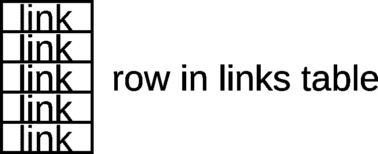
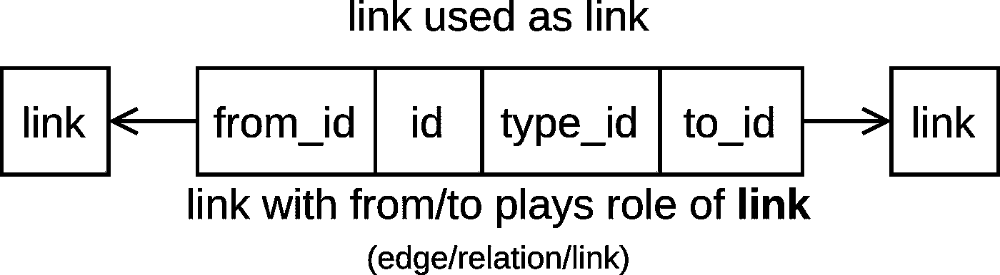

# 关联链接

> 原文：<https://medium.com/codex/associative-links-e13abc5251af?source=collection_archive---------12----------------------->


照片由[乌列尔 SC](https://unsplash.com/@urielsc26?utm_source=medium&utm_medium=referral) 在 [Unsplash](https://unsplash.com?utm_source=medium&utm_medium=referral) 上拍摄

什么是理想的“信息量”或“最小意义单位”，为什么要问这样的问题？与此相关的痛苦很多，甚至常常没有意识到。我们提供了一个解决方案，但首先你需要弄清楚它的用途。我们推荐你阅读[系列的第一篇文章](/@ivansglazunov/code-is-dependent-on-data-and-models-and-therefore-on-the-abstractions-used-in-them-so-603e083b3434)。

# 回顾的

关系表、面向文档的数据库、jsonb 存储…我们经常使用表/集合中的模型作为最小的意义单位。该模型由具有不同结构的列/字段组成，并反映作者定义的一些真实对象或抽象概念。

这种方法会产生问题:

*   很多地址空间。(如果你不认为这是一个问题，那么很快就会有一篇关于这个主题的文章，你会明白为什么这个问题是真实的)。
*   数据结构的许多控制点改变起来很昂贵。
*   仅在作者定义的级别上兼容。
*   如果不创建另一个表/集合，就无法完全描述新的事物。
*   无法将对象与它们之间的关系分开。

所有这些问题都在深层解决。数据的事例关联模型。

> *如果您对优化感兴趣，或者对图表中的范围感兴趣，这里会有一个到该文章的链接。*

# 让我们深入研究一下

很深。格与链接概念一起运作，作为意义/信息量的最小单位。

# 链接表

链接(链接的网络)非常类似于图，但是，图分为节点和仅指节点的边。链接不会划分这些地址空间。这允许链接引用链接，并携带数据模型作者可以放入其中的任何含义。



# 链接结构

链接结构由所需的唯一`id`和`type_id`组成，用作该链接的类型。可选的`from_id`和`to_id`字段只能一起指定。

用于创建链接的类型很容易由用户自己在项目模型中创建，或者由导入的模型包提供。

指定的`from_id`和`to_id`字段指的是其他链接。任何关系都可以用这样的链接来描述。


```
{
  links(where: { id: { _eq: 74  } }) {
    id
    type_id
    from_id
    to_id
  }
}{
  "data": {
    "links": [
      {
        "id": 74,
        "type_id": 70,
        "from_id": 72,
        "to_id": 73,
      }
    ]
  }
}
```

# 作为节点链接

您可以将链接中的`from_id`和`to_id`字段留空。这种联系起着一个节点、一个点、一个关系对象的作用。


```
{
  links(where: { id: { _eq: 28 } }) {
    id
    type_id
    from_id
    to_id
  }
}{
  "data": {
    "links": [
      {
        "id": 28,
        "type_id": 6,
        "from_id": 0,
        "to_id": 0
      }
    ]
  }
}
```

# 作为链接的链接

如果指定了`from_id`和`to_id`，则链接扮演节点或链接之间关系的角色。它可以使用`type_id`来回答它们是如何关联的问题。具有链接的节点的环境可以回答关于其含义、关系、目的、值和状态的许多问题。



```
{
	links(where: { id: { _in: [6,7,8] } }) {
    id
    type_id
    from_id
    to_id
  }
}{
  "data": {
    "links": [
      {
        "id": 6,
        "type_id": 1,
        "from_id": 0,
        "to_id": 0
      },
      {
        "id": 7,
        "type_id": 1,
        "from_id": 0,
        "to_id": 0
      },
      {
        "id": 8,
        "type_id": 1,
        "from_id": 7,
        "to_id": 6
      }
    ]
  }
}
```

# 统一 GraphQL API

> *这个 API 允许做很多事情，比如使用 index 遍历某些子树中的所有子树/父树。但是关于这个会有单独的文章。*

显然，链接本身的结构在那里是可用的，并且从一个链接你可以通过它的链接(`from_id`和`to_id`)和从其他链接的向后引用(输出和输入)转到其他链接。例如，您可以使用关系`out`通过`from_id`(这些链接来自它)或者使用关系`in`通过`to_id`(这些链接指向它)转到引用该链接的所有链接。


```
{
  links(where: {id: {_eq: 8}}) {
    id
    type {
      id
    }
    from {
      id
      type_id
      from_id
      to_id
      out {
        id
        type_id
        from_id
        to_id
      }
    }
    to {
      id
      type_id
      from_id
      to_id
      in {
        id
        type_id
        from_id
        to_id
      }
    }
  }
}{
  "data": {
    "links": [
      {
        "id": 8,
        "type": {
          "id": 1
        },
        "from": {
          "id": 7,
          "type_id": 1,
          "from_id": 0,
          "to_id": 0,
          "out": [
            {
              "id": 8,
              "type_id": 1,
              "from_id": 7,
              "to_id": 6
            }
          ]
        },
        "to": {
          "id": 6,
          "type_id": 1,
          "from_id": 0,
          "to_id": 0,
          "in": [
            {
              "id": 8,
              "type_id": 1,
              "from_id": 7,
              "to_id": 6
            },
            {
              "id": 13,
              "type_id": 1,
              "from_id": 6,
              "to_id": 6
            },
            {
              "id": 24,
              "type_id": 22,
              "from_id": 23,
              "to_id": 6
            }
          ]
        }
      }
    ]
  }
}
```

# 类似 SQL 的查询

我们不仅能接收到上述结构的数据。我们可以使用类似 sql 的`where`谓词在每个级别执行各种复杂的过滤。

```
{
  links(where: {id: { _eq: 6 } }) {
    id
    type { id }
    from { id }
    to { id }
    out(where: { from_id: { _eq: 6} }) {
      id
      type_id
      from_id
      to_id
    }
    in(where: { type_id: { _eq: 1} }, limit: 1) {
      id
      type_id
      from_id
      to_id
    }
  }
}{
  "data": {
    "links": [
      {
        "id": 6,
        "type": {
          "id": 1
        },
        "from": null,
        "to": null,
        "out": [
          {
            "id": 13,
            "type_id": 1,
            "from_id": 6,
            "to_id": 6
          }
        ],
        "in": [
          {
            "id": 8,
            "type_id": 1,
            "from_id": 7,
            "to_id": 6
          }
        ]
      }
    ]
  }
}
```

# 捐款

所有这些都已经支持订阅。您可以简单地描述您想要订阅哪个结构——您将实时收到查询结果的更新。

```
subscription {
  links(where: { from_id: { _eq: 7 }, to_id: { _eq: 6 } }) {
    id
    type_id
  }
}
```

# 支持关联技术

我们创建了一个开发环境(盒装 CE / EE 版本和 SaaS 版本)，它允许您使用数据存储来解决您的业务问题，并能够使用关联方法来适应任何业务变化。我们将在一个单一的关联空间中创建一个服务器集群的分布式网络，这样在创建项目时就不必考虑地区法规。我们创造了一种发布可重用数据模型及其行为的文化。

在 [Discord](https://discord.com/invite/vNJCTK4nZB) 上加入我们的社区。在我们的等待名单上注册提前访问或在 [Patreon](https://www.patreon.com/deepfoundation?fan_landing=true) 上支持我们。

[在我们的网站](https://deep.foundation/?utm_source=medium&utm_medium=article&utm_content=article2)上，您可以找到开发中的未来文章草稿的链接、代码源的链接、项目和产品管理计划以及 invest 演示文稿的链接。