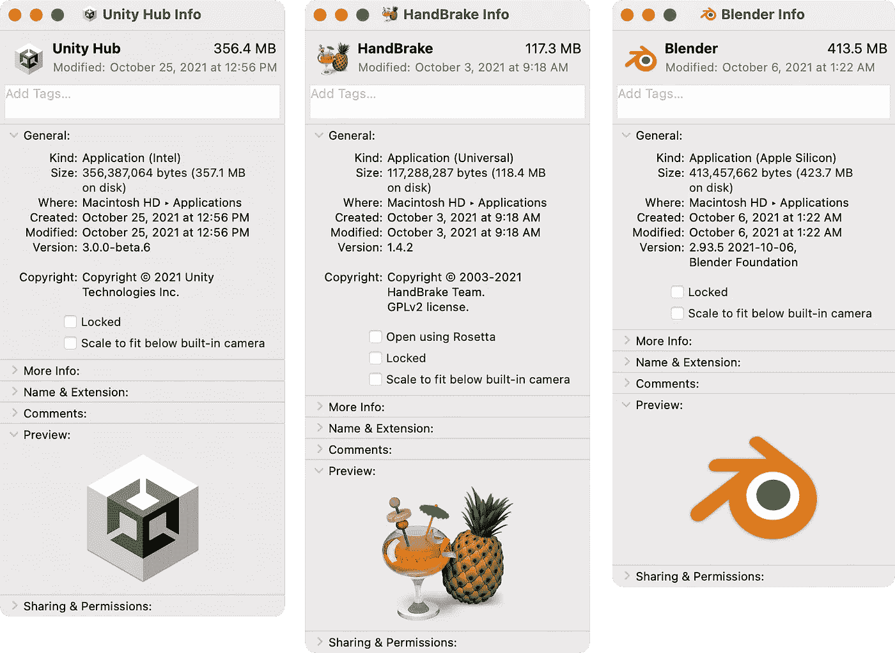
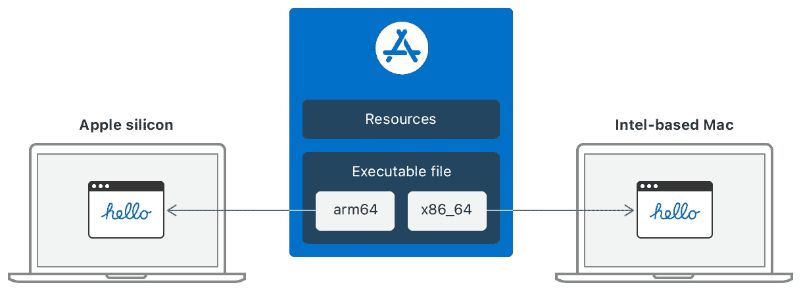
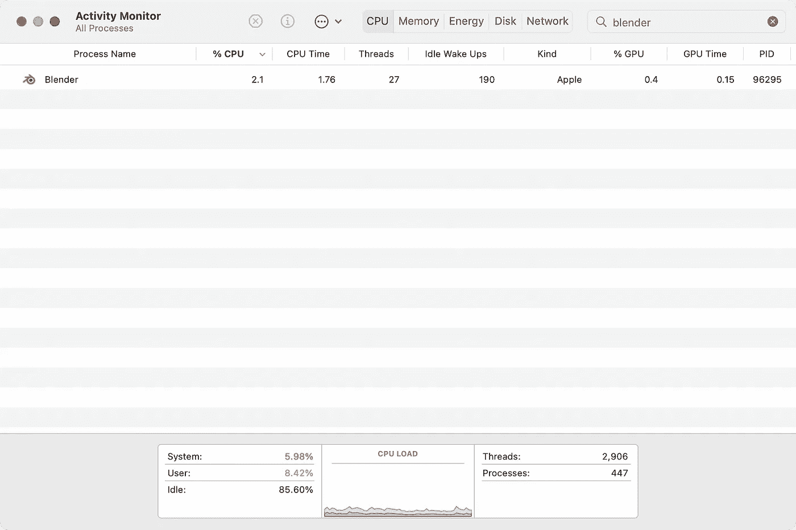
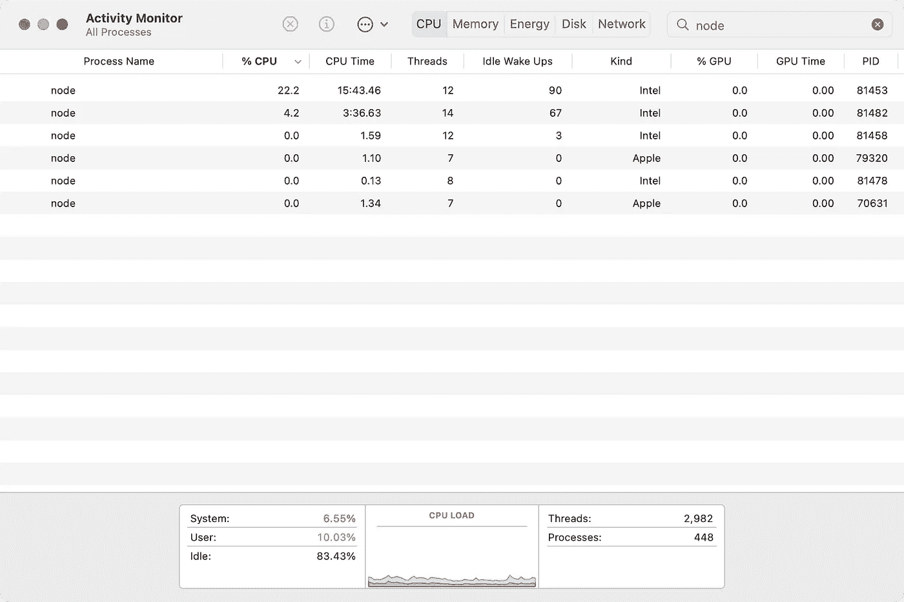

# 保证苹果硅

> 原文：<https://medium.com/codex/assuring-apple-silicon-9fd77f557005?source=collection_archive---------11----------------------->

如何验证苹果芯片上的应用程序实际上是以 arm64 运行的

简·根格在 [Unsplash](https://unsplash.com?utm_source=medium&utm_medium=referral) 上的照片

右键点击应用程序并选择*获取信息:*，可以通过 Finder 验证应用程序包

有三种可能性:

*   **英特尔** —可执行文件专为英特尔打造，必须在发布时通过 Rosetta 进行转换
*   **通用** —可执行文件包含两个版本的编译代码，一个在苹果芯片上本地运行，另一个在基于英特尔的 MAC 上本地运行。请注意，您可以通过使用 Rosetta 启用 *Open 来运行英特尔变体。*

通用可执行结构

*   **苹果芯片** —可执行文件在苹果的 arm64 处理器上本地运行

一旦应用程序启动，活动监视器将通过*种类*字段指示哪个可执行文件正在运行。

搅拌机，在苹果芯片上自然运行

请注意，根据应用程序的启动方式，它可以在多种模式下运行。通过英特尔启动的 Shells 或任务运行程序可以调用进程树下的英特尔子可执行文件。

Node.js 作为英特尔和苹果芯片运行

上图中，两个节点进程在苹果芯片上本地运行；然而，其他人是通过 Rosetta 运行英特尔的，因为任务运行程序启动了他们的流程。

这对通用应用非常重要——仅仅因为 arm64 组件可用，并不能保证它的优化执行得到利用。