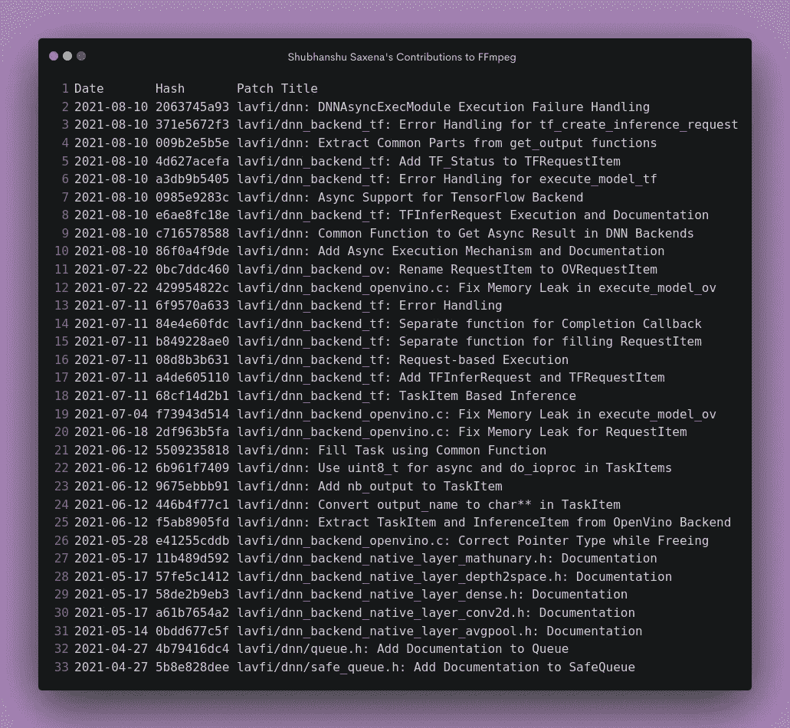

# FFmpeg 中 TensorFlow 后端的异步支持

> 原文：<https://medium.com/codex/async-support-for-tensorflow-backend-in-ffmpeg-695998cd439c?source=collection_archive---------10----------------------->

这篇博文总结了我的**谷歌代码 2021 之夏**项目和**英特尔 Linux 视频和音频**。这个夏天充满了大量的实践学习，一些我无法想象的事情。

谷歌代码 2021 之夏，英特尔视频和音频 Linux 版

## 该项目

该项目主要致力于在 **FFmpeg 深度神经网络** (DNN)模块的后端实现一个异步推理机制，尽管它也有其他可选的可交付成果。您可以点击查看原提案[。](https://docs.google.com/document/d/1J79_Id4XDYfMSJh94q11kHm1SjewYoLAOEX15uwNkhU/edit?usp=sharing)

DNN 模块有三个主要过滤器:

1.  `**vf_dnn_processing**`用于使用深度学习模型应用过滤器
2.  `**vf_dnn_detect**`用于物体检测
3.  `**vf_dnn_classify**`用于图像分类

还有另外两种滤镜——`vf_sr`(用于超分辨率滤镜)和`vf_derain`(用于去雨滤镜)，不过为了使用完整的功能`vf_dnn_processing`应该是首选。

## 技术堆栈

当任何人看到一个项目时，他们问的第一件事就是它建立在什么样的技术基础上。在我的例子中，项目完全是用 C 语言*编写的，并使用了用于多线程的****pthread***库。**

## ****交付成果****

1.  ****准备异步支持(必需)** —我们切换到基于任务的机制，其中每个任务对应一个输入帧，为异步模式做准备。这种方法现在在所有三个后端中都很常见。**
2.  ****TensorFlow 后端中的异步支持(必需)——**最初，tensor flow 后端仅支持模型推理的同步模式。**
3.  ****从过滤器的角度统一执行模式(可选)** —目前，后端为过滤器中使用的异步和同步模式提供不同的功能。有了这个可交付的产品，选择执行模式的控制权就在后端了。该交付成果还将进一步帮助扩展同步模式下的批处理执行模式。**
4.  ****原生后端的异步支持(可选)——**当目标系统不支持 OpenVino 或 TensorFlow 后端时，原生后端用于模型推断。这个后端也只支持同步模型执行，但是我们可以使用相同的机制将异步支持扩展到本地后端。**
5.  ****tensor flow 后端支持批处理模式(可选)——**将多个图像帧作为单个批处理加载，并立即推断它们，在系统上比逐个处理所有帧的开销更低。如果与异步模式结合使用，为模型推理启用批量推理将显著提高 TensorFlow 后端的性能。**

## **项目中完成的工作**

**以下拉式请求包含与此项目相关的工作。每个拉请求在其描述中都包含与补丁程序集相关的提交列表。**

1.  **[对 TensorFlow 后端的异步支持](https://github.com/intel-media-ci/ffmpeg/pull/407)**
2.  **[异步和同步模式的统一](https://github.com/intel-media-ci/ffmpeg/pull/423)**
3.  **[对本地后端的异步支持](https://github.com/intel-media-ci/ffmpeg/pull/425)**
4.  **[tensor flow 后端批量执行](https://github.com/intel-media-ci/ffmpeg/pull/427)**

> ****什么是完整的？**截至提交时，所有必需的交付件已完全合并，可选交付件已准备就绪，可供审查。**

**除了这个项目的这些主要补丁，我还贡献了一些文档给本地后端层函数，并修复了后端中的一些小的内存泄漏，可以在这里查看。为了改进错误处理，我们从这个补丁集中的[DNN 后端返回特定的错误代码。](https://github.com/intel-media-ci/ffmpeg/pull/438)**

****

**我的合并补丁 FFmpeg DNN 模块。[https://bit.ly/3mdeluB](https://bit.ly/3mdeluB)**

> ****为什么拉取请求被关闭而不是被合并？**
> 这是因为导师们审查了 GitHub 上的 PR，英特尔 CI 测试也在 GitHub 上运行，以检查补丁是否正常工作。然后补丁被发送到 FFmpeg 邮件列表进行最终审查，然后补丁被合并。**

## **异步推理背后的思想**

**让我在这里给出一点背景。DNN 后端使用 TensorFlow C API 和 OpenVINO 推理引擎来加载和执行深度学习模型。**

**在同步模式下，它们调用`ff_dnn_execute_model`函数，输入帧期待一个输出帧返回。在异步模式下，过滤器使用`ff_dnn_execute_model_async`发送输入帧，后端开始推理并返回成功。重复该过程，直到所有帧都被发送到后端。在特定时间，最多可以同时执行`nireq`个异步请求。**

**现在过滤器开始为输出帧调用`ff_dnn_get_async_result`。这个函数按顺序返回后端接收到的帧，而不管推断何时完成。**

**现在，由于 TensorFlow C API 不像 OpenVINO 那样提供任何异步函数，我们不得不实现一种机制，使模型推断与主 FFmpeg 过滤器线程异步发生。**

**为此，我们添加了`DNNAsyncExecModule`，它在不同的线程上从后端执行`RequestItem`。该线程在开始同一`RequestItem`的后续推理之前加入。如果最后一次推理失败，退出状态被捕获，我们取消当前会话的所有进一步执行。**

> ****为什么要加入线程？我们不能拆开这些线吗？早先的计划是使用分离的线程，但是为了扩展对 Windows 构建的支持和更好的错误处理，我们转向使用可连接的线程。****

## **结果**

**TensorFlow 后端显示了异步补丁集应用程序的性能提升。对于一个 2GB 内存的普通 GPU 来说，CPU 版本的改进可能比 TensorFlow C API 的 GPU 版本更大。**

**此[补丁](https://git.ffmpeg.org/gitweb/ffmpeg.git/commit/0985e9283ca2fe85dd0744f97c869bf24fbf14b5)中记录了四核 CPU 上的 CPU 变体在 10 秒视频中仅使用异步模式所带来的性能提升。**

## **信用**

**我要感谢谷歌和 GSoC 团队为我提供了这个绝佳的机会。我要真诚地感谢导师郭，他在整个项目过程中给予了指导，并帮助我消除了我的疑虑。特别感谢导师 Ting Fu 对 patchset 的测试以及英特尔媒体团队的支持。**