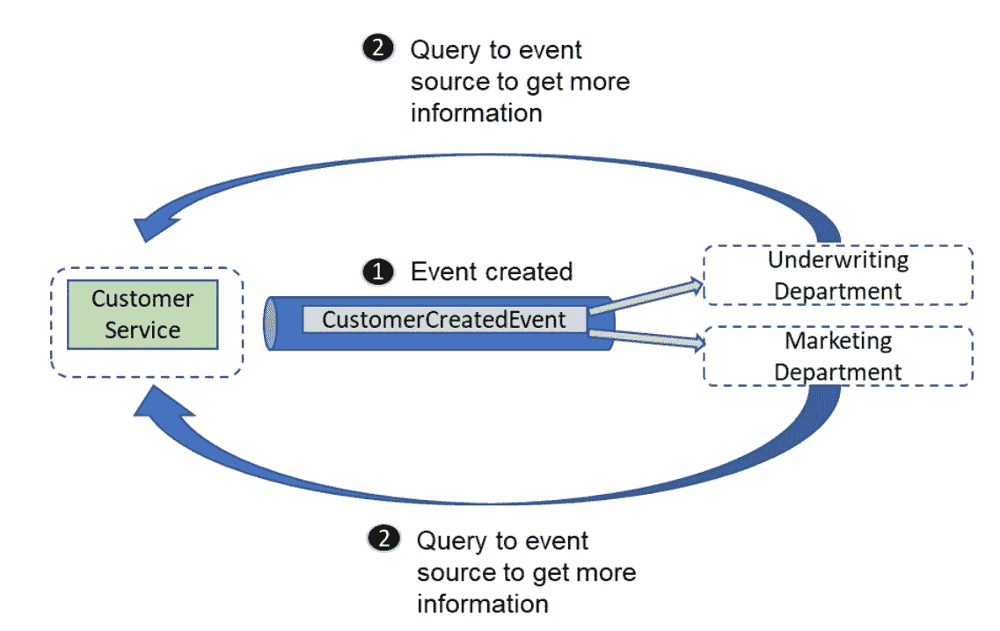
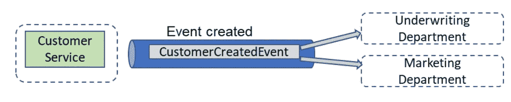
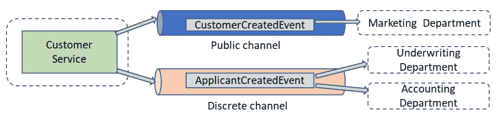
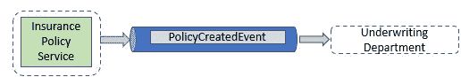
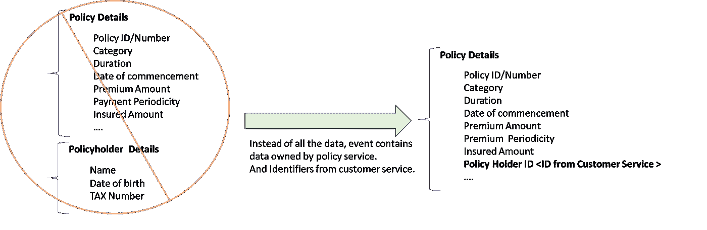

# 异步通信——我们在事件中打包了多少信息来减少耦合？

> 原文：<https://medium.com/codex/asynchronous-communicaiton-how-much-information-do-we-pack-in-events-to-reduce-coupling-ef5749e01da8?source=collection_archive---------8----------------------->

丹尼尔·利维斯·佩鲁西在 [Unsplash](https://unsplash.com?utm_source=medium&utm_medium=referral) 上的照片

事件驱动通信的优势在于它促进了松散耦合，即事件源不知道下游服务。源发出一个关于已经发生的事情(或一些已经改变的数据)的事件，并期望下游服务找出如何处理它。

这里的一个重要方面是我们是否向下游服务传递了足够的信息，以便它能够自主工作。这相位引发了两种事件——瘦事件和胖事件。

**瘦事件**告诉接收者发生了/改变了一些事情，并且具有允许接收者从事件源查询更多细节的最少信息(通常是标识符)。

瘦事件示例—在一家保险公司内，当创建新客户时，营销和承保部门会监听任何新客户，并查询事件源以了解更多详细信息。

这种模式有一些特征，根据上下文，这些特征可能是需要的，也可能不是需要的

1.  耦合度更高&更健谈。下游服务需要查询事件源以获得更多信息。
2.  事件源本身正受到查询的狂轰滥炸。

但是尽管它有缺点，瘦事件还是在以下情况下使用

1.  对敏感信息的严格/不同的访问控制—事件源可能会对谁可以看到什么应用访问策略，而不是将敏感信息传播给每个人。
2.  已更改的数据属于非常分层的数据模型。因此，对于事件源来说，最好是响应查询，而不是在事件本身中传递所有细节。

**Fat 事件**具有足够的属性来传达变化或更新的状态，因此下游服务不需要查询事件源来获得更多细节&可以自主工作。这些属性是专门选择的，就像任何公共契约一样，因为下游服务开始在这个模式上增长。

示例:包含下游服务所需的所有信息的 Fat 事件

优势非常明显，耦合减少，设计更简单。

然而，fat 事件将所有信息传播给每个人，这可能并不是在所有情况下都是可取的。让我们举一个例子来解释这一点—假设一家保险公司创建了一个新客户。营销部门需要关于这个客户的一些基本信息，以便将来销售保单，而承保部门需要更多的信息，可能还需要一些敏感信息来评估投保人&会计部门需要关于投保人账户的信息。

示例:客户服务在单独的通道上发出两个单独的事件来维护访问控制。

在这种情况下，客户服务在不同的频道上发出两个不同的事件，CustmerCreatedEvent 拥有基本信息，并向任何感兴趣的人广播。而 ApplicantCreatedEvent 拥有关于申请人的所有信息，并在一个独立的频道上发布。

与更简单的版本相比，这确实增加了复杂性，但是系统仍然是解耦的，并且有更强的访问控制。

**如何防止事件包含过多信息？**

就像任何公共契约一样，fat 事件的一个问题是，无论公开什么，下游服务都可以使用。随着下游服务开始在公开的领域上增长，它将创建一个**模式耦合**。使得以后改变或删除任何暴露的字段变得困难。

其中一件事是**从事件中最少的信息开始，只暴露目前需要的信息**。

第二是注意服务边界，用服务边界的视角来审视事件中对更多信息的需求。也就是说，如果数据在正确的范围内，那么这种需求首先就不会出现。

以保险为例，假设已经在系统中创建的客户想要签订保险合同。因此，保险合同/保单服务捕获交易细节，并为已创建的保单创建一个事件。假设核保部门是此事件的听众之一，因为它需要了解保单本身的条款以及计算风险的各方。

创建合同/策略时，保险单服务会发出一个事件

现在让我们来看看简化的数据，这将是事件的一部分

基于服务边界减少事件数据。

在上图中，事件包含策略服务自身拥有的数据和来自客户服务的引用，而不是将所有数据打包到事件中。策略服务不会通过添加来自其他服务的信息来膨胀其事件。

因为核保部门也在创建新客户时获取信息。它可以使用来自客户创建的事件的信息来完成保单契约的画面。

我希望你觉得这篇文章很有用，如果你有什么想让我解释的，请在反馈中告诉我。