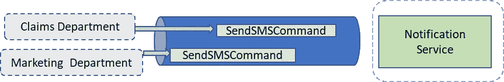
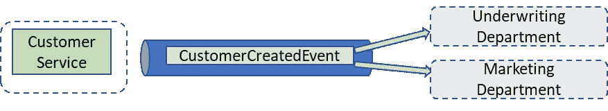

# 异步通信——异步事件或异步命令……有什么区别？

> 原文：<https://medium.com/codex/asynchronous-communication-asynchronous-event-or-asynchronous-command-whats-the-difference-296c4a982e51?source=collection_archive---------17----------------------->

古伊列梅·斯特卡内拉在 [Unsplash](https://unsplash.com?utm_source=medium&utm_medium=referral) 上的照片

由于两者都是消息&两者都可以异步交付，这看起来可能是一个灰色区域，但是在下面的文章中，我试图给出两者之间的明确区别。

## 命令

**命令**表示发布者希望发生的请求/意图。

可以把它看作是一种一对一的通信，其中发布者认识接收者，例如，*“嗨，Abhinav！*请用餐。

这意味着调用系统知道被调用系统的行为。行为耦合程度更高。

为了解释后面的观点，我举一个例子，假设一家保险公司有一个专门负责与客户沟通的部门，这个部门提供通知服务。该通知服务必须由任何其他想要向客户发送 SMS 的部门使用。

通知服务接收、发送来自两个独立部门的 SMS 命令。

示例中的考虑事项—

1.  由于命令正在调用一个尚未发生的行为，它可能会被接收者拒绝(假设不支持国家代码)。
2.  该命令可能由多个发布者调用，但只有一个接收者(通知服务)。发送一个命令。
3.  接收方(通知服务)拥有命令的模式。收件人控制执行操作所需的信息。
4.  域耦合程度更高，因为命令的发出者知道接收者，以及完成任务所需的模式。

## 事件

另一方面，事件是时间点事实。对过去已经发生的事情的通知。

把它当成一个公告，*“大家好！晚餐准备好了。”*

我们再举一个例子，假设系统中创建了一个新客户。市场部需求和核保部对任何新创建的客户都感兴趣。

为相关方创建新客户后，客户服务会发出一个事件。

示例中的考虑事项—

1.  事件源没有关于谁在收听信息的信息，它是一个广播。发布了一个事件。
2.  事件可以有零个或多个收件人。
3.  事件的模式归事件源所有。
4.  耦合度较低，因为事件源不将命令/请求发送给下游服务，而是让下游服务自己决定当事件发生时需要做什么。话虽如此，事件的模式充当公共契约。在 fat 事件中，下游服务将开始在可用信息上增长。在瘦事件的情况下，服务将查询事件源以获得更多增加耦合性的信息(我已经在我的另一篇[文章](/@kapoorabhinav/asynchronous-communicaiton-how-much-information-do-we-pack-in-events-to-reduce-coupling-ef5749e01da8)中讨论过这一点)。

## 结论

如果我们期望我们的事件总是被特定的接收者处理，那么我认为我们谈论的是作为事件实现的命令。

如果你觉得这篇文章很有用，或者你想让我介绍其他方面，请在反馈中告诉我。