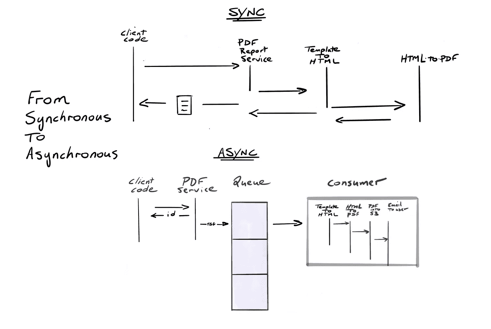
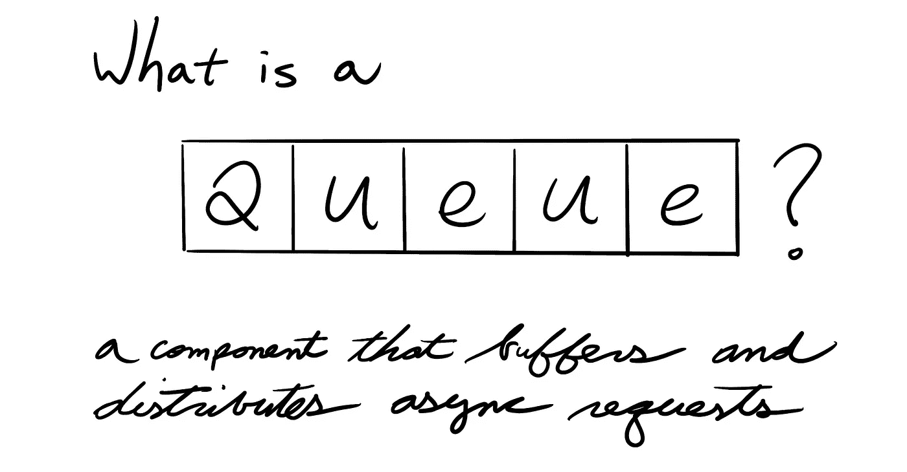
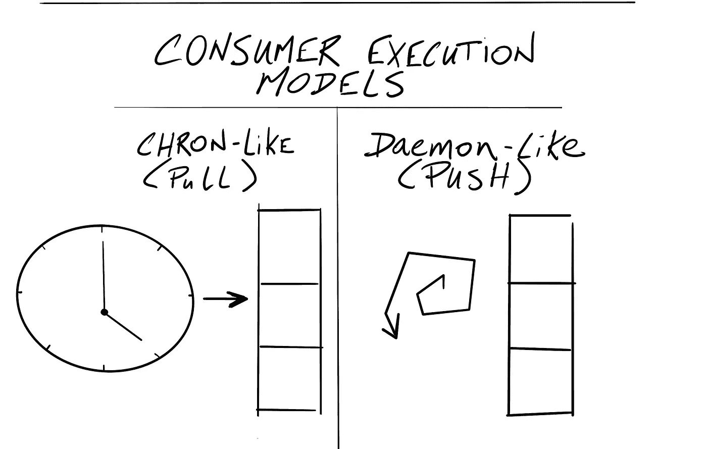
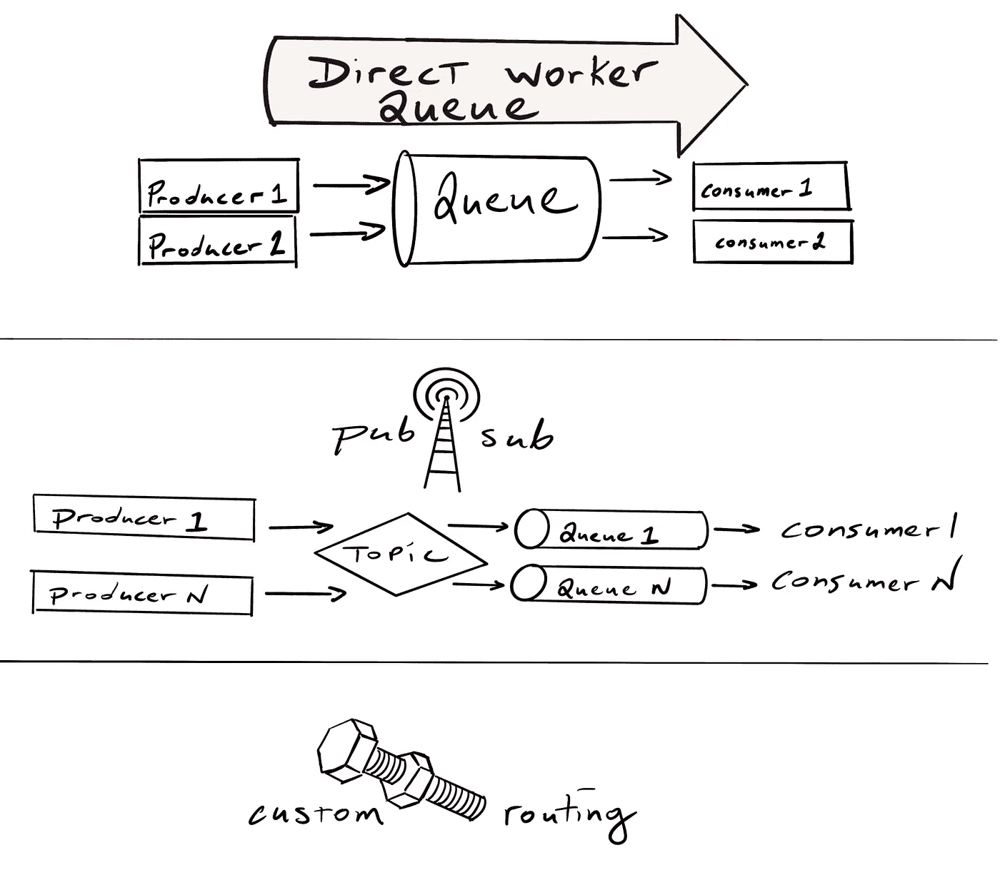
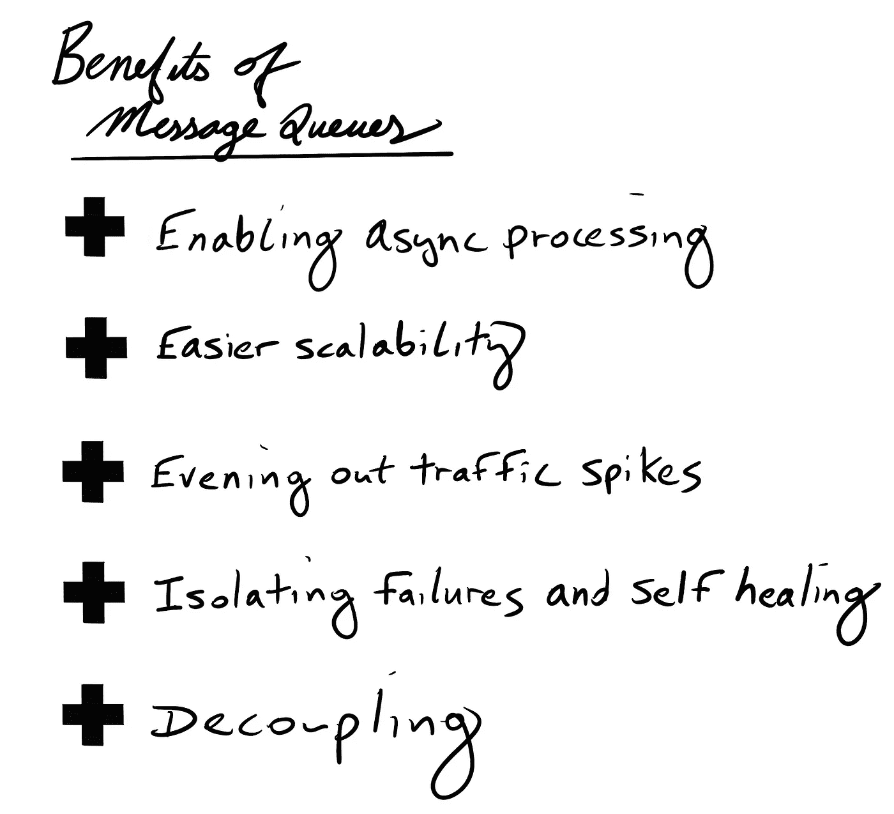
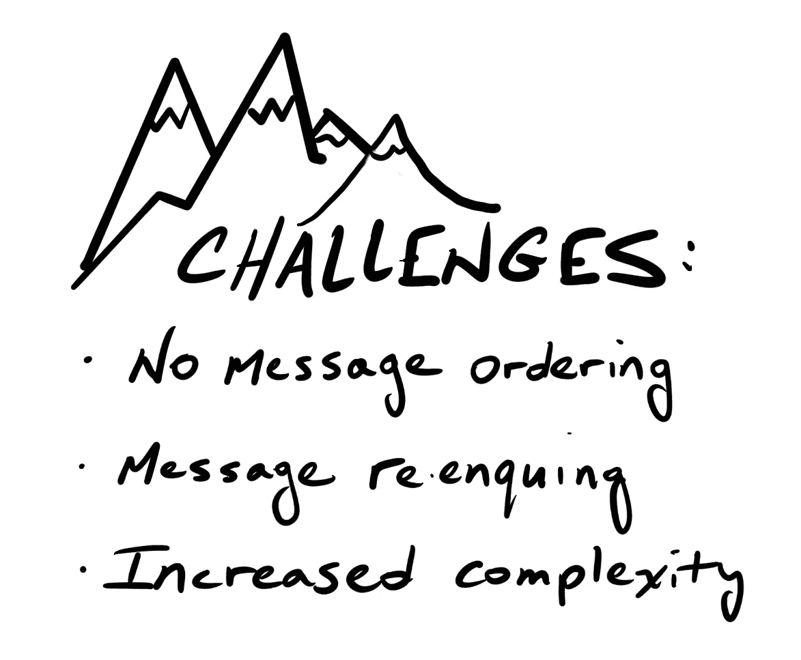

# 异步处理

> 原文：<https://medium.com/codex/asynchronous-processing-the-fundamentals-2d7d0a564d00?source=collection_archive---------5----------------------->

## 将高强度任务转移到后台的基本原则

# 它是如何工作的

## 信息

PDF 服务不是在响应客户端之前等待任务完成，而是简单地接收一个请求，将其转化为一条消息(通常是 JSON 或 XML ),并将其放入队列中。此消息包含对消费者的说明。

然后，服务可以对客户端做出响应，可能带有一个消息标识符，该标识符允许客户端监视挂起的进程。

## 队列

队列可以通过多种方式实现，从单个文件到功能丰富的消息代理。不管实现如何，主要职责是缓冲和分发异步请求。

## 消费者

一旦进入队列，消息就会等待。当时机成熟时，消费者将从队列中取出一条消息并开始处理。

围绕消息消费的*何时*由消费者的执行模型决定。这些模型通常是类似于*的编年史或守护进程。*在 chron 模型中，消费者定期检查消息队列，可能每 5 秒、5 分钟或 5 小时一次。在守护进程模型中，消费者不断地重新访问新消息的队列。

除了各种执行模型之外，消费者可以使用不同的订阅模型来声明他们感兴趣的消息。

两种常见的订阅模型是*直接工作队列*和*发布订阅*。

在直接工作队列方法中，生产者和消费者只知道队列的名称。由生产者排队的每个消息被添加到按名称定位的单个工作队列中。队列的另一端是等待消息的消费者的数量。

在发布/订阅模型中，消息可以传递给多个消费者。生产者将消息推送到一个主题而不是一个队列。然后，主题为每个订阅者/消费者克隆消息，并将其放入私有队列中，由消费者独立处理。

## 协议

为了让异步系统的不同组件进行通信，需要一个协议。异步处理中比较常用的三种协议是 AMQP、STOMP 和 JMS。

AMQP(高级消息队列协议)是一种行业标准。它的特性非常丰富，比如可靠的消息传递、交付保证和事务。但是这个功能带来了更多的开销。

STOMP(面向文本的流消息协议)是一种无状态的、基于文本的协议，类似于 HTTP。它支持大约 12 种操作，是一个极简协议，其主要优点是简单。但是，当需要更高级的功能时，这种简单性会带来问题。任何高级功能都需要使用头文件作为扩展来实现。这通常会导致互操作性问题，因为做某件事情没有标准的方法。

JMS(Java 消息服务)是一个具有良好特性集的 Java 消息传递标准。不幸的是，它纯粹是一个 Java 标准，这使得它很难与基于非 JVM(Java 虚拟机)的技术集成。

# 利益

异步处理对最终用户和整个系统都有好处。在这里，我们能够快速清除主线程，允许用户在后台工作的同时继续与我们的应用程序进行交互。系统很容易扩展，因为随着排队消息数量的增加，我们可以将更多的消费者添加到队列的末尾。如果我们的系统看到一个意外的请求高峰，任务可能会被延迟，但消费者永远不会被淹没，他们只是继续处理队列中积压的任务。在处理过程中，任何故障都会被隔离。由于诸如格式错误的消息等原因而失败的任务将被删除，并放入死信队列中进行相应的处理。所有这些都发生在一个分离的系统中，生产者和消费者对彼此一无所知。

# 挑战

但是伴随这些好处而来的是挑战，我们必须做好应对的准备。因为我们是并行处理消息的，消费者之间没有同步。异步处理不保证消息排序。

解决这个问题的一个方法是限制一个队列中一个消费者的数量。但是，这种解决方案无法扩展。另一个选择可能是构建我们的系统，假设消息将无序到达。最后，我们尝试利用支持部分消息排序的消息代理。

任何系统都可能出现故障，异步系统也不例外。这些失败通常会导致重新排队，这又会导致意外的结果，因为任务最终会被执行多次。

为了处理这个挑战，我们可以构建我们的系统来期望至少一个交付，而不是正好一个。但是，这样做是困难的，因为它要求消费者是幂等的。在某些情况下，这是可能的，但这也带来了让我们的消费者对无序消息更加敏感的可能性。

这种不可预测性导致异步流程的复杂性增加。当理解消息如何在系统中流动并创建一个各部分如何组合在一起的心智模型时，文档是关键。

# 结论

异步处理是动态的、强大的，并且有点不可预测。但是，通过对局限性的深入了解，我们可以构建更健壮、高可用性的系统来改善用户体验。