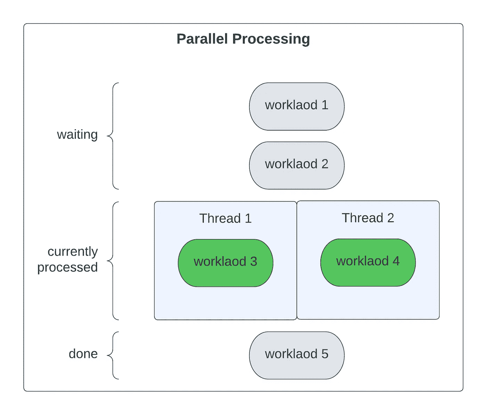
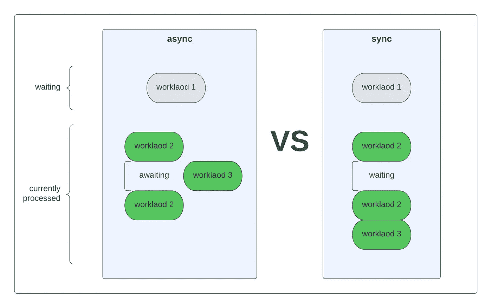
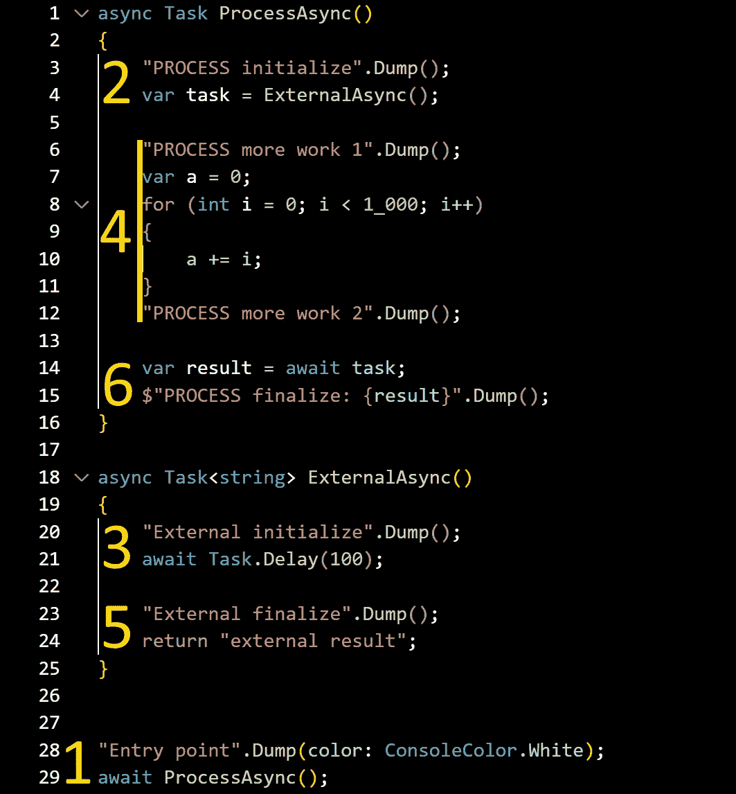
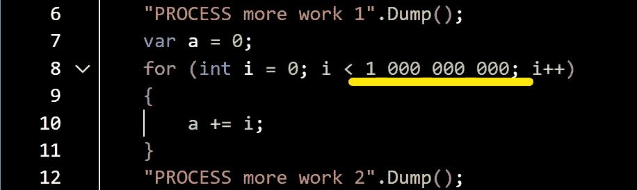
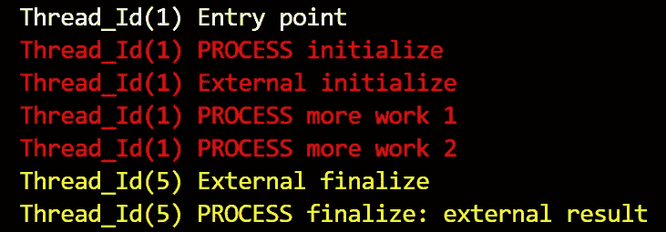
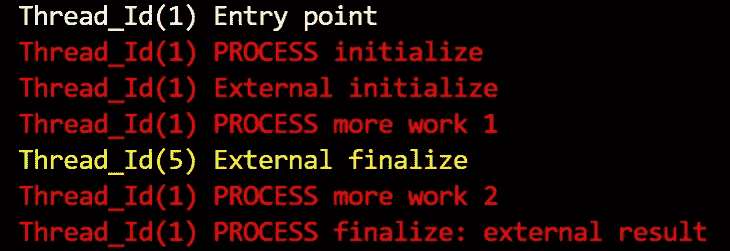
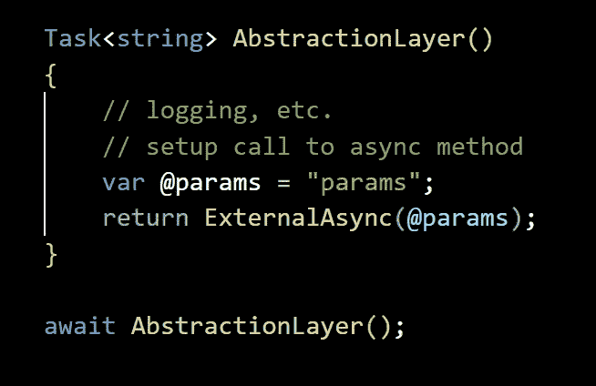
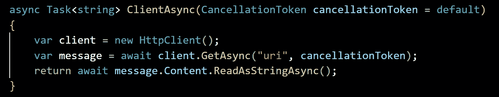
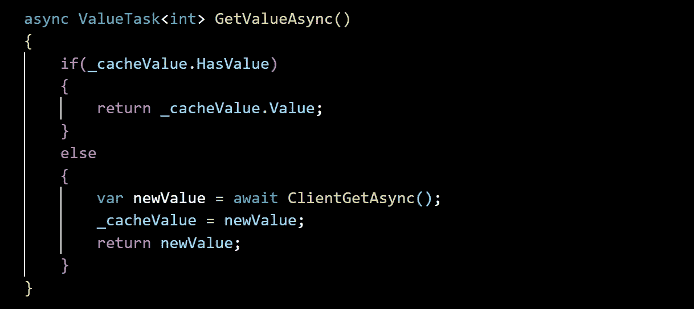

# 异步编程

> 原文：<https://medium.com/codex/asynchronous-programming-73b4f1988cc6?source=collection_archive---------5----------------------->

我想介绍一些关于. NET 中异步编程的事情。主要概念也可以应用于其他语言，所以请随意通读。我们将讨论异步和并行编程的常见误解，以及如何决定合适的方法。我还将描述异步是如何工作的。在下面的文章中，我将展示一个使用异步方法可以实现的性能提升的例子。我们还将讨论如何在同步环境中使用异步。希望你永远不需要这么做:)

*   [异步与同步性能](/@karol.rossa/asynchronous-performance-1be01a71925d)
*   [价值任务与任务](/@karol.rossa/valuetask-vs-task-5fb4f9c6517)

# 异步与并行

在并行编程中，工作是同时并行进行的:)。可以同时完成的工作量取决于处理器内核的数量。它在处理占用大量 CPU 处理时间的任务时最有用，并且可以被分割成更小的块。

并行处理

我们甚至可以在一个内核上实现异步代码，但它可以利用多核机器。异步不是同时做多个单元的工作，而是在当前需要计算时间的任务之间切换。在处理流程外部的任何事情时，比如调用 DB 或 HTTP 客户端，它可以节省大量处理时间。在使用 HTTP 客户端调用网络资源之后，我们需要等待响应。我们可以在线程上完成额外的工作，而不是阻塞线程。

异步处理

# 什么是异步

异步编程就是释放等待外部资源的线程，这样我们就可以将它们用于其他工作。我之前提到过，async 可以在单线程上工作，但是今天几乎所有的机器都配备了多核处理器。我将向您展示我们如何从中受益。此外，请记住，在编写异步代码时，我们必须从调用堆栈的顶部到底部使用异步。

在幕后，async 创建了一个状态机。你可以找到无数的文章将 async 比作沸水或在厨房准备食物。这次我们将讨论它是如何工作的。让我们看看下面的例子，一步一步来。

[**代码库**](https://github.com/krossa/AsyncSample)

> *Dump()是我的自定义函数，用于将信息打印到控制台*。

代码版本 A

代码版本 B

代码 B 的不同之处仅在于等待来自 ExternaAsync 的任务之前在 ProcessAsync 中完成的工作量。

结果 A

成果 B

我们应用程序的入口点。线程 1 负责这项工作。

还没有什么令人兴奋的，只是初始化我们的过程，像标准同步函数一样调用 ExternalAsync 函数。线程 1 也完成这项工作。

3 仍在线程 1 上同步初始化外部工作。但是现在，我们遇到了我们节目中的第一个等待。任务。Delay(100)表示对外部资源(如 HttpClient)的异步调用。GetAsync 函数。这时，工作被委托给外部驱动程序，我们必须等待结果。但是我们没有等待和无所事事，而是立即返回 ProcessAsync 函数。

返回 ProcessAsync 后，我们可以在 HTTP 请求运行时完成额外的工作。我们还可以注意到，异步可以并行工作。现在我们将考虑这两种情况。
**A (1_000)** —在 ExternalAsync 能够完成之前完成的少量工作。
**B (1_000_000_000)** —比 ExternalAsync 花费更多时间完成的繁重工作

## 版本 A

4 在输出中，我们可以看到两个检查点“处理更多工作 1/2”相继出现在线程 1 上。当我们在任务中点击 wait 时，我们没有其他事情可做。任务还没有解决，我们需要等待。因此，线程 1 被释放到线程池中，可以用于不同的用途，比如处理对控制器的另一个调用。

5 外部工作最终完成，在新线程 5 上继续执行。在完成 ExternalAsync 方法中的工作后，我们将结果返回给 ProcessAsync。

6 只有外部调用是并行执行的，但这是由一些外部驱动程序处理的，而不是由我们的应用程序处理的。在本例中，ProcessAsync 中的工作在线程 5 上继续。我们的代码是按顺序执行的，但是在等待异步调用时，我们不会阻塞线程 1。仅这一点就让我们的应用程序性能大幅提升。

## 版本 B

4

*   Thread_Id(1)处理更多工作 1
*   Thread_Id(5)外部完成
*   Thread_Id(1)处理更多工作 2

我们已经实现了并行处理，不需要任何额外的代码，只需要知道 async 是如何工作的，调用 ExternalAsync，然后在代码中等待它的任务。由于不同的线程 id(1–5)，我们可以清楚地看到这一点。如果我们在第 4 行等待 ExternalAsync，我们的代码就不可能并行化。

在这个例子中，当在 ProcessAsync 中点击 await 时，任务已经被解决了，所以我们可以在同一个线程 1 上继续工作。我希望我们能够用这些知识编写更好的异步代码，同时利用并行化。

# 异步如何工作

三个部分定义了异步:async、await 和 Task。Async 创建一个具有一个初始状态的状态机。每个 await 添加一个额外的状态，所以状态的数量等于 await 的数量+ 1。任务是结果的包装。该任务包含有关状态和结果的信息，可以等待。

我们已经知道，每个 await 都会向我们的状态机添加一个状态。如果可能，我们应该避免它。例如，当添加带有设置或日志记录的抽象层(如代理)时，我们只是传递一个对异步方法的调用。请记住，我们最终必须等待代码库中的所有任务。如果一个最终没有被等待的异步方法抛出了一个异常，那么这个异常将会丢失，我们将不会有任何错误的记忆。

返回任务

# 提示和注意事项

异步编程是一个庞大的话题。我无法在一篇文章中涵盖所有内容。我已经提到了可以让你编写高效异步代码的东西。现在，我们将讨论更多的指导原则。我们将再次触及每个主题的基础。

## 注销令牌

当编写供您使用的异步代码时，如果您不打算使用它，可以忽略传递取消令牌。它允许您取消长时间运行的任务。在创建通用的库时，最好记住它。只需用默认值作为最后一个参数添加即可。

注销令牌

## 同步上下文和配置等待

SynchronizationContext 的主要方面是提供一种将工作单元排队到上下文的方法。上下文不局限于单个线程，可以在它们之间传递。它主要用于具有用户界面的应用程序，如 WPF 或 Windows 窗体。由于传递了 SynchronizationContext，它允许您进行后台工作，并在返回时在 UI 线程中进行更改。的巨大变化。NET Core 将从 ASP.NET 中移除 SynchronizationContext。

ConfigureAwait 用于避免在原始上下文中强制调用回调。默认情况下，。NET 使用原始上下文。不将原始上下文传递给回调函数有很多好处。

> *configurewait(continueoncomputuredcontext:false)*

**性能提升**。当所有的回调都在同一个上下文中排队时，它增加了按顺序执行它们的延迟。有时，只检查同步上下文会给路径增加不必要的延迟。

避免死锁。在一些罕见的情况下，当异步代码同步执行时(。Result)和 SynchronizationContext 将可以在其上运行的操作数限制为 1。想象一下主线程使用上下文的情况。异步方法是用。结果使它成为阻塞主线程的同步调用。现在，异步方法在不同的线程上完成，并且不能访问上下文，因为它在主线程中被阻塞了。

如果没有必要，应该通过将 await 配置为 false 来避免强制使用原始上下文。

> *当事人。AsyncCall()。configurewait(fasle)*

## 价值任务

ValueTask 是包装值或任务并将其返回的结构。它应该用作可以同步或异步运行的方法的返回类型。例如，可以从缓存中检索值或需要对外部资源进行异步调用的方法。

价值任务

任务分配比返回普通值占用更多的资源。如果同步执行一个方法，就不需要创建任务。所以 ValueTask 包装了一个普通的整数值。这是因为 ValueTask 实现了必要的方法，尤其是 GetAwaiter()，并且可以由调用者作为 Task 使用。[在这里你可以检查内存分配的差异。](/@karol.rossa/valuetask-vs-task-5fb4f9c6517)

只有几项操作不应在 ValueTask 实例上执行:

*   多次等待实例。
*   多次调用 AsTask。
*   使用。结果还是。GetAwaiter()。GetResult()当操作还没有完成时，或者多次使用它们。