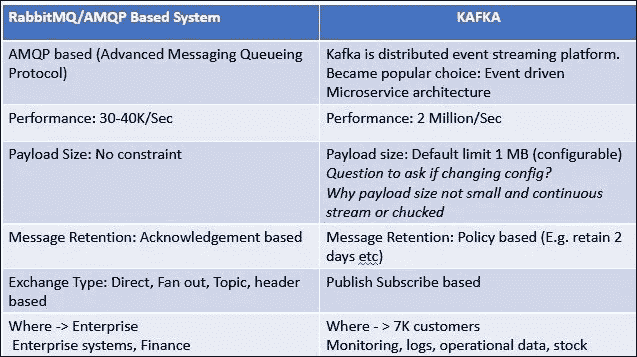
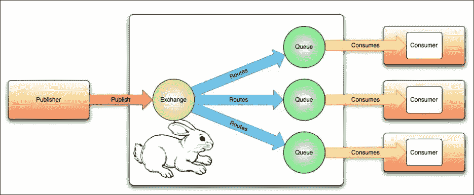
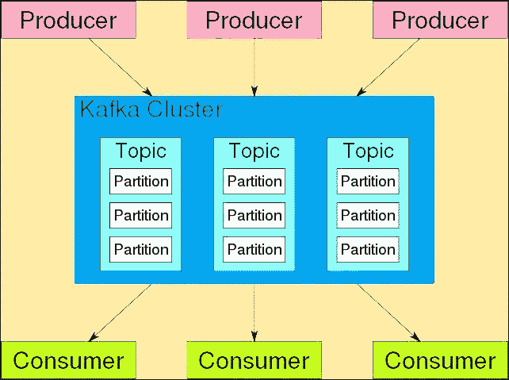

# 消息传递中的异步 Rest 服务

> 原文：<https://medium.com/codex/asynchronous-rest-service-in-messaging-27823d67988f?source=collection_archive---------25----------------------->

我说的是我们如何利用微服务进行异步通信。

微服务是基于 **REST 实现的，REST 是“异步的”**，使用 **HTTP 协议，它是“同步的”**。这意味着，只要我们尝试使用 REST 和 HTTP 实现微服务，它就会变成同步的。

但是如果要避免这个问题，解决的办法就是**【消息】**。我们必须使用一些消息代理。

等等，什么？什么是消息代理？

## **消息代理:**

> 这就像是微服务的中间人。它从一个应用程序(生产者)接收消息，并把它们交给另一个应用程序(消费者)去做一些工作。

有很多消息代理，如 **Kafka、RabbitMQ 和 ActiveMQ** 。在这种情况下，我们将主要关注卡夫卡和 RabbitMQ。

RabbiMQ 是一个**普通队列管理协议**。另一方面， *Kafka* 也可以做同样的事情，但是它主要是一个**流处理系统**可以处理一个消息流。

在这篇文章中，我将详细讨论这些是什么，以及我们什么时候可以同样使用它们。

# **RabbitMQ vs 卡夫卡:**

1.如上所述，RabbitMQ 是一个普通的队列管理协议，它使用一个名为 AMQP(高级消息队列协议)的库，Kafka 在用于处理消息流时也可以做同样的事情。

2.RabbitMQ 中有一个智能代理，它可以完成代理内部的所有路由工作。另一方面，卡夫卡笔下的经纪人不是这样的，有一个不同的架构来实现同样的事情。

3.最重要的是，如果有只受您的系统影响的情况，我们可以使用 RabbitMQ。如果是你私人的。

但是如果有这样的情况，比如，如果那里发生了什么事，还有其他一些系统感兴趣并希望得到通知。那你需要和卡夫卡一起去。

这两个我们分开考虑。

# **1。RabbitMQ**

这里，我们不直接将消息推送到队列中。我们有**交换**，它是一个*消息路由代理*。此外，我们还有一个**路由键**，它是用于将消息推送到不同队列的*。Route key 使您能够将队列绑定到交换，然后消费者可以使用消息。*

这里，当我们将消息路由到队列时，有不同的类型。(根据 exchange 配置，它决定进入哪个队列)

1.  **扇出交换** :-这将*把消息复制到它所连接的每个队列中*
2.  **直接交换** :-您可以*将消息直接定向到特定队列*
3.  **主题交换** :-根据路由关键字和队列绑定的路由模式之间的通配符匹配，向队列*发送消息*
4.  **消息头交换**:——这使用带有消息头和可选值的*参数来路由消息*。
5.  **默认交换** :-这是一个未命名的预先声明的直接交换

如何向消费者发布消息:

RabbitMQ 以**“Round Robbin”**格式分发消息。但是我们对此有异议。

1.让我们假设这样的情况，某些消息需要更长的时间来处理。这可能会导致这种情况。有时，一些用户可能会在一些用户空闲的时候填满消息，这会花费更多的时间。

为了避免这些问题，解决方案是“**公平调度**”。在公平调度中，我们有一种叫做“**预取**”的东西。

如果我们的预取设置为 3。这意味着 RabbitMQ 只会给你 3 条消息。然后，所有的消费者总会有一些信息。这样，我们就能克服这个问题。

2.还有一个问题。通常，RabbitMQ 将消息传递给消费者，它将从队列中删除消息。但是，如果发生了消费者无法处理的事情，消费者收到消息后会发生什么呢？现在消息无处可去，因为 RabbitMQ 在将消息传递给消费者后删除了消息。

为了避免这种问题，我们可以有一个“ **ACK 机制**”。它的作用是，告诉 RabbitMQ 避免自动确认。然后它会告诉 RabbitMQ 什么时候删除消息。

# 2.卡夫卡

这是更受欢迎的消息代理。这里，它使用了发布-订阅模式。

在 Kafka 中，我们有一个**主题**,在主题中，我们可以有**分区**,当我们做实现时需要一个强有力的想法。如上所述，生产者将向主题发送消息，并且有分区。分区将接收消息并将它们发送给消费者。

不像 RabbitMQ，在 Kafka 中，我们没有使用“循环”格式，因为 Kafka 有另一套做事的方法。

第一点是可以有“**消费者群体**”，不同的消费者群体可以有不同数量的消费者。

卡夫卡的作品是怎样的，

当发布者发布消息给卡夫卡时，我们可以设置一个**键**。有些案件没有关键。但通常我们都有钥匙。

如果我们有了密钥，那么 Kafka 有一个叫做“模式”的算法，它将决定消息如何分配给分区。

对于消费者组，我们有一些限制，因为我们可以让消费者在具有多个分区的同一个消费者组中。但是有一个规则。 ***总是同一个消费群中的几个消费者应小于或等于该话题拥有的分区数*。**(可以打开更多的消费者。但是消息不会传递给这些消费者。)

总结事实后，

1.  ***同一消费群中的几个消费者应小于或等于几个分区题目有*。**
2.  如果**你想要一个订单保证**，**你需要有一把“钥匙”**。(例如，如果您有一个消费者 id，并且您需要将特定的消费者消息作为一个订单。)在这里，卡夫卡将遵循模式算法，并决定如何向消费者分发消息。
3.  如果您的实现没有密钥，那么 Kafka 不会使用模式算法，它将遵循**“循环”模式**来决定如何向消费者分发消息。

最后，你需要记住的是，根据你的需求，选择最合适的消息经纪人，获得收益，乐在其中。