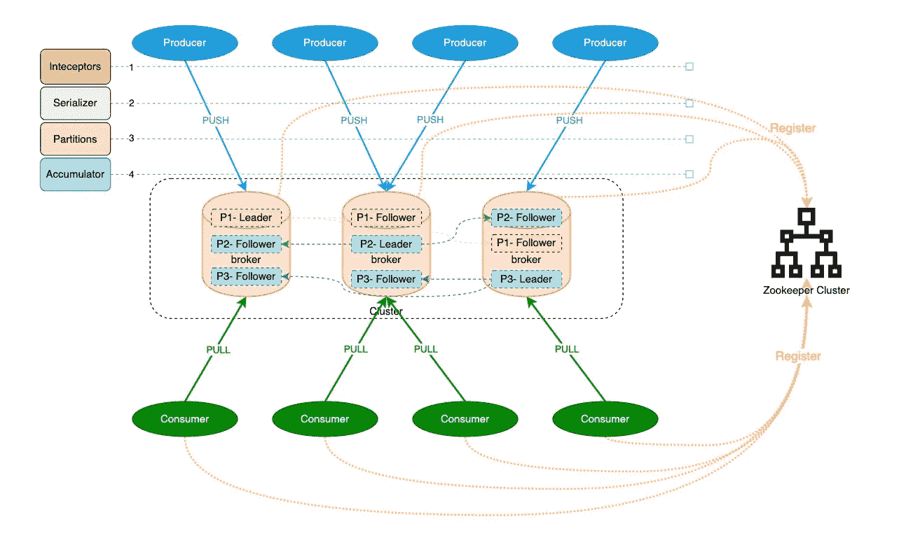

# 在对消息队列进行技术选择之前，您至少需要解决 4 个以上的问题

> 原文：<https://medium.com/codex/at-least-4-problems-you-need-to-figure-out-before-technical-selection-of-message-queues-aa766991ede0?source=collection_archive---------9----------------------->

卡夫卡建筑

*   **4+** 表示项目会继续更新添加。
*   本文将使用**卡夫卡**作为默认消息队列来讨论。
*   更多细节都在图中。
*   欢迎不同的想法和观点。请随时添加评论。